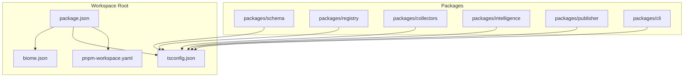
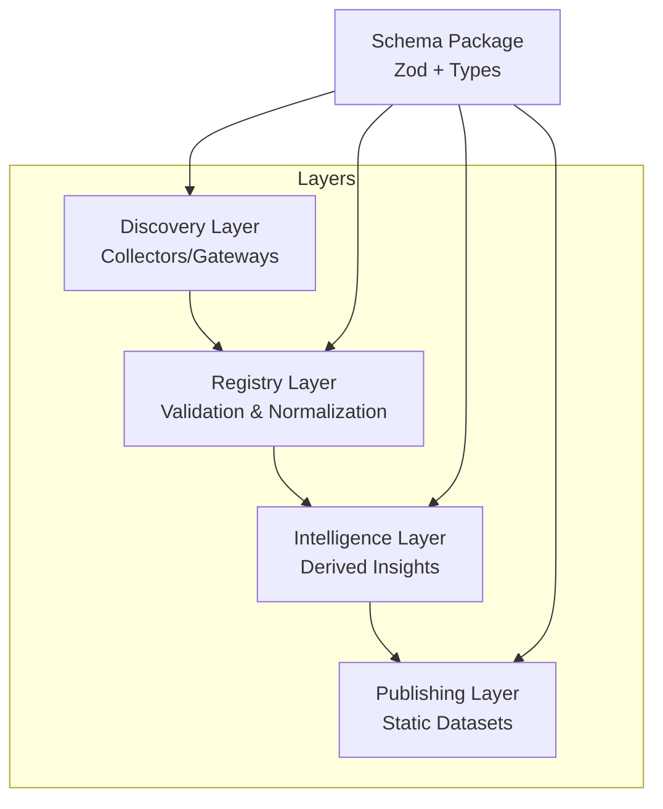
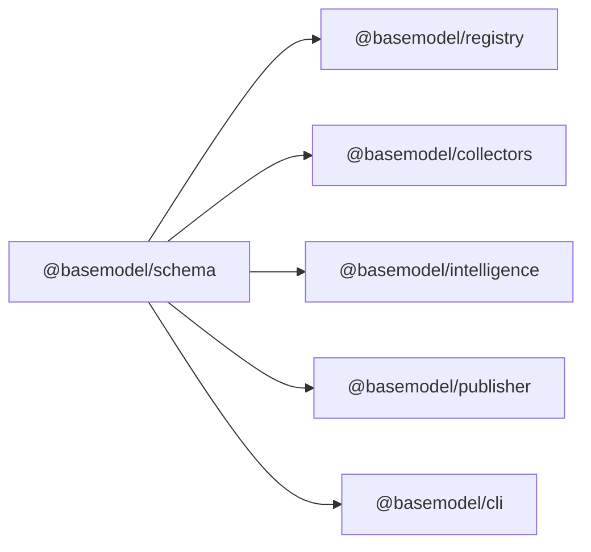

# Code Standards & Quality

<cite>
**Referenced Files in This Document**
- [biome.json](file://biome.json)
- [package.json](file://package.json)
- [tsconfig.json](file://tsconfig.json)
- [pnpm-workspace.yaml](file://pnpm-workspace.yaml)
- [README.md](file://README.md)
- [CONTRIBUTING.md](file://CONTRIBUTING.md)
- [packages/schema/package.json](file://packages/schema/package.json)
- [packages/schema/src/index.ts](file://packages/schema/src/index.ts)
- [packages/collectors/tsconfig.json](file://packages/collectors/tsconfig.json)
- [packages/intelligence/tsconfig.json](file://packages/intelligence/tsconfig.json)
- [packages/publisher/tsconfig.json](file://packages/publisher/tsconfig.json)
- [packages/registry/tsconfig.json](file://packages/registry/tsconfig.json)
- [docs/03_Architecture.md](file://docs/03_Architecture.md)
- [docs/05_Data_Model.md](file://docs/05_Data_Model.md)
</cite>

## Table of Contents
1. [Introduction](#introduction)
2. [Project Structure](#project-structure)
3. [Core Components](#core-components)
4. [Architecture Overview](#architecture-overview)
5. [Detailed Component Analysis](#detailed-component-analysis)
6. [Dependency Analysis](#dependency-analysis)
7. [Performance Considerations](#performance-considerations)
8. [Troubleshooting Guide](#troubleshooting-guide)
9. [Conclusion](#conclusion)
10. [Appendices](#appendices)

## Introduction
This document defines the code standards and quality guidelines enforced across BaseModel. It consolidates the Biome configuration, TypeScript compiler settings, workspace conventions, and architectural principles that guide clean, maintainable, and secure development. It also provides practical examples of compliant and non-compliant patterns to help contributors write consistent, high-quality code.

## Project Structure
BaseModel is a pnpm monorepo with clear package boundaries:
- packages/schema: Canonical Zod schemas and TypeScript types
- packages/registry: Registry storage, validation, and merge utilities
- packages/collectors: Provider and gateway collectors
- packages/intelligence: Derived rankings, search, and recommendations
- packages/publisher: Dataset generation for dist/
- packages/cli: Command-line interface for querying intelligence

The root configuration centralizes tooling and type-checking, while each package extends the shared tsconfig.

**Diagram sources**
- [package.json:17-25](file://package.json#L17-L25)
- [biome.json:1-49](file://biome.json#L1-L49)
- [tsconfig.json:1-26](file://tsconfig.json#L1-L26)
- [pnpm-workspace.yaml:1-3](file://pnpm-workspace.yaml#L1-L3)

**Section sources**
- [README.md:11-30](file://README.md#L11-L30)
- [pnpm-workspace.yaml:1-3](file://pnpm-workspace.yaml#L1-L3)

## Core Components
This section outlines the foundational tools and configurations that enforce code quality and consistency.

- Biome (linting and formatting):
  - Enabled linter with recommended preset; accessibility rules tuned off for specific cases
  - Formatter configured with space indentation, width 100, single quotes, semicolons always, trailing commas all
  - JSON formatter and linter disabled
  - File includes cover packages/**/*.ts, apps/**/*.ts|tsx, and *.json

- TypeScript (strictness and module behavior):
  - Target ES2022, module ESNext, bundler resolution
  - Strict mode on, isolatedModules, verbatimModuleSyntax
  - noUncheckedIndexedAccess, noUnusedLocals, noUnusedParameters, noFallthroughCasesInSwitch
  - Declaration and source maps enabled

- Workspace and scripts:
  - pnpm workspaces include packages/*
  - Scripts: lint, lint:fix, format, typecheck, build, test, generate

- Package-level TypeScript configs extend the root tsconfig consistently.

**Section sources**
- [biome.json:8-48](file://biome.json#L8-L48)
- [tsconfig.json:1-26](file://tsconfig.json#L1-L26)
- [package.json:17-29](file://package.json#L17-L29)
- [pnpm-workspace.yaml:1-3](file://pnpm-workspace.yaml#L1-L3)
- [packages/collectors/tsconfig.json:1-8](file://packages/collectors/tsconfig.json#L1-L8)
- [packages/intelligence/tsconfig.json:1-8](file://packages/intelligence/tsconfig.json#L1-L8)
- [packages/publisher/tsconfig.json:1-9](file://packages/publisher/tsconfig.json#L1-L9)
- [packages/registry/tsconfig.json:1-10](file://packages/registry/tsconfig.json#L1-L10)

## Architecture Overview
BaseModel enforces layered architecture and stable data contracts:
- Discovery Layer: collectors and gateways
- Registry Layer: canonical records, validation, normalization
- Intelligence Layer: derived insights without modifying canonical data
- Publishing Layer: static dataset generation

The schema package is the single source of truth for entity shapes and Zod validators.

**Diagram sources**
- [docs/03_Architecture.md:5-44](file://docs/03_Architecture.md#L5-L44)
- [packages/schema/package.json:1-48](file://packages/schema/package.json#L1-L48)

**Section sources**
- [docs/03_Architecture.md:5-44](file://docs/03_Architecture.md#L5-L44)
- [docs/05_Data_Model.md:15-22](file://docs/05_Data_Model.md#L15-L22)

## Detailed Component Analysis

### Biome Configuration and Linting Rules
- Linter:
  - Preset: recommended
  - Accessibility rules selectively disabled for SVG and click interactions
- Formatter:
  - Indent style: space, width: 2, line width: 100
  - JavaScript: single quotes, semicolons always, trailing commas all
- JSON:
  - Formatter and linter disabled
- File inclusion:
  - packages/**/*.ts, apps/**/*.ts|tsx, *.json

Compliant pattern example (conceptual):
- Use single quotes, semicolons, and trailing commas consistently
- Keep lines under 100 characters
- Avoid unused variables or parameters

Non-compliant pattern example (conceptual):
- Mixed quote styles or missing semicolons
- Excessively long lines
- Unused imports or variables

**Section sources**
- [biome.json:8-48](file://biome.json#L8-L48)

### TypeScript Coding Conventions and Compiler Settings
- Strictness:
  - strict: true
  - noUncheckedIndexedAccess: true
  - noUnusedLocals: true
  - noUnusedParameters: true
  - noFallthroughCasesInSwitch: true
- Module system:
  - module: ESNext
  - moduleResolution: bundler
  - isolatedModules: true
  - verbatimModuleSyntax: true
- Outputs:
  - declaration: true
  - declarationMap: true
  - sourceMap: true
- Lib target:
  - lib: ["ES2022"]

Compliant pattern example (conceptual):
- Always handle optional properties explicitly due to noUncheckedIndexedAccess
- Avoid index signatures where possible; prefer mapped types or enums
- Use explicit import/export syntax aligned with verbatimModuleSyntax

Non-compliant pattern example (conceptual):
- Using any or implicit any
- Indexing arrays/objects without checks
- Mixing CommonJS and ESM syntax inconsistently

**Section sources**
- [tsconfig.json:1-26](file://tsconfig.json#L1-L26)

### Workspace and Scripting Standards
- pnpm workspaces:
  - Include packages/*
- Scripts:
  - lint: biome check .
  - lint:fix: biome check --write .
  - format: biome format --write .
  - typecheck: pnpm -r run typecheck
  - build: pnpm -r run build
  - test: pnpm -r run test
  - generate: pnpm --filter @basemodel/publisher run generate

Compliant pattern example (conceptual):
- Run pnpm lint and pnpm typecheck before committing
- Use pnpm --filter for targeted operations

Non-compliant pattern example (conceptual):
- Skipping lint/typecheck locally
- Running npm instead of pnpm

**Section sources**
- [pnpm-workspace.yaml:1-3](file://pnpm-workspace.yaml#L1-L3)
- [package.json:17-25](file://package.json#L17-L25)

### Schema Package as the Contract Boundary
- Purpose:
  - Centralized Zod schemas and TypeScript types for all entities
- Exports:
  - Type and schema exports per entity (e.g., Model, Provider, Capability, Pricing, License, API, Benchmark)
- Build:
  - tsup ESM build with declarations

Compliant pattern example (conceptual):
- Import types from @basemodel/schema for cross-package consistency
- Validate incoming data using exported Zod schemas

Non-compliant pattern example (conceptual):
- Defining ad-hoc types outside the schema package
- Bypassing Zod validation at boundaries

**Section sources**
- [packages/schema/package.json:1-48](file://packages/schema/package.json#L1-L48)
- [packages/schema/src/index.ts:1-27](file://packages/schema/src/index.ts#L1-L27)

### Data Model Naming and Identifier Conventions
- Identifiers:
  - provider_id uses kebab-case
  - model_id uses {provider_id}/{model-slug}
  - Other identifiers are stable and human-readable
- Entities:
  - Provider, Model, Capability, Benchmark, Pricing, API, License
- Dataset metadata:
  - schema_version, source_revision, count

Compliant pattern example (conceptual):
- Generate model_id by concatenating provider_id and a normalized slug
- Ensure provider_id follows kebab-case

Non-compliant pattern example (conceptual):
- Using PascalCase or snake_case for provider_id
- Omitting required fields in entity definitions

**Section sources**
- [docs/05_Data_Model.md:137-151](file://docs/05_Data_Model.md#L137-L151)

### Architectural Principles Enforced Across Packages
- Layered responsibilities:
  - Discovery, Registry, Intelligence, Publishing
- Boundaries:
  - No inference runtime, hosting, or chat interfaces within BaseModel
- Stability:
  - Domain model evolves slowly; implementations may change

Compliant pattern example (conceptual):
- Keep registry logic free of discovery-specific details
- Derive intelligence without mutating canonical records

Non-compliant pattern example (conceptual):
- Embedding provider-specific logic into registry core
- Mutating canonical records during intelligence computation

**Section sources**
- [docs/03_Architecture.md:5-57](file://docs/03_Architecture.md#L5-L57)

## Dependency Analysis
The schema package is the primary dependency boundary for type safety and validation. All other packages should consume it rather than redefining types.

**Diagram sources**
- [packages/schema/package.json:1-48](file://packages/schema/package.json#L1-L48)
- [docs/03_Architecture.md:37-44](file://docs/03_Architecture.md#L37-L44)

**Section sources**
- [docs/03_Architecture.md:37-44](file://docs/03_Architecture.md#L37-L44)

## Performance Considerations
- Prefer immutable data transformations in registry and intelligence layers to avoid accidental mutations and enable safe caching.
- Use typed schemas and early validation to fail fast and reduce downstream processing costs.
- Minimize large object allocations in hot paths; reuse structures where appropriate.
- Leverage ESM modules and isolatedModules for faster builds and predictable bundling.

[No sources needed since this section provides general guidance]

## Troubleshooting Guide
Common issues and resolutions:
- Lint/format failures:
  - Run pnpm lint:fix and pnpm format to auto-correct
  - Review biome.json rules if custom overrides are needed
- Type errors:
  - Ensure strict flags are respected; fix noUncheckedIndexedAccess violations
  - Verify imports align with verbatimModuleSyntax requirements
- Workspace commands not working:
  - Confirm Node.js >= 20 and pnpm >= 9
  - Reinstall dependencies and rebuild

**Section sources**
- [package.json:17-25](file://package.json#L17-L25)
- [CONTRIBUTING.md:19-24](file://CONTRIBUTING.md#L19-L24)

## Conclusion
BaseModel’s code standards center around strict TypeScript, consistent Biome formatting/linting, and a strong schema contract. Adhering to these guidelines ensures maintainability, correctness, and stability across the monorepo. Contributors should follow the documented patterns, use the provided scripts, and respect architectural boundaries.

[No sources needed since this section summarizes without analyzing specific files]

## Appendices

### Code Review Criteria Checklist
- Does the change adhere to Biome rules and TypeScript strictness?
- Are new types defined in @basemodel/schema and consumed elsewhere?
- Is validation performed at boundaries using Zod schemas?
- Are there tests covering happy and failure paths?
- Do changes preserve layer boundaries and immutability expectations?
- Are identifiers and naming conventions followed?

[No sources needed since this section provides general guidance]

### Security Considerations
- Treat secrets and credentials as external inputs; validate and sanitize rigorously.
- Avoid logging sensitive data; redact tokens and keys.
- Follow least privilege when accessing external APIs or file systems.
- Validate all user-provided inputs against canonical schemas.

[No sources needed since this section provides general guidance]

### Logging Standards
- Use structured logs with consistent levels (info, warn, error).
- Include context such as operation name, request IDs, and relevant identifiers.
- Avoid verbose payloads; log summaries and references only.

[No sources needed since this section provides general guidance]

### Documentation Comments
- Add JSDoc-style comments for public APIs and complex logic.
- Reference canonical docs (e.g., docs/05_Data_Model.md) for domain concepts.
- Keep comments aligned with implementation changes.

[No sources needed since this section provides general guidance]