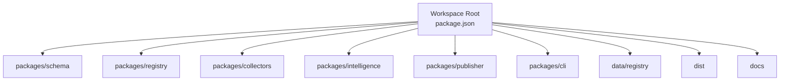
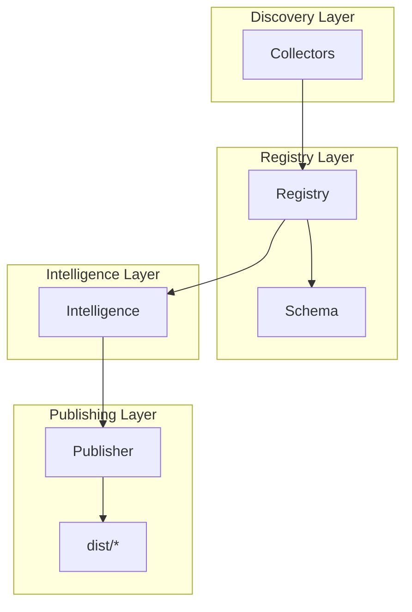
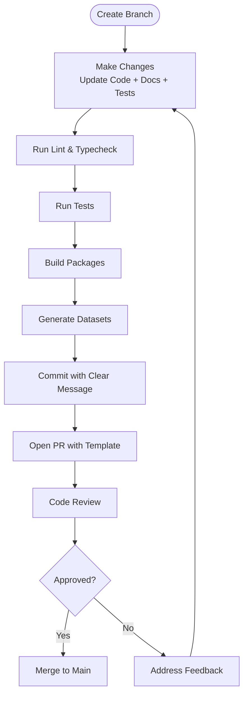
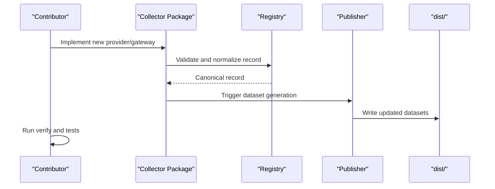
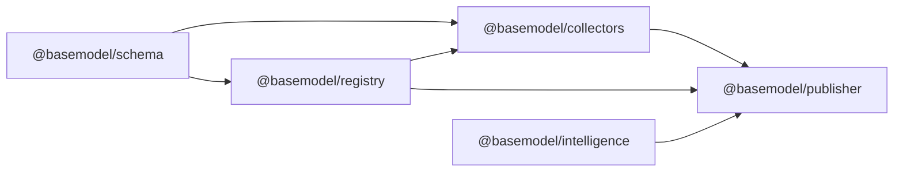

# Contribution Guidelines

<cite>
**Referenced Files in This Document**
- [CONTRIBUTING.md](file://CONTRIBUTING.md)
- [README.md](file://README.md)
- [package.json](file://package.json)
- [.github/pull_request_template.md](file://.github/pull_request_template.md)
- [pnpm-workspace.yaml](file://pnpm-workspace.yaml)
- [packages/schema/package.json](file://packages/schema/package.json)
- [packages/registry/package.json](file://packages/registry/package.json)
- [packages/collectors/package.json](file://packages/collectors/package.json)
- [docs/01_Vision.md](file://docs/01_Vision.md)
- [docs/02_Philosophy.md](file://docs/02_Philosophy.md)
- [docs/03_Architecture.md](file://docs/03_Architecture.md)
</cite>

## Table of Contents
1. Introduction
2. Project Structure
3. Core Components
4. Architecture Overview
5. Detailed Component Analysis
6. Dependency Analysis
7. Performance Considerations
8. Troubleshooting Guide
9. Conclusion
10. Appendices

## Introduction
This document provides comprehensive contribution guidelines for the BaseModel project. It explains how to report issues, request features, submit pull requests, and maintain code quality. It also covers branching strategies, merge policies, testing requirements, documentation standards, community guidelines, communication channels, contributor recognition, and guidance on backward compatibility and breaking changes.

BaseModel is an open-source AI model intelligence platform that discovers, validates, normalizes, stores, analyzes, and publishes structured knowledge about AI models. It is not an inference runtime or end-user application; it is a data layer consumed by other systems.

**Section sources**
- [README.md:1-61](file://README.md#L1-L61)

## Project Structure
BaseModel is organized as a pnpm workspace with multiple packages:
- Schema: canonical Zod schemas and TypeScript types
- Registry: storage, validation, and merge utilities
- Collectors: provider and gateway collectors
- Intelligence: derived rankings, search, and recommendations
- Publisher: dataset generation for dist/
- CLI: command-line interface for querying intelligence

The repository uses Node.js 20+ and pnpm 9+. Daily development commands include linting, type checking, testing, building, and generating datasets.

**Diagram sources**
- [package.json:17-25](file://package.json#L17-L25)
- [pnpm-workspace.yaml:1-3](file://pnpm-workspace.yaml#L1-L3)
- [README.md:10-30](file://README.md#L10-L30)

**Section sources**
- [README.md:10-30](file://README.md#L10-L30)
- [package.json:12-25](file://package.json#L12-L25)
- [pnpm-workspace.yaml:1-3](file://pnpm-workspace.yaml#L1-L3)

## Core Components
- Schema package defines the canonical data contracts used across the project.
- Registry package reads, writes, validates, and merges canonical records.
- Collectors package discovers and collects data from providers and gateways.
- Intelligence package computes derived insights without modifying canonical records.
- Publisher package generates static JSON datasets into dist/.
- CLI package exposes intelligence queries from the terminal.

When changing behavior, update relevant schemas, registry logic, collectors, publisher outputs, and documentation accordingly.

**Section sources**
- [README.md:10-30](file://README.md#L10-L30)
- [CONTRIBUTING.md:26-34](file://CONTRIBUTING.md#L26-L34)

## Architecture Overview
BaseModel follows a layered architecture:
- Discovery Layer: finds sources via collectors
- Registry Layer: stores validated, normalized canonical records
- Intelligence Layer: derives search, alternatives, cost info
- Publishing Layer: converts data into public datasets

**Diagram sources**
- [docs/03_Architecture.md:5-36](file://docs/03_Architecture.md#L5-L36)
- [README.md:10-30](file://README.md#L10-L30)

**Section sources**
- [docs/03_Architecture.md:5-36](file://docs/03_Architecture.md#L5-L36)

## Detailed Component Analysis

### Issue Reporting Process
- Use the GitHub Issues tab to report bugs or request features.
- For bugs, include environment details (Node.js and pnpm versions), steps to reproduce, expected vs actual behavior, and logs if available.
- For feature requests, describe the problem, proposed solution, and impact on consumers.
- Link related issues and PRs when applicable.

While there are no custom issue templates present, follow the same structure as the PR template to ensure clarity and completeness.

**Section sources**
- [.github/pull_request_template.md:1-20](file://.github/pull_request_template.md#L1-L20)

### Feature Request Procedures
- Open an issue with a clear title and description.
- Explain why the feature is needed and how it aligns with the project’s vision and philosophy.
- Propose minimal changes to schema, registry, collectors, or publisher as appropriate.
- Include examples of expected inputs/outputs and any backward compatibility considerations.

**Section sources**
- [docs/01_Vision.md:1-76](file://docs/01_Vision.md#L1-L76)
- [docs/02_Philosophy.md:1-76](file://docs/02_Philosophy.md#L1-L76)

### Pull Request Submission Guidelines
- Keep PRs small and focused.
- Add or update tests for behavior changes.
- Do not introduce undocumented fields or outputs.
- Ensure examples and docs stay in sync with current commands and repository paths.
- Use the provided PR template to describe what the PR does, related issues, testing approach, and checklist items.

**Diagram sources**
- [CONTRIBUTING.md:36-41](file://CONTRIBUTING.md#L36-L41)
- [.github/pull_request_template.md:1-20](file://.github/pull_request_template.md#L1-L20)

**Section sources**
- [CONTRIBUTING.md:36-41](file://CONTRIBUTING.md#L36-L41)
- [.github/pull_request_template.md:1-20](file://.github/pull_request_template.md#L1-L20)

### Adding Providers or Gateways
- Follow existing schema contracts.
- Add collector or gateway under packages/collectors/src/.
- Register required secret names in the core secrets file.
- Write tests for happy path and failure path.
- Update developer access and security documentation when integration surface changes.

**Diagram sources**
- [CONTRIBUTING.md:43-51](file://CONTRIBUTING.md#L43-L51)
- [README.md:10-30](file://README.md#L10-L30)

**Section sources**
- [CONTRIBUTING.md:43-51](file://CONTRIBUTING.md#L43-L51)

### Testing Requirements
- Use the workspace test suite to validate changes.
- Add tests for new functionality and edge cases.
- Ensure all tests pass locally before submitting a PR.
- For collectors, run verification scripts against specific files when necessary.

**Section sources**
- [CONTRIBUTING.md:19-24](file://CONTRIBUTING.md#L19-L24)
- [README.md:42-51](file://README.md#L42-L51)

### Documentation Standards
- Read existing docs before changing behavior.
- Update relevant documentation when data shape, registry logic, collector inputs, or dataset outputs change.
- Keep examples synchronized with current commands and repository paths.
- Maintain clarity and precision; avoid undocumented fields or outputs.

**Section sources**
- [CONTRIBUTING.md:6-10](file://CONTRIBUTING.md#L6-L10)
- [CONTRIBUTING.md:26-34](file://CONTRIBUTING.md#L26-L34)

### Backward Compatibility and Breaking Changes
- Prefer additive changes to schemas and APIs.
- Avoid introducing undocumented fields or outputs.
- When breaking changes are necessary, provide migration guidance and update documentation accordingly.
- Align changes with the project’s philosophy of truth over completeness and schema first.

**Section sources**
- [CONTRIBUTING.md:36-41](file://CONTRIBUTING.md#L36-L41)
- [docs/02_Philosophy.md:19-46](file://docs/02_Philosophy.md#L19-L46)

## Dependency Analysis
BaseModel uses a monorepo structure with clear package boundaries:
- @basemodel/schema: canonical types and Zod schemas
- @basemodel/registry: depends on schema for validation and normalization
- @basemodel/collectors: depends on registry and schema for discovery and collection
- Workspace root orchestrates build, test, lint, and generate tasks

**Diagram sources**
- [packages/schema/package.json:1-48](file://packages/schema/package.json#L1-L48)
- [packages/registry/package.json:1-35](file://packages/registry/package.json#L1-L35)
- [packages/collectors/package.json:1-41](file://packages/collectors/package.json#L1-L41)
- [README.md:10-30](file://README.md#L10-L30)

**Section sources**
- [packages/schema/package.json:1-48](file://packages/schema/package.json#L1-L48)
- [packages/registry/package.json:1-35](file://packages/registry/package.json#L1-L35)
- [packages/collectors/package.json:1-41](file://packages/collectors/package.json#L1-L41)
- [README.md:10-30](file://README.md#L10-L30)

## Performance Considerations
- Keep PRs small to reduce review and CI overhead.
- Prefer static datasets for caching and distribution.
- Automate discovery, validation, normalization, ranking, and publication where possible.
- Optimize collectors and registry operations to minimize redundant work.

[No sources needed since this section provides general guidance]

## Troubleshooting Guide
Common issues and resolutions:
- Environment setup: Ensure Node.js 20+ and pnpm 9+ are installed.
- Linting/type errors: Run linter and type checker to fix formatting and static issues.
- Test failures: Investigate failing tests and add coverage for new behaviors.
- Dataset generation: Re-run generator after schema or registry changes.

Useful commands:
- Install dependencies and build
- Lint and format
- Type check
- Run tests
- Generate datasets

**Section sources**
- [CONTRIBUTING.md:6-24](file://CONTRIBUTING.md#L6-L24)
- [README.md:42-51](file://README.md#L42-L51)

## Conclusion
BaseModel welcomes contributions that improve data quality, correctness, reproducibility, and usability. Follow the established workflows for issues, feature requests, and pull requests. Adhere to coding standards, testing requirements, and documentation practices. Respect community guidelines and communicate clearly. By maintaining backward compatibility and managing breaking changes thoughtfully, contributors help keep BaseModel reliable and valuable for its consumers.

[No sources needed since this section summarizes without analyzing specific files]

## Appendices

### Contribution Templates

- Bug Report Template
  - Title: Concise summary of the bug
  - Description: Steps to reproduce, expected vs actual behavior, environment details, logs
  - Related Issues: Links to related issues or PRs

- Feature Request Template
  - Title: Proposed feature name
  - Problem Statement: Why the feature is needed
  - Proposed Solution: Minimal changes and impact
  - Backward Compatibility: Notes on compatibility and migration
  - Related Issues: Links to related issues or discussions

- Pull Request Checklist
  - Read CONTRIBUTING.md
  - Code follows project standards (lint passes)
  - Added/updated tests
  - All tests pass locally
  - Build succeeds
  - Documentation updated

**Section sources**
- [.github/pull_request_template.md:1-20](file://.github/pull_request_template.md#L1-L20)
- [CONTRIBUTING.md:36-41](file://CONTRIBUTING.md#L36-L41)

### Branching Strategy and Merge Policies
- Branching Strategy
  - Use feature branches for new functionality
  - Use bugfix branches for issue fixes
  - Prefix branches descriptively (e.g., feature/add-collector, bugfix/fix-schema-validation)
- Merge Policies
  - Require passing CI checks (lint, typecheck, test, build, generate)
  - Require at least one approval from maintainers
  - Squash or rebase commits for clean history
  - Ensure documentation and examples are updated

[No sources needed since this section provides general guidance]

### Community Guidelines and Communication Channels
- Code of Conduct
  - Be respectful, precise, and constructive
- Communication Channels
  - Use GitHub Issues for bugs and feature requests
  - Use PR comments for code review discussions
  - Reference related issues and PRs in comments and descriptions

**Section sources**
- [CONTRIBUTING.md:53-56](file://CONTRIBUTING.md#L53-L56)

### Contributor Recognition
- Acknowledge contributors in release notes and README where appropriate
- Thank contributors in PR reviews and discussions
- Encourage consistent, high-quality contributions

[No sources needed since this section provides general guidance]