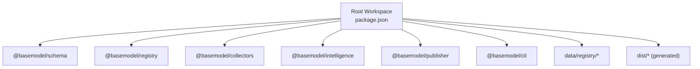
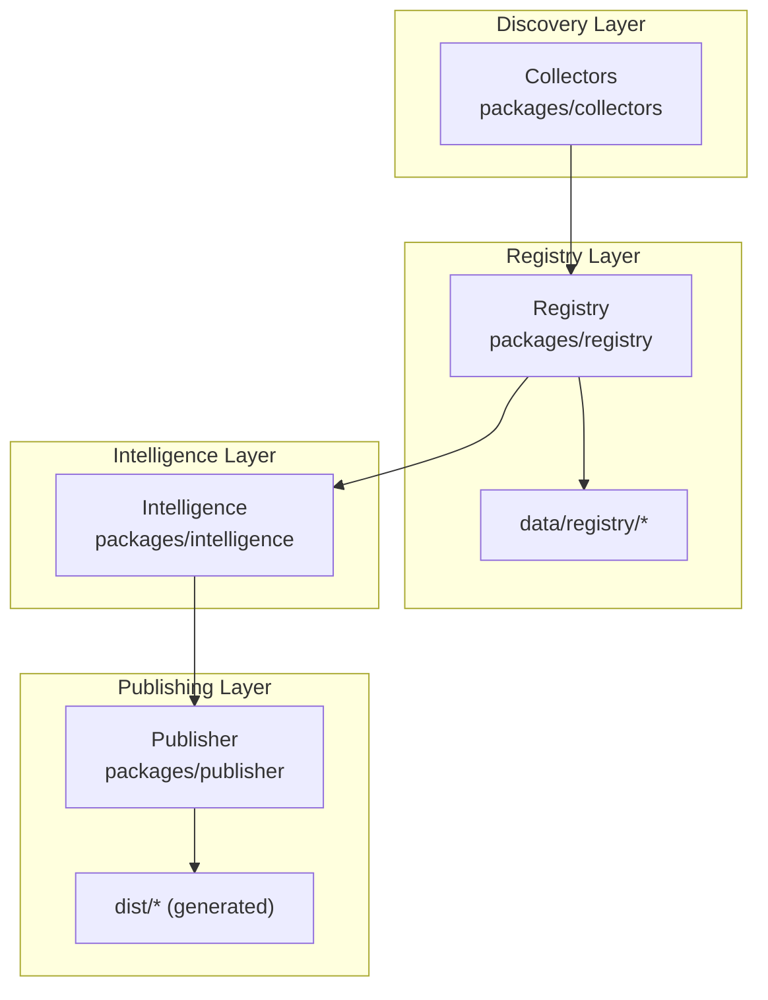
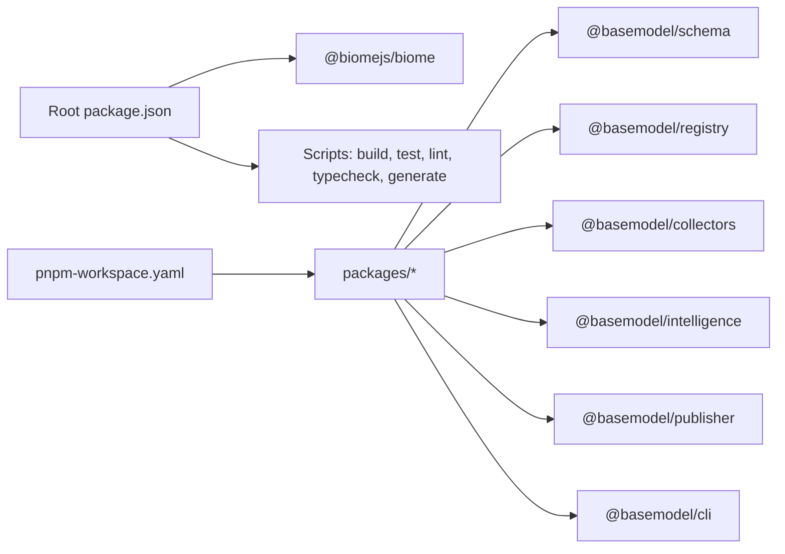

# Development & Contributing

<cite>
**Referenced Files in This Document**
- [package.json](file://package.json)
- [biome.json](file://biome.json)
- [tsconfig.json](file://tsconfig.json)
- [pnpm-workspace.yaml](file://pnpm-workspace.yaml)
- [CONTRIBUTING.md](file://CONTRIBUTING.md)
- [README.md](file://README.md)
- [.github/workflows/ci.yml](file://.github/workflows/ci.yml)
- [.github/pull_request_template.md](file://.github/pull_request_template.md)
- [docs/03_Architecture.md](file://docs/03_Architecture.md)
- [docs/04_Pipeline.md](file://docs/04_Pipeline.md)
</cite>

## Table of Contents
1. [Introduction](#introduction)
2. [Project Structure](#project-structure)
3. [Core Components](#core-components)
4. [Architecture Overview](#architecture-overview)
5. [Detailed Component Analysis](#detailed-component-analysis)
6. [Dependency Analysis](#dependency-analysis)
7. [Performance Considerations](#performance-considerations)
8. [Troubleshooting Guide](#troubleshooting-guide)
9. [Conclusion](#conclusion)
10. [Appendices](#appendices)

## Introduction
This document is the authoritative guide for contributing to BaseModel. It covers development setup, code quality standards enforced by Biome, TypeScript configuration, testing and build processes, CI/CD pipelines, release and versioning strategy, backward compatibility requirements, contribution guidelines, templates for pull requests and issues, debugging techniques, performance profiling, and troubleshooting common development issues.

BaseModel is an open-source AI model intelligence platform that discovers, validates, normalizes, stores, analyzes, and publishes structured knowledge about AI models. It focuses on data infrastructure rather than inference runtimes or end-user applications.

**Section sources**
- [README.md:1-61](file://README.md#L1-L61)

## Project Structure
The repository is a pnpm monorepo with multiple packages under packages/. The root package.json defines shared scripts for building, testing, linting, formatting, typechecking, generating datasets, and cleaning artifacts. The workspace includes schema, registry, collectors, intelligence, publisher, and cli packages. Data lives under data/registry/, and generated datasets are written to dist/.

**Diagram sources**
- [package.json:1-31](file://package.json#L1-L31)
- [pnpm-workspace.yaml:1-3](file://pnpm-workspace.yaml#L1-L3)

Key responsibilities:
- Schema: Canonical Zod schemas and TypeScript types.
- Registry: Storage, validation, and merge utilities for canonical records.
- Collectors: Provider and gateway collectors for discovery and collection.
- Intelligence: Derived rankings, search, and recommendations from registry data.
- Publisher: Dataset generation for dist/.
- CLI: Command-line interface for querying intelligence.

**Section sources**
- [README.md:10-51](file://README.md#L10-L51)
- [pnpm-workspace.yaml:1-3](file://pnpm-workspace.yaml#L1-L3)

## Core Components
Development workflow commands are defined at the workspace root:
- Install dependencies and build all packages.
- Lint and format using Biome.
- Typecheck across the workspace.
- Run tests across the workspace.
- Generate published datasets.
- Clean build artifacts.

Quality and configuration:
- Biome enforces consistent linting and formatting rules across TypeScript files and JSON where enabled.
- TypeScript is configured with strict mode, ES2022 target, ESNext modules, bundler module resolution, declaration and source maps, and additional safety flags like noUncheckedIndexedAccess and noUnusedLocals.

Testing and builds:
- Tests are executed via pnpm test which runs tests in each package.
- Builds are executed via pnpm build which runs builds in each package.

Generation:
- Datasets are regenerated via pnpm generate which invokes the publisher package’s generate script.

**Section sources**
- [package.json:17-25](file://package.json#L17-L25)
- [biome.json:1-50](file://biome.json#L1-L50)
- [tsconfig.json:1-27](file://tsconfig.json#L1-L27)

## Architecture Overview
BaseModel follows a layered architecture:
- Discovery Layer: Finds sources for AI model data through collectors.
- Registry Layer: Stores canonical records after validation and normalization.
- Intelligence Layer: Derives search, alternatives, and cost information without modifying canonical records.
- Publishing Layer: Converts registry and intelligence data into public datasets.

**Diagram sources**
- [docs/03_Architecture.md:1-77](file://docs/03_Architecture.md#L1-L77)

## Detailed Component Analysis

### Code Quality Standards (Biome)
Biome is used for both linting and formatting. Key aspects:
- Enabled linter with recommended preset and specific accessibility rule overrides.
- Formatter configured with space indentation, width 100, single quotes, always semicolons, and trailing commas.
- JSON formatter and linter disabled; only TypeScript files and selected JSON files included.
- VCS integration enabled for Git with ignore file support.

Practical usage:
- Check and fix style issues: pnpm lint and pnpm lint:fix.
- Format code: pnpm format.

**Section sources**
- [biome.json:1-50](file://biome.json#L1-L50)
- [package.json:20-22](file://package.json#L20-L22)

### TypeScript Configuration
TypeScript settings ensure strong typing and consistency:
- Target ES2022, module ESNext, bundler resolution.
- Strict mode enabled with additional checks: noUncheckedIndexedAccess, noUnusedLocals, noUnusedParameters, noFallthroughCasesInSwitch.
- Declaration and source maps enabled for better DX and debugging.
- Exclude node_modules and dist.

Implications for contributors:
- All new code should be strictly typed and avoid unused variables/parameters.
- Prefer explicit optional property handling due to strictness.

**Section sources**
- [tsconfig.json:1-27](file://tsconfig.json#L1-L27)

### Testing Frameworks and Procedures
- Tests are run across the workspace using pnpm test.
- Each package may define its own test runner and framework; the root command orchestrates execution.
- Add or update tests for behavior changes as required by contribution guidelines.

Guidelines:
- Include happy path and failure path tests for new features.
- Keep tests focused and deterministic.
- Ensure tests pass locally before opening PRs.

**Section sources**
- [package.json:19-19](file://package.json#L19-L19)
- [CONTRIBUTING.md:36-41](file://CONTRIBUTING.md#L36-L41)

### Build Processes
- pnpm build executes builds across all packages.
- Output directories and artifact generation are managed per package; root build aggregates results.
- Generated datasets are produced by the publisher package and written to dist/.

Best practices:
- Use incremental builds where possible.
- Avoid unnecessary rebuilds by isolating changes to relevant packages.

**Section sources**
- [package.json:18-18](file://package.json#L18-L18)
- [README.md:44-51](file://README.md#L44-L51)

### Deployment Pipelines (CI/CD)
GitHub Actions workflows automate validation and publication:
- ci.yml: Validates workspace on push and pull requests to main. Steps include install, lint, build, typecheck, and test.
- collect.yml: Nightly collection and regeneration of datasets.
- publish.yml: Regenerates datasets on push to main.
- deploy-pages.yml: Publishes static files to GitHub Pages.
- verify-gateway.yml: Checks gateway plugin changes.

Workflow highlights:
- Uses Node.js 20 and pnpm 9.
- Caches dependencies for faster runs.
- Enforces frozen lockfiles for reproducible installs.

**Section sources**
- [.github/workflows/ci.yml:1-41](file://.github/workflows/ci.yml#L1-L41)
- [docs/04_Pipeline.md:223-232](file://docs/04_Pipeline.md#L223-L232)

### Release Process and Versioning Strategy
- The root package.json declares version 0.1.0 and uses pnpm workspaces.
- Releases are driven by CI/CD: dataset regeneration and publishing occur on pushes to main.
- Backward compatibility:
  - Changes to canonical schemas must be coordinated with consumers.
  - Avoid undocumented fields or outputs.
  - Maintain stable interfaces for registry and publisher contracts.

Versioning guidance:
- Follow semantic versioning principles when bumping versions.
- Ensure breaking changes are clearly documented and accompanied by migration notes.

**Section sources**
- [package.json:1-16](file://package.json#L1-L16)
- [CONTRIBUTING.md:36-41](file://CONTRIBUTING.md#L36-L41)
- [docs/04_Pipeline.md:163-217](file://docs/04_Pipeline.md#L163-L217)

### Contribution Guidelines
General expectations:
- Use Node.js 20+ and pnpm 9+.
- Read docs before changing behavior.
- Keep PRs small and focused.
- Update relevant schemas, registry logic, collectors, publisher, and documentation when behavior changes.

Adding providers or gateways:
- Implement collector/gateway under packages/collectors/src/.
- Register secret names in core gateway secrets.
- Provide tests for success and failure paths.
- Update developer access and security docs when integration surface changes.

Code review checklist:
- Read CONTRIBUTING.md.
- Ensure code follows project standards (pnpm lint).
- Add/update tests.
- Verify all tests pass locally.
- Confirm build succeeds.

**Section sources**
- [CONTRIBUTING.md:1-56](file://CONTRIBUTING.md#L1-L56)
- [.github/pull_request_template.md:1-20](file://.github/pull_request_template.md#L1-L20)

### Templates for Pull Requests, Issues, and Feature Proposals
- Pull Request template:
  - Describe what the PR achieves.
  - Link related issues.
  - Explain how changes were tested.
  - Checklist ensures adherence to standards and passing CI.

- Issue reporting:
  - Provide clear reproduction steps.
  - Include environment details (Node.js, pnpm versions).
  - Attach logs or error messages.

- Feature proposals:
  - Outline problem statement and proposed solution.
  - Detail impact on schemas, registry, collectors, intelligence, and publisher.
  - Include test plan and documentation updates.

**Section sources**
- [.github/pull_request_template.md:1-20](file://.github/pull_request_template.md#L1-L20)
- [CONTRIBUTING.md:36-51](file://CONTRIBUTING.md#L36-L51)

### Debugging Techniques and Performance Profiling
Debugging tips:
- Use TypeScript source maps for stack traces.
- Enable verbose logging in collectors and enrichment steps.
- Validate registry entries against schemas to catch malformed data early.

Profiling:
- Measure collection times for external APIs (Hugging Face, OpenRouter).
- Profile enrichment steps to identify bottlenecks in pricing derivation.
- Monitor CI job durations and optimize dependency caching.

Common pitfalls:
- Rate limiting from external services triggers fallbacks; configure tokens where appropriate.
- Stale registry data can cause incorrect intelligence outputs; ensure regular regeneration.

**Section sources**
- [docs/04_Pipeline.md:93-126](file://docs/04_Pipeline.md#L93-L126)
- [docs/04_Pipeline.md:127-217](file://docs/04_Pipeline.md#L127-L217)

## Dependency Analysis
Workspace dependencies and relationships:
- Root package.json coordinates scripts and devDependencies (Biome).
- pnpm-workspace.yaml includes packages/* for unified management.
- Packages depend on shared schemas and registry contracts.

**Diagram sources**
- [package.json:27-29](file://package.json#L27-L29)
- [pnpm-workspace.yaml:1-3](file://pnpm-workspace.yaml#L1-L3)

**Section sources**
- [package.json:1-31](file://package.json#L1-L31)
- [pnpm-workspace.yaml:1-3](file://pnpm-workspace.yaml#L1-L3)

## Performance Considerations
- Use pnpm for fast, deterministic installs and builds.
- Leverage CI caching to reduce job durations.
- Optimize collection jobs by configuring rate limit tokens for external services.
- Minimize redundant computations in enrichment by caching intermediate results.
- Monitor dataset sizes and generation times; consider incremental updates.

[No sources needed since this section provides general guidance]

## Troubleshooting Guide
Common issues and resolutions:
- Linting failures: Run pnpm lint:fix to auto-correct style issues.
- Type errors: Review strict TypeScript flags and ensure proper typing.
- Test failures: Inspect package-specific test logs and validate inputs.
- Build errors: Check package-level build scripts and dependencies.
- Generation failures: Validate registry data and external API availability.

CI-related:
- Ensure Node.js 20 and pnpm 9 are used in local environments matching CI.
- Verify frozen lockfiles and dependency installation steps.

**Section sources**
- [package.json:17-25](file://package.json#L17-L25)
- [.github/workflows/ci.yml:1-41](file://.github/workflows/ci.yml#L1-L41)

## Conclusion
Contributing to BaseModel requires adherence to strict code quality standards, robust testing, and careful maintenance of canonical schemas and registry contracts. The monorepo structure, CI/CD automation, and comprehensive documentation enable efficient collaboration and reliable dataset generation. By following the guidelines in this document, contributors can deliver high-quality changes that maintain backward compatibility and improve the platform’s reliability and usability.

[No sources needed since this section summarizes without analyzing specific files]

## Appendices

### Quick Start Commands
- Install dependencies: pnpm install
- Lint and fix: pnpm lint, pnpm lint:fix
- Format: pnpm format
- Typecheck: pnpm typecheck
- Test: pnpm test
- Build: pnpm build
- Generate datasets: pnpm generate
- Clean: pnpm clean

**Section sources**
- [package.json:17-25](file://package.json#L17-L25)
- [CONTRIBUTING.md:19-24](file://CONTRIBUTING.md#L19-L24)

### Pipeline Stages Reference
- Discovery, Collection, Validation, Normalization, Registry, Intelligence, Generation, Publication.
- Failure handling ensures invalid records are isolated and valid records continue processing.

**Section sources**
- [docs/04_Pipeline.md:1-92](file://docs/04_Pipeline.md#L1-L92)