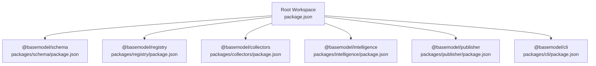
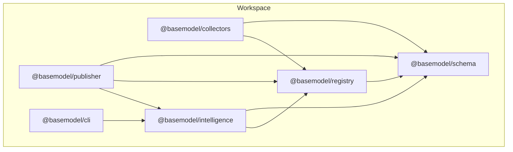
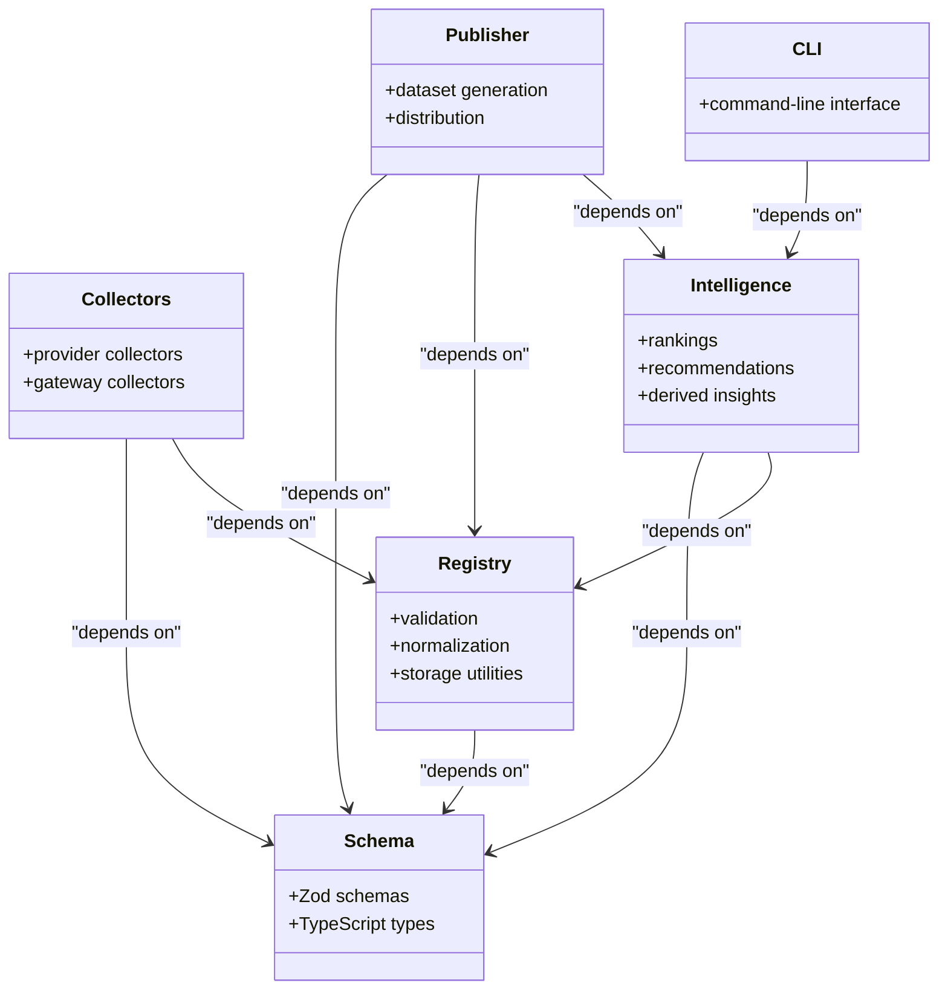

# Development Setup

<cite>
**Referenced Files in This Document**
- [package.json](file://package.json)
- [pnpm-workspace.yaml](file://pnpm-workspace.yaml)
- [tsconfig.json](file://tsconfig.json)
- [README.md](file://README.md)
- [CONTRIBUTING.md](file://CONTRIBUTING.md)
- [biome.json](file://biome.json)
- [packages/schema/package.json](file://packages/schema/package.json)
- [packages/registry/package.json](file://packages/registry/package.json)
- [packages/collectors/package.json](file://packages/collectors/package.json)
- [packages/intelligence/package.json](file://packages/intelligence/package.json)
- [packages/publisher/package.json](file://packages/publisher/package.json)
- [packages/cli/package.json](file://packages/cli/package.json)
</cite>

## Table of Contents
1. [Introduction](#introduction)
2. [Project Structure](#project-structure)
3. [Core Components](#core-components)
4. [Architecture Overview](#architecture-overview)
5. [Detailed Component Analysis](#detailed-component-analysis)
6. [Dependency Analysis](#dependency-analysis)
7. [Performance Considerations](#performance-considerations)
8. [Troubleshooting Guide](#troubleshooting-guide)
9. [Conclusion](#conclusion)
10. [Appendices](#appendices)

## Introduction
This document provides a complete development setup guide for BaseModel, including environment requirements, pnpm workspace configuration, TypeScript sharing across packages, and IDE recommendations. It also includes step-by-step instructions to clone the repository, install dependencies, build, verify the environment, and troubleshoot common issues.

## Project Structure
BaseModel is a pnpm monorepo with multiple packages under packages/. The root configuration defines Node.js and pnpm version constraints, shared scripts, and workspace membership. Each package has its own package.json with build, typecheck, test, and clean scripts.

**Diagram sources**
- [package.json:17-25](file://package.json#L17-L25)
- [pnpm-workspace.yaml:1-3](file://pnpm-workspace.yaml#L1-L3)
- [packages/schema/package.json:1-48](file://packages/schema/package.json#L1-L48)
- [packages/registry/package.json:1-35](file://packages/registry/package.json#L1-L35)
- [packages/collectors/package.json:1-41](file://packages/collectors/package.json#L1-L41)
- [packages/intelligence/package.json:1-50](file://packages/intelligence/package.json#L1-L50)
- [packages/publisher/package.json:1-38](file://packages/publisher/package.json#L1-L38)
- [packages/cli/package.json:1-45](file://packages/cli/package.json#L1-L45)

**Section sources**
- [package.json:12-16](file://package.json#L12-L16)
- [pnpm-workspace.yaml:1-3](file://pnpm-workspace.yaml#L1-L3)
- [README.md:10-17](file://README.md#L10-L17)

## Core Components
- Node.js and pnpm versions are enforced at the workspace root.
- Scripts provide consistent commands across the workspace (build, lint, typecheck, test, generate, clean).
- TypeScript configuration is centralized at the root and can be extended by packages.
- Linting and formatting are handled by Biome with a single configuration file.

Key points:
- Engine constraints ensure compatibility across the workspace.
- Workspace scripts delegate to each package via pnpm -r or --filter.
- TypeScript settings include strict mode, declaration maps, source maps, and modern module resolution.
- Biome enforces consistent code style and checks across all TypeScript files.

**Section sources**
- [package.json:12-16](file://package.json#L12-L16)
- [package.json:17-25](file://package.json#L17-L25)
- [tsconfig.json:1-27](file://tsconfig.json#L1-L27)
- [biome.json:1-50](file://biome.json#L1-L50)

## Architecture Overview
The monorepo uses pnpm workspaces to manage inter-package dependencies. Packages depend on @basemodel/schema as the canonical types and schemas. Other packages may depend on registry, intelligence, and publisher layers as needed.

**Diagram sources**
- [packages/schema/package.json:1-48](file://packages/schema/package.json#L1-L48)
- [packages/registry/package.json:22-25](file://packages/registry/package.json#L22-L25)
- [packages/collectors/package.json:26-30](file://packages/collectors/package.json#L26-L30)
- [packages/intelligence/package.json:38-41](file://packages/intelligence/package.json#L38-L41)
- [packages/publisher/package.json:23-27](file://packages/publisher/package.json#L23-L27)
- [packages/cli/package.json:33-35](file://packages/cli/package.json#L33-L35)

## Detailed Component Analysis

### Environment Requirements and Installation
- Use Node.js 20 or newer and pnpm 9 or newer as enforced by the workspace engines field.
- Recommended package manager version is pinned in the root packageManager field.
- Clone the repository and run the standard install command to bootstrap the workspace.

Steps:
1. Ensure Node.js >= 20 and pnpm >= 9 are installed.
2. Install dependencies using the workspace script.
3. Build all packages using the workspace build script.
4. Run typecheck and tests to validate the environment.

**Section sources**
- [package.json:12-16](file://package.json#L12-L16)
- [CONTRIBUTING.md:6-17](file://CONTRIBUTING.md#L6-L17)
- [README.md:42-51](file://README.md#L42-L51)

### Workspace Configuration and Dependency Management
- pnpm-workspace.yaml declares packages under packages/*.
- Each package’s package.json defines its own build, typecheck, test, and clean scripts.
- Inter-package dependencies use workspace:* protocol to reference sibling packages.

Notes:
- Use pnpm -r to run commands across all packages.
- Use pnpm --filter <pkg> to target specific packages.
- The root scripts orchestrate workspace-wide tasks like build, test, lint, typecheck, and generate.

**Section sources**
- [pnpm-workspace.yaml:1-3](file://pnpm-workspace.yaml#L1-L3)
- [package.json:17-25](file://package.json#L17-L25)
- [packages/registry/package.json:22-25](file://packages/registry/package.json#L22-L25)
- [packages/collectors/package.json:26-30](file://packages/collectors/package.json#L26-L30)
- [packages/intelligence/package.json:38-41](file://packages/intelligence/package.json#L38-L41)
- [packages/publisher/package.json:23-27](file://packages/publisher/package.json#L23-L27)
- [packages/cli/package.json:33-35](file://packages/cli/package.json#L33-L35)

### TypeScript Configuration Sharing
- Root tsconfig.json sets compiler options such as target, module, lib, strictness, and output directories.
- Packages typically extend this configuration; ensure your IDE resolves the root tsconfig.
- Declaration and source maps are enabled for better tooling support.

Recommendations:
- Keep package-level tsconfig minimal and inherit from the root where possible.
- Verify that moduleResolution is compatible with your bundler or runtime.

**Section sources**
- [tsconfig.json:1-27](file://tsconfig.json#L1-L27)

### Linting and Formatting with Biome
- Biome is configured at the workspace root to enforce consistent style and checks.
- Includes patterns target TypeScript files across packages.
- JSON formatting and linting are disabled by default in the configuration.

Usage:
- Run pnpm lint to check.
- Run pnpm lint:fix to auto-fix issues.
- Run pnpm format to apply formatting.

**Section sources**
- [biome.json:1-50](file://biome.json#L1-L50)
- [package.json:20-22](file://package.json#L20-L22)

### Package-Specific Commands and Workflows
- schema: build, typecheck, test, clean.
- registry: build, typecheck, test, clean.
- collectors: build, collect, enrich, collect-benchmarks, verify, typecheck, test, clean.
- intelligence: build, typecheck, test, clean.
- publisher: build, generate, typecheck, test, clean.
- cli: build, dev, typecheck, test, clean.

Examples:
- Run collectors: pnpm --filter @basemodel/collectors run collect
- Generate datasets: pnpm generate (delegates to publisher)

**Section sources**
- [packages/schema/package.json:31-36](file://packages/schema/package.json#L31-L36)
- [packages/registry/package.json:15-21](file://packages/registry/package.json#L15-L21)
- [packages/collectors/package.json:15-25](file://packages/collectors/package.json#L15-L25)
- [packages/intelligence/package.json:31-36](file://packages/intelligence/package.json#L31-L36)
- [packages/publisher/package.json:15-22](file://packages/publisher/package.json#L15-L22)
- [packages/cli/package.json:25-32](file://packages/cli/package.json#L25-L32)
- [README.md:53-57](file://README.md#L53-L57)

## Dependency Analysis
Inter-package dependencies follow a layered architecture:
- schema: foundational Zod schemas and types.
- registry: depends on schema for validation and normalization.
- collectors: depends on schema and registry to discover and validate data.
- intelligence: depends on schema and registry to compute rankings and insights.
- publisher: depends on schema, registry, and intelligence to generate datasets.
- cli: depends on intelligence to query results.

**Diagram sources**
- [packages/schema/package.json:1-48](file://packages/schema/package.json#L1-L48)
- [packages/registry/package.json:22-25](file://packages/registry/package.json#L22-L25)
- [packages/collectors/package.json:26-30](file://packages/collectors/package.json#L26-L30)
- [packages/intelligence/package.json:38-41](file://packages/intelligence/package.json#L38-L41)
- [packages/publisher/package.json:23-27](file://packages/publisher/package.json#L23-L27)
- [packages/cli/package.json:33-35](file://packages/cli/package.json#L33-L35)

**Section sources**
- [packages/schema/package.json:1-48](file://packages/schema/package.json#L1-L48)
- [packages/registry/package.json:1-35](file://packages/registry/package.json#L1-L35)
- [packages/collectors/package.json:1-41](file://packages/collectors/package.json#L1-L41)
- [packages/intelligence/package.json:1-50](file://packages/intelligence/package.json#L1-L50)
- [packages/publisher/package.json:1-38](file://packages/publisher/package.json#L1-L38)
- [packages/cli/package.json:1-45](file://packages/cli/package.json#L1-L45)

## Performance Considerations
- Use pnpm for fast installs and efficient disk usage.
- Prefer workspace scripts to avoid redundant operations.
- Enable incremental builds where supported by your tools.
- Limit CI runs to changed packages using pnpm --filter.

[No sources needed since this section provides general guidance]

## Troubleshooting Guide
Common issues and resolutions:
- Node.js or pnpm version mismatch: Ensure you meet the engine constraints defined in the root package.json.
- Workspace not recognized: Confirm pnpm-workspace.yaml exists and packages/* matches your structure.
- TypeScript errors: Verify tsconfig inheritance and moduleResolution settings.
- Linting/formatting failures: Run pnpm lint:fix and pnpm format to auto-resolve issues.
- Missing binaries: For CLI development, ensure the package is built and linked if necessary.

Environment variables:
- No explicit environment variables are required by the workspace configuration.
- If collectors or publishers require secrets, consult their respective documentation and set them before running commands.

IDE setup recommendations:
- VS Code:
  - Install extensions for TypeScript, Biome, and Vitest.
  - Set the workspace root as the project folder so the root tsconfig is used.
  - Configure Biome as the default formatter and linter.
  - Add launch configurations for running collector or publisher scripts with tsx if needed.
- JetBrains WebStorm/IntelliJ:
  - Open the workspace root and enable TypeScript and Node.js support.
  - Configure Biome integration for linting and formatting.
  - Create run configurations for package-specific scripts (e.g., collectors collect, publisher generate).

Verification steps:
- Run pnpm build to compile all packages.
- Run pnpm typecheck to validate TypeScript across the workspace.
- Run pnpm test to execute tests.
- Run pnpm generate to produce datasets in dist/.

**Section sources**
- [package.json:12-16](file://package.json#L12-L16)
- [pnpm-workspace.yaml:1-3](file://pnpm-workspace.yaml#L1-L3)
- [tsconfig.json:1-27](file://tsconfig.json#L1-L27)
- [biome.json:1-50](file://biome.json#L1-L50)
- [README.md:42-51](file://README.md#L42-L51)

## Conclusion
You now have a comprehensive setup guide for developing BaseModel. Follow the environment requirements, install dependencies with pnpm, build and verify the workspace, and use the provided scripts and configurations to maintain consistency across packages. For advanced workflows, leverage per-package commands and IDE integrations for efficient development.

[No sources needed since this section summarizes without analyzing specific files]

## Appendices

### Quick Start Checklist
- Install Node.js >= 20 and pnpm >= 9.
- Clone the repository.
- Run pnpm install.
- Run pnpm build.
- Run pnpm typecheck.
- Run pnpm test.
- Run pnpm generate.

**Section sources**
- [CONTRIBUTING.md:6-17](file://CONTRIBUTING.md#L6-L17)
- [README.md:42-51](file://README.md#L42-L51)