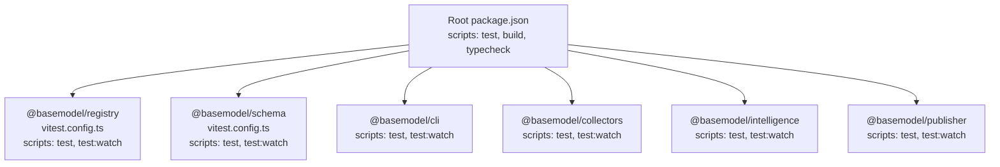
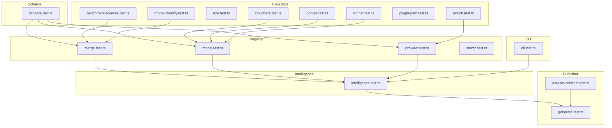
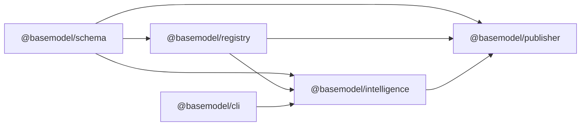

# Testing Framework & Practices

<cite>
**Referenced Files in This Document**
- [package.json](file://package.json)
- [packages/registry/package.json](file://packages/registry/package.json)
- [packages/schema/package.json](file://packages/schema/package.json)
- [packages/cli/package.json](file://packages/cli/package.json)
- [packages/collectors/package.json](file://packages/collectors/package.json)
- [packages/intelligence/package.json](file://packages/intelligence/package.json)
- [packages/publisher/package.json](file://packages/publisher/package.json)
- [packages/registry/vitest.config.ts](file://packages/registry/vitest.config.ts)
- [packages/schema/vitest.config.ts](file://packages/schema/vitest.config.ts)
- [packages/registry/src/__tests__/merge.test.ts](file://packages/registry/src/__tests__/merge.test.ts)
- [packages/registry/src/__tests__/model.test.ts](file://packages/registry/src/__tests__/model.test.ts)
- [packages/registry/src/__tests__/provider.test.ts](file://packages/registry/src/__tests__/provider.test.ts)
- [packages/registry/src/__tests__/stamp.test.ts](file://packages/registry/src/__tests__/stamp.test.ts)
- [packages/schema/src/__tests__/schema.test.ts](file://packages/schema/src/__tests__/schema.test.ts)
- [packages/cli/src/__tests__/cli.test.ts](file://packages/cli/src/__tests__/cli.test.ts)
- [packages/collectors/src/__tests__/benchmark-sources.test.ts](file://packages/collectors/src/__tests__/benchmark-sources.test.ts)
- [packages/collectors/src/__tests__/cloudflare.test.ts](file://packages/collectors/src/__tests__/cloudflare.test.ts)
- [packages/collectors/src/__tests__/e2e.test.ts](file://packages/collectors/src/__tests__/e2e.test.ts)
- [packages/collectors/src/__tests__/enrich.test.ts](file://packages/collectors/src/__tests__/enrich.test.ts)
- [packages/collectors/src/__tests__/google.test.ts](file://packages/collectors/src/__tests__/google.test.ts)
- [packages/collectors/src/__tests__/model-classify.test.ts](file://packages/collectors/src/__tests__/model-classify.test.ts)
- [packages/collectors/src/__tests__/plugin-path.test.ts](file://packages/collectors/src/__tests__/plugin-path.test.ts)
- [packages/collectors/src/__tests__/runner.test.ts](file://packages/collectors/src/__tests__/runner.test.ts)
- [packages/intelligence/src/__tests__/intelligence.test.ts](file://packages/intelligence/src/__tests__/intelligence.test.ts)
- [packages/publisher/src/__tests__/dataset-contract.test.ts](file://packages/publisher/src/__tests__/dataset-contract.test.ts)
- [packages/publisher/src/__tests__/generate.test.ts](file://packages/publisher/src/__tests__/generate.test.ts)
</cite>

## Table of Contents
1. Introduction
2. Project Structure
3. Core Components
4. Architecture Overview
5. Detailed Component Analysis
6. Dependency Analysis
7. Performance Considerations
8. Troubleshooting Guide
9. Conclusion
10. Appendices

## Introduction
This document explains the testing framework and practices used across the BaseModel monorepo. It covers Vitest configuration, test file organization, and patterns for unit, integration, and end-to-end tests. It also provides guidance on mocking strategies, test data management, utilities, coverage requirements, performance testing approaches, debugging techniques, and examples of well-structured tests for schema validation, registry operations, collector implementations, and intelligence algorithms.

## Project Structure
The repository is a pnpm workspace with multiple packages. Each package defines its own test scripts using Vitest and keeps tests co-located next to source code under src/__tests__. Some packages include per-package Vitest configurations; others rely on defaults or shared settings.

**Diagram sources**
- [package.json:17-25](file://package.json#L17-L25)
- [packages/registry/package.json:15-21](file://packages/registry/package.json#L15-L21)
- [packages/schema/package.json:31-36](file://packages/schema/package.json#L31-L36)
- [packages/cli/package.json:25-31](file://packages/cli/package.json#L25-L31)
- [packages/collectors/package.json:15-24](file://packages/collectors/package.json#L15-L24)
- [packages/intelligence/package.json:31-36](file://packages/intelligence/package.json#L31-L36)
- [packages/publisher/package.json:15-21](file://packages/publisher/package.json#L15-L21)

**Section sources**
- [package.json:17-25](file://package.json#L17-L25)
- [packages/registry/package.json:15-21](file://packages/registry/package.json#L15-L21)
- [packages/schema/package.json:31-36](file://packages/schema/package.json#L31-L36)
- [packages/cli/package.json:25-31](file://packages/cli/package.json#L25-L31)
- [packages/collectors/package.json:15-24](file://packages/collectors/package.json#L15-L24)
- [packages/intelligence/package.json:31-36](file://packages/intelligence/package.json#L31-L36)
- [packages/publisher/package.json:15-21](file://packages/publisher/package.json#L15-L21)

## Core Components
- Test runner: Vitest is used consistently across packages.
- Configuration: Per-package vitest.config.ts files enable globals where needed.
- Scripts: Each package exposes test and test:watch scripts; root script runs tests across all packages.
- Organization: Tests are colocated under src/__tests__ within each package.

Key observations:
- Global test APIs (describe, it, expect) are enabled via globals: true in some packages’ Vitest configs.
- Some packages pass --passWithNoTests to avoid failing when no tests exist.

**Section sources**
- [packages/registry/vitest.config.ts:1-8](file://packages/registry/vitest.config.ts#L1-L8)
- [packages/schema/vitest.config.ts:1-8](file://packages/schema/vitest.config.ts#L1-L8)
- [packages/registry/package.json:15-21](file://packages/registry/package.json#L15-L21)
- [packages/schema/package.json:31-36](file://packages/schema/package.json#L31-L36)
- [packages/cli/package.json:25-31](file://packages/cli/package.json#L25-L31)
- [packages/collectors/package.json:15-24](file://packages/collectors/package.json#L15-L24)
- [packages/intelligence/package.json:31-36](file://packages/intelligence/package.json#L31-L36)
- [packages/publisher/package.json:15-21](file://packages/publisher/package.json#L15-L21)

## Architecture Overview
Testing architecture follows a layered approach aligned with package responsibilities:
- Schema layer: Unit tests validate Zod schemas and types.
- Registry layer: Unit tests cover merge logic, model/provider handling, and stamping.
- Collectors layer: Unit and integration tests for provider-specific collectors, enrichment, benchmark sources, and an E2E scenario.
- Intelligence layer: Unit tests for ranking/recommendation algorithms.
- Publisher layer: Contract and generation tests for dataset outputs.
- CLI layer: Command behavior tests.

[No sources needed since this diagram shows conceptual workflow, not actual code structure]

## Detailed Component Analysis

### Vitest Configuration and Setup
- Globals: Enabled in registry and schema packages to use describe/it/expect without imports.
- Scripts: Each package uses vitest run and vitest for watch mode; some add --passWithNoTests.
- Workspace execution: The root test script orchestrates running tests across all packages.

Recommendations:
- Keep vitest.config.ts minimal and consistent across packages.
- Use environment variables for toggling network-dependent tests.
- Centralize common setup/teardown in a shared helper if needed.

**Section sources**
- [packages/registry/vitest.config.ts:1-8](file://packages/registry/vitest.config.ts#L1-L8)
- [packages/schema/vitest.config.ts:1-8](file://packages/schema/vitest.config.ts#L1-L8)
- [package.json:17-25](file://package.json#L17-L25)
- [packages/registry/package.json:15-21](file://packages/registry/package.json#L15-L21)
- [packages/schema/package.json:31-36](file://packages/schema/package.json#L31-L36)
- [packages/cli/package.json:25-31](file://packages/cli/package.json#L25-L31)
- [packages/collectors/package.json:15-24](file://packages/collectors/package.json#L15-L24)
- [packages/intelligence/package.json:31-36](file://packages/intelligence/package.json#L31-L36)
- [packages/publisher/package.json:15-21](file://packages/publisher/package.json#L15-L21)

### Test File Organization and Patterns
- Colocation: All tests live under src/__tests__ within their respective packages.
- Naming: *.test.ts suffix for discoverability by Vitest.
- Scope: Unit tests focus on pure functions and deterministic behavior; integration tests exercise interactions between modules; e2e tests simulate real-world flows.

Examples by package:
- Schema: schema.test.ts validates input/output contracts.
- Registry: merge.test.ts, model.test.ts, provider.test.ts, stamp.test.ts verify normalization and storage logic.
- Collectors: Multiple provider-focused tests plus enrich, benchmark, plugin path, runner, and e2e scenarios.
- Intelligence: intelligence.test.ts exercises ranking and recommendation logic.
- Publisher: dataset-contract.test.ts and generate.test.ts ensure output integrity.
- CLI: cli.test.ts verifies command behavior.

**Section sources**
- [packages/schema/src/__tests__/schema.test.ts](file://packages/schema/src/__tests__/schema.test.ts)
- [packages/registry/src/__tests__/merge.test.ts](file://packages/registry/src/__tests__/merge.test.ts)
- [packages/registry/src/__tests__/model.test.ts](file://packages/registry/src/__tests__/model.test.ts)
- [packages/registry/src/__tests__/provider.test.ts](file://packages/registry/src/__tests__/provider.test.ts)
- [packages/registry/src/__tests__/stamp.test.ts](file://packages/registry/src/__tests__/stamp.test.ts)
- [packages/collectors/src/__tests__/benchmark-sources.test.ts](file://packages/collectors/src/__tests__/benchmark-sources.test.ts)
- [packages/collectors/src/__tests__/cloudflare.test.ts](file://packages/collectors/src/__tests__/cloudflare.test.ts)
- [packages/collectors/src/__tests__/e2e.test.ts](file://packages/collectors/src/__tests__/e2e.test.ts)
- [packages/collectors/src/__tests__/enrich.test.ts](file://packages/collectors/src/__tests__/enrich.test.ts)
- [packages/collectors/src/__tests__/google.test.ts](file://packages/collectors/src/__tests__/google.test.ts)
- [packages/collectors/src/__tests__/model-classify.test.ts](file://packages/collectors/src/__tests__/model-classify.test.ts)
- [packages/collectors/src/__tests__/plugin-path.test.ts](file://packages/collectors/src/__tests__/plugin-path.test.ts)
- [packages/collectors/src/__tests__/runner.test.ts](file://packages/collectors/src/__tests__/runner.test.ts)
- [packages/intelligence/src/__tests__/intelligence.test.ts](file://packages/intelligence/src/__tests__/intelligence.test.ts)
- [packages/publisher/src/__tests__/dataset-contract.test.ts](file://packages/publisher/src/__tests__/dataset-contract.test.ts)
- [packages/publisher/src/__tests__/generate.test.ts](file://packages/publisher/src/__tests__/generate.test.ts)
- [packages/cli/src/__tests__/cli.test.ts](file://packages/cli/src/__tests__/cli.test.ts)

### Writing Unit Tests
Guidelines:
- Isolate behavior: Mock external dependencies (network, filesystem).
- Deterministic inputs: Provide explicit fixtures or factories for test data.
- Assertions: Validate both success paths and error cases.
- Readability: Group related assertions with descriptive test names.

Patterns observed:
- Schema validation tests assert valid and invalid payloads against Zod schemas.
- Registry tests assert normalized structures and merge outcomes.
- Collector tests isolate provider-specific parsing and transformation.
- Intelligence tests assert ranking scores and ordering stability.
- Publisher tests assert generated datasets conform to contracts.

**Section sources**
- [packages/schema/src/__tests__/schema.test.ts](file://packages/schema/src/__tests__/schema.test.ts)
- [packages/registry/src/__tests__/merge.test.ts](file://packages/registry/src/__tests__/merge.test.ts)
- [packages/registry/src/__tests__/model.test.ts](file://packages/registry/src/__tests__/model.test.ts)
- [packages/registry/src/__tests__/provider.test.ts](file://packages/registry/src/__tests__/provider.test.ts)
- [packages/registry/src/__tests__/stamp.test.ts](file://packages/registry/src/__tests__/stamp.test.ts)
- [packages/intelligence/src/__tests__/intelligence.test.ts](file://packages/intelligence/src/__tests__/intelligence.test.ts)
- [packages/publisher/src/__tests__/dataset-contract.test.ts](file://packages/publisher/src/__tests__/dataset-contract.test.ts)
- [packages/publisher/src/__tests__/generate.test.ts](file://packages/publisher/src/__tests__/generate.test.ts)

### Writing Integration Tests
Guidelines:
- Combine multiple modules to validate cross-cutting behavior.
- Use lightweight mocks for external services.
- Ensure tests are repeatable and fast.

Observed integrations:
- Collectors integrate with registry to normalize and store discovered models.
- Intelligence integrates with registry to compute rankings from canonical data.
- Publisher integrates with registry and intelligence to generate datasets.

**Section sources**
- [packages/collectors/src/__tests__/enrich.test.ts](file://packages/collectors/src/__tests__/enrich.test.ts)
- [packages/collectors/src/__tests__/runner.test.ts](file://packages/collectors/src/__tests__/runner.test.ts)
- [packages/intelligence/src/__tests__/intelligence.test.ts](file://packages/intelligence/src/__tests__/intelligence.test.ts)
- [packages/publisher/src/__tests__/generate.test.ts](file://packages/publisher/src/__tests__/generate.test.ts)

### Writing End-to-End Tests
Guidelines:
- Simulate realistic workflows with minimal stubs.
- Mark network-bound tests clearly and gate them behind flags.
- Use stable fixtures and seed data.

Observed example:
- collectors/e2e.test.ts demonstrates an end-to-end flow typical of collection and enrichment.

**Section sources**
- [packages/collectors/src/__tests__/e2e.test.ts](file://packages/collectors/src/__tests__/e2e.test.ts)

### Mocking Strategies
Recommended approaches:
- Network calls: Stub fetch or HTTP clients; return deterministic responses.
- Filesystem: Use in-memory filesystem or mock fs methods for IO-heavy tests.
- External services: Replace with local adapters that return predefined fixtures.
- Time-sensitive logic: Freeze time or mock timers for deterministic results.

Best practices:
- Keep mocks close to the tested module.
- Prefer factory functions for building complex test objects.
- Avoid over-mocking; only replace unstable or slow dependencies.

[No sources needed since this section provides general guidance]

### Test Data Management
Guidelines:
- Store fixtures near the tests that consume them.
- Use small, focused fixtures for single scenarios.
- Version control fixtures alongside tests to ensure reproducibility.
- For large datasets, reference read-only JSON files under a dedicated fixtures directory.

Observed usage:
- Registry and collectors tests likely rely on JSON fixtures for model/provider definitions.
- Publisher tests validate generated outputs against expected contracts.

**Section sources**
- [packages/registry/src/__tests__/model.test.ts](file://packages/registry/src/__tests__/model.test.ts)
- [packages/registry/src/__tests__/provider.test.ts](file://packages/registry/src/__tests__/provider.test.ts)
- [packages/collectors/src/__tests__/benchmark-sources.test.ts](file://packages/collectors/src/__tests__/benchmark-sources.test.ts)
- [packages/publisher/src/__tests__/dataset-contract.test.ts](file://packages/publisher/src/__tests__/dataset-contract.test.ts)

### Testing Utilities
Recommendations:
- Create shared helpers for common assertions, fixture builders, and environment setup.
- Centralize test-time configuration (e.g., timeouts, retries).
- Provide utility functions to construct valid model/provider payloads.

[No sources needed since this section provides general guidance]

### Testing Schema Validation
Focus areas:
- Valid payloads pass schema checks.
- Invalid payloads fail with meaningful errors.
- Edge cases like missing fields, wrong types, and boundary values are covered.

Example test locations:
- Schema validation tests reside in schema.test.ts.

**Section sources**
- [packages/schema/src/__tests__/schema.test.ts](file://packages/schema/src/__tests__/schema.test.ts)

### Testing Registry Operations
Focus areas:
- Merge correctness and conflict resolution.
- Model and provider normalization.
- Stamp generation and consistency.

Example test locations:
- merge.test.ts, model.test.ts, provider.test.ts, stamp.test.ts.

**Section sources**
- [packages/registry/src/__tests__/merge.test.ts](file://packages/registry/src/__tests__/merge.test.ts)
- [packages/registry/src/__tests__/model.test.ts](file://packages/registry/src/__tests__/model.test.ts)
- [packages/registry/src/__tests__/provider.test.ts](file://packages/registry/src/__tests__/provider.test.ts)
- [packages/registry/src/__tests__/stamp.test.ts](file://packages/registry/src/__tests__/stamp.test.ts)

### Testing Collector Implementations
Focus areas:
- Provider-specific parsing and transformation.
- Enrichment pipelines.
- Benchmark sources processing.
- Plugin path resolution and runner orchestration.
- E2E collection flows.

Example test locations:
- cloudflare.test.ts, google.test.ts, enrich.test.ts, benchmark-sources.test.ts, plugin-path.test.ts, runner.test.ts, e2e.test.ts, model-classify.test.ts.

**Section sources**
- [packages/collectors/src/__tests__/cloudflare.test.ts](file://packages/collectors/src/__tests__/cloudflare.test.ts)
- [packages/collectors/src/__tests__/google.test.ts](file://packages/collectors/src/__tests__/google.test.ts)
- [packages/collectors/src/__tests__/enrich.test.ts](file://packages/collectors/src/__tests__/enrich.test.ts)
- [packages/collectors/src/__tests__/benchmark-sources.test.ts](file://packages/collectors/src/__tests__/benchmark-sources.test.ts)
- [packages/collectors/src/__tests__/plugin-path.test.ts](file://packages/collectors/src/__tests__/plugin-path.test.ts)
- [packages/collectors/src/__tests__/runner.test.ts](file://packages/collectors/src/__tests__/runner.test.ts)
- [packages/collectors/src/__tests__/e2e.test.ts](file://packages/collectors/src/__tests__/e2e.test.ts)
- [packages/collectors/src/__tests__/model-classify.test.ts](file://packages/collectors/src/__tests__/model-classify.test.ts)

### Testing Intelligence Algorithms
Focus areas:
- Ranking computations and tie-breaking rules.
- Recommendations based on registry data.
- Stability and determinism of outputs.

Example test location:
- intelligence.test.ts.

**Section sources**
- [packages/intelligence/src/__tests__/intelligence.test.ts](file://packages/intelligence/src/__tests__/intelligence.test.ts)

### Testing Publisher Outputs
Focus areas:
- Dataset contract conformance.
- Generation pipeline correctness.

Example test locations:
- dataset-contract.test.ts, generate.test.ts.

**Section sources**
- [packages/publisher/src/__tests__/dataset-contract.test.ts](file://packages/publisher/src/__tests__/dataset-contract.test.ts)
- [packages/publisher/src/__tests__/generate.test.ts](file://packages/publisher/src/__tests__/generate.test.ts)

### Testing CLI Behavior
Focus areas:
- Command-line argument parsing.
- Output formatting and exit codes.

Example test location:
- cli.test.ts.

**Section sources**
- [packages/cli/src/__tests__/cli.test.ts](file://packages/cli/src/__tests__/cli.test.ts)

## Dependency Analysis
Vitest is a dev dependency across packages. Workspace dependencies link schema, registry, intelligence, and publisher together. Tests should reflect these relationships by importing from workspace packages and isolating external side effects.

**Diagram sources**
- [packages/schema/package.json:38-46](file://packages/schema/package.json#L38-L46)
- [packages/registry/package.json:22-32](file://packages/registry/package.json#L22-L32)
- [packages/intelligence/package.json:38-47](file://packages/intelligence/package.json#L38-L47)
- [packages/publisher/package.json:23-35](file://packages/publisher/package.json#L23-L35)
- [packages/cli/package.json:33-43](file://packages/cli/package.json#L33-L43)

**Section sources**
- [packages/schema/package.json:38-46](file://packages/schema/package.json#L38-L46)
- [packages/registry/package.json:22-32](file://packages/registry/package.json#L22-L32)
- [packages/intelligence/package.json:38-47](file://packages/intelligence/package.json#L38-L47)
- [packages/publisher/package.json:23-35](file://packages/publisher/package.json#L23-L35)
- [packages/cli/package.json:33-43](file://packages/cli/package.json#L33-L43)

## Performance Considerations
- Keep unit tests fast and deterministic; avoid network calls.
- Use --run for CI to prevent watch mode overhead.
- Parallelize independent suites; limit concurrency if flaky.
- Profile slow tests with Vitest’s built-in profiling or Node.js profilers.
- Cache expensive fixtures and avoid re-parsing large JSON files per test.

[No sources needed since this section provides general guidance]

## Troubleshooting Guide
Common issues and resolutions:
- Missing globals: Ensure vitest.config.ts sets globals: true or import describe/it/expect explicitly.
- No tests found: Add --passWithNoTests or create at least one test file.
- Flaky network tests: Gate with environment flags and mock HTTP calls.
- Type errors in tests: Run typecheck before running tests to catch mismatches early.
- Slow tests: Identify bottlenecks and split suites; reduce heavy IO.

Debugging tips:
- Use vitest --reporter=verbose for detailed logs.
- Narrow scope with pattern matching to run specific files or suites.
- Inspect snapshots or diffs for assertion failures.
- Add structured logging around critical paths during investigation.

**Section sources**
- [packages/registry/vitest.config.ts:1-8](file://packages/registry/vitest.config.ts#L1-L8)
- [packages/schema/vitest.config.ts:1-8](file://packages/schema/vitest.config.ts#L1-L8)
- [packages/cli/package.json:25-31](file://packages/cli/package.json#L25-L31)
- [packages/collectors/package.json:15-24](file://packages/collectors/package.json#L15-L24)
- [packages/intelligence/package.json:31-36](file://packages/intelligence/package.json#L31-L36)
- [packages/publisher/package.json:15-21](file://packages/publisher/package.json#L15-L21)

## Conclusion
BaseModel’s testing strategy leverages Vitest across a modular monorepo with clear separation of concerns. Tests are colocated with source code, organized by package, and follow consistent patterns for unit, integration, and end-to-end scenarios. By adhering to the guidelines here—mocking externalities, managing fixtures, validating schemas, and ensuring deterministic outputs—you can maintain high confidence in schema validation, registry operations, collector implementations, and intelligence algorithms while keeping tests fast and reliable.

## Appendices

### Example Test Scenarios
- Schema validation: Assert valid and invalid payloads against Zod schemas.
- Registry merge: Verify merging rules and conflict resolution.
- Provider normalization: Ensure provider metadata is normalized consistently.
- Stamp generation: Confirm stamps are reproducible and unique.
- Collector enrichment: Validate enrichment steps transform data correctly.
- Intelligence ranking: Check ranking stability and score calculations.
- Publisher contract: Ensure generated datasets match expected contracts.
- CLI commands: Verify argument parsing and output formats.

[No sources needed since this section provides general guidance]