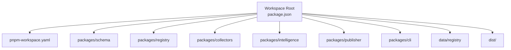
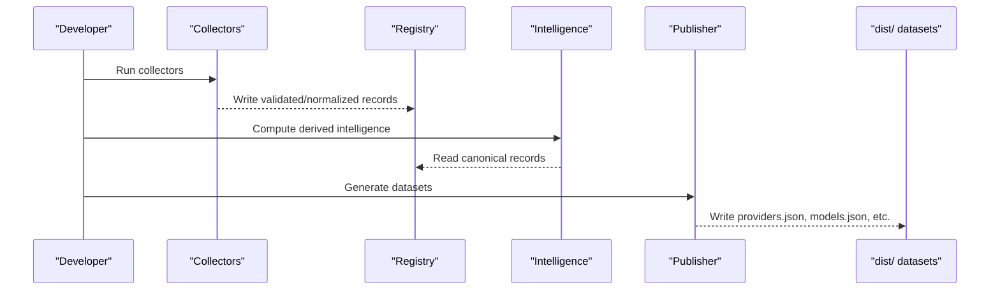
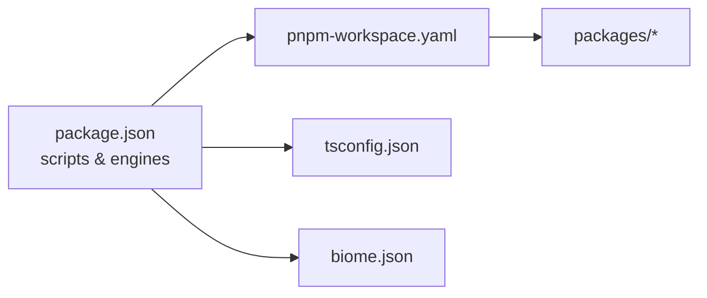

# Getting Started

<cite>
**Referenced Files in This Document**
- [README.md](file://README.md)
- [package.json](file://package.json)
- [pnpm-workspace.yaml](file://pnpm-workspace.yaml)
- [tsconfig.json](file://tsconfig.json)
- [biome.json](file://biome.json)
- [CONTRIBUTING.md](file://CONTRIBUTING.md)
- [03_Architecture.md](file://docs/03_Architecture.md)
- [04_Pipeline.md](file://docs/04_Pipeline.md)
- [07_Developer_Access.md](file://docs/07_Developer_Access.md)
</cite>

## Table of Contents
1. [Introduction](#introduction)
2. [Project Structure](#project-structure)
3. [Core Components](#core-components)
4. [Architecture Overview](#architecture-overview)
5. [Detailed Component Analysis](#detailed-component-analysis)
6. [Dependency Analysis](#dependency-analysis)
7. [Performance Considerations](#performance-considerations)
8. [Troubleshooting Guide](#troubleshooting-guide)
9. [Conclusion](#conclusion)

## Introduction
BaseModel is an open-source AI model intelligence platform that discovers, validates, normalizes, stores, analyzes, and publishes structured knowledge about AI models. It is not an inference runtime or chatbot; it provides the data layer consumed by other systems.

This guide helps you set up the development environment with pnpm, run collectors, verify provider integrations, and access generated datasets quickly.

## Project Structure
The repository is a pnpm workspace containing several packages:
- schema: Canonical Zod schemas and TypeScript types
- registry: Registry storage, validation, and merge utilities
- collectors: Provider and gateway collectors
- intelligence: Derived rankings, search, and recommendations
- publisher: Dataset generation for dist/
- cli: Command-line interface for querying intelligence

Canonical records live under data/registry/. Generated datasets are written to dist/ and include providers.json, models.json, capabilities.json, licenses.json, apis.json, benchmarks.json, pricing.json, intelligence.json, and metadata.json.

**Diagram sources**
- [package.json:1-31](file://package.json#L1-L31)
- [pnpm-workspace.yaml:1-3](file://pnpm-workspace.yaml#L1-L3)

**Section sources**
- [README.md:10-30](file://README.md#L10-L30)
- [package.json:1-31](file://package.json#L1-L31)
- [pnpm-workspace.yaml:1-3](file://pnpm-workspace.yaml#L1-L3)

## Core Components
- Discovery Layer (collectors): Finds and collects data from provider sites, catalogs, and documentation.
- Registry Layer (registry): Stores canonical records after validation and normalization.
- Intelligence Layer (intelligence): Derives search, alternatives, and cost information without modifying canonical records.
- Publishing Layer (publisher): Converts registry and intelligence data into public JSON datasets under dist/.

These layers map directly to packages and pipeline stages as described in the architecture and pipeline docs.

**Section sources**
- [03_Architecture.md:1-77](file://docs/03_Architecture.md#L1-L77)
- [04_Pipeline.md:1-85](file://docs/04_Pipeline.md#L1-L85)

## Architecture Overview
High-level flow from discovery to publication:

**Diagram sources**
- [03_Architecture.md:1-77](file://docs/03_Architecture.md#L1-L77)
- [04_Pipeline.md:1-85](file://docs/04_Pipeline.md#L1-L85)

## Detailed Component Analysis

### Installation and Environment Setup
- Node.js: Use Node.js 20 or newer.
- pnpm: Use pnpm 9 or newer. The workspace specifies a pinned packageManager version.
- Workspace configuration: pnpm-workspace.yaml includes all packages under packages/*.

Essential commands:
- Install dependencies: pnpm install
- Build all packages: pnpm build
- Type-check across workspace: pnpm typecheck
- Lint and format: pnpm lint / pnpm format
- Test suite: pnpm test
- Generate datasets: pnpm generate

TypeScript settings target ES2022 with strict mode and modern module resolution.

**Section sources**
- [package.json:12-16](file://package.json#L12-L16)
- [package.json:17-26](file://package.json#L17-L26)
- [pnpm-workspace.yaml:1-3](file://pnpm-workspace.yaml#L1-L3)
- [tsconfig.json:1-27](file://tsconfig.json#L1-L27)
- [biome.json:1-50](file://biome.json#L1-L50)
- [CONTRIBUTING.md:6-17](file://CONTRIBUTING.md#L6-L17)

### Quick Start Examples

#### Run collectors
Use the collectors package to discover and collect data from providers/gateways:
- Example command: pnpm --filter @basemodel/collectors run collect

#### Verify provider integrations
Validate a specific collector implementation:
- Example command: pnpm --filter @basemodel/collectors run verify packages/collectors/src/gateways/openai.ts

#### Access generated datasets
After running the generator, read static JSON files from dist/:
- Key outputs: providers.json, models.json, capabilities.json, licenses.json, apis.json, benchmarks.json, pricing.json, intelligence.json, metadata.json

For programmatic consumption, use the published npm packages or fetch dist/ files directly.

**Section sources**
- [README.md:42-57](file://README.md#L42-L57)
- [04_Pipeline.md:64-85](file://docs/04_Pipeline.md#L64-L85)
- [07_Developer_Access.md:80-103](file://docs/07_Developer_Access.md#L80-L103)

### Development Workflow
Recommended daily workflow:
1. Install dependencies: pnpm install
2. Build: pnpm build
3. Lint and type-check: pnpm lint && pnpm typecheck
4. Run tests: pnpm test
5. Regenerate datasets: pnpm generate

When changing behavior:
- Update schemas in packages/schema if data shape changes
- Update registry logic in packages/registry if record handling changes
- Update collectors in packages/collectors if provider/gateway inputs change
- Update publisher in packages/publisher if dataset outputs change
- Keep docs in sync

**Section sources**
- [CONTRIBUTING.md:12-34](file://CONTRIBUTING.md#L12-L34)
- [README.md:42-51](file://README.md#L42-L51)

### Using the CLI and SDKs
- CLI usage: basemodel search/info/alternatives with filters like --provider, --modality, --flag, --min-context
- SDK usage: Import @basemodel/schema and @basemodel/intelligence to parse records and compute intelligence locally or hydrate in browser-like environments

**Section sources**
- [07_Developer_Access.md:1-56](file://docs/07_Developer_Access.md#L1-L56)
- [07_Developer_Access.md:63-79](file://docs/07_Developer_Access.md#L63-L79)

## Dependency Analysis
Workspace and tooling dependencies:
- Package manager: pnpm@10.12.1 (pinned via packageManager)
- Runtime engines: node >=20.0.0, pnpm >=9.0.0
- Linting/formatting: Biome configured via biome.json
- TypeScript: ES2022 target, strict mode, bundler module resolution

**Diagram sources**
- [package.json:12-26](file://package.json#L12-L26)
- [pnpm-workspace.yaml:1-3](file://pnpm-workspace.yaml#L1-L3)
- [tsconfig.json:1-27](file://tsconfig.json#L1-L27)
- [biome.json:1-50](file://biome.json#L1-L50)

**Section sources**
- [package.json:12-26](file://package.json#L12-L26)
- [pnpm-workspace.yaml:1-3](file://pnpm-workspace.yaml#L1-L3)
- [tsconfig.json:1-27](file://tsconfig.json#L1-L27)
- [biome.json:1-50](file://biome.json#L1-50)

## Performance Considerations
- Prefer running pnpm build once before iterative development to avoid repeated transpilation.
- Use pnpm --filter to scope operations to specific packages when working on collectors or publisher.
- For large dataset regeneration, ensure sufficient disk space for dist/ outputs.
- When fetching external benchmark/pricing sources, consider rate limits; optional tokens can improve throughput.

[No sources needed since this section provides general guidance]

## Troubleshooting Guide
Common setup issues and resolutions:
- Node.js or pnpm version mismatch: Ensure Node.js >=20 and pnpm >=9. The workspace enforces these via engines and packageManager.
- Missing dependencies: Re-run pnpm install at the workspace root.
- Build failures: Check TypeScript errors with pnpm typecheck and fix strict-mode violations.
- Lint/format issues: Run pnpm lint and pnpm format to auto-fix where possible.
- Collector verification fails: Confirm the collector path exists and secrets are configured per gateway requirements.
- Dataset generation errors: Review logs during pnpm generate; invalid records are isolated and valid ones continue through the pipeline.

Useful references:
- Workspace scripts and commands: README.md and CONTRIBUTING.md
- Pipeline behavior and failure handling: docs/04_Pipeline.md
- Developer access patterns and direct JSON consumption: docs/07_Developer_Access.md

**Section sources**
- [package.json:12-16](file://package.json#L12-L16)
- [README.md:42-57](file://README.md#L42-L57)
- [CONTRIBUTING.md:19-24](file://CONTRIBUTING.md#L19-L24)
- [04_Pipeline.md:86-92](file://docs/04_Pipeline.md#L86-L92)
- [07_Developer_Access.md:80-103](file://docs/07_Developer_Access.md#L80-L103)

## Conclusion
You now have the essentials to set up BaseModel with pnpm, run collectors, verify provider integrations, and consume generated datasets. For deeper understanding, explore the architecture and pipeline documents, and use the CLI and SDKs to integrate BaseModel intelligence into your applications.

[No sources needed since this section summarizes without analyzing specific files]