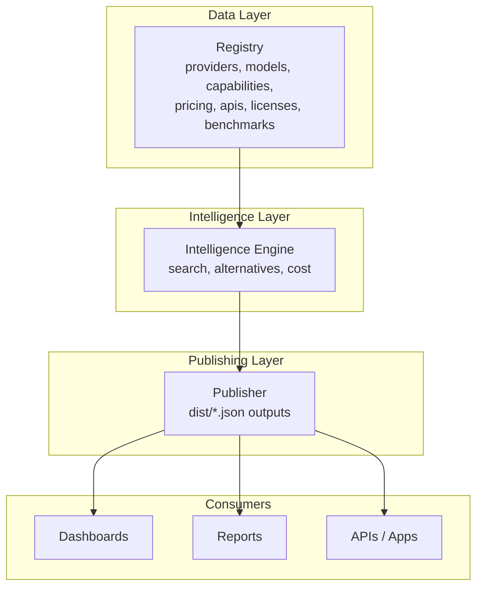
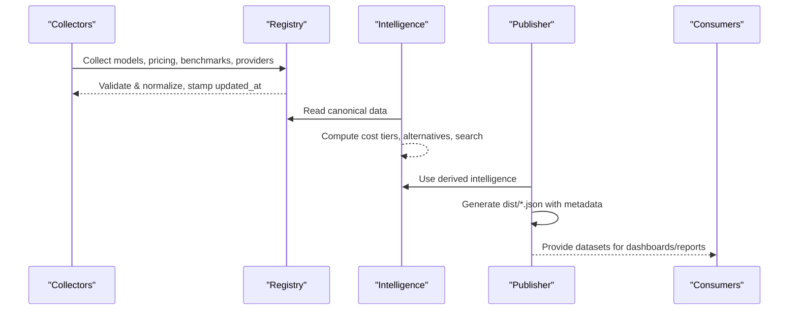
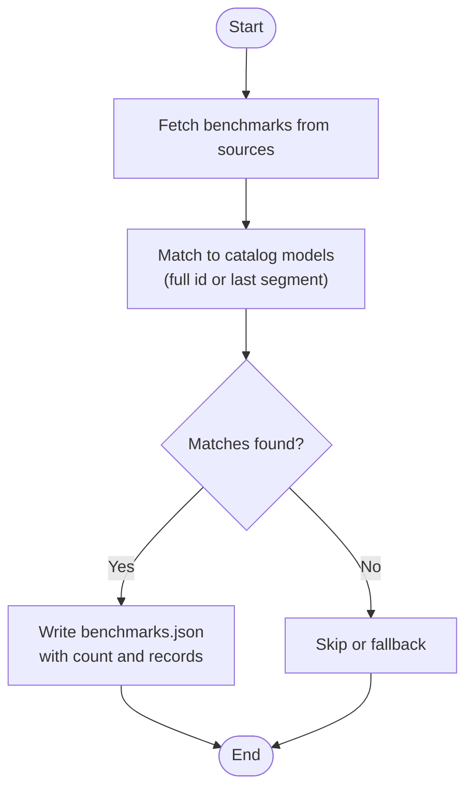
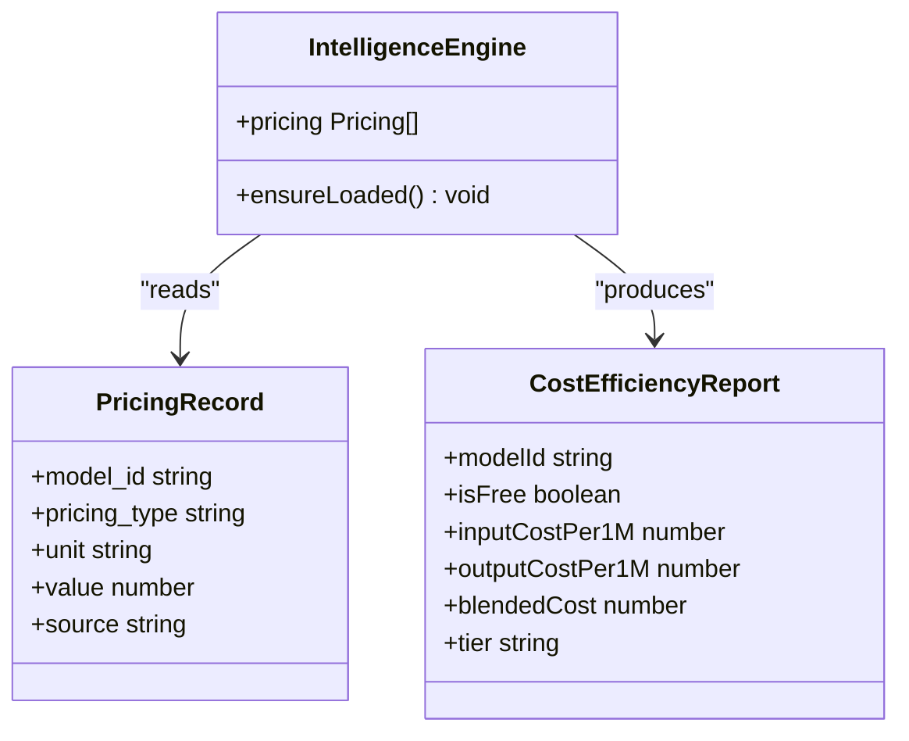
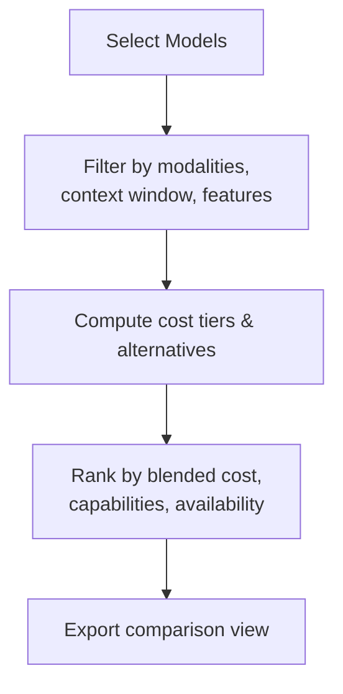
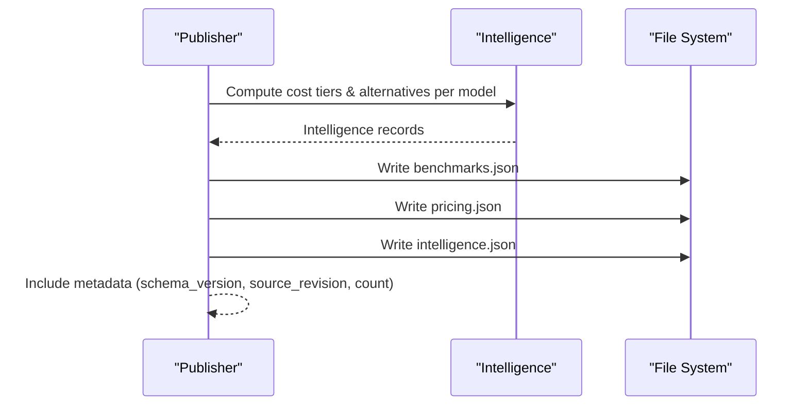
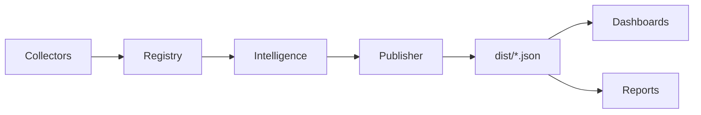

# Analytics & Metrics

<cite>
**Referenced Files in This Document**
- [README.md](file://README.md)
- [03_Architecture.md](file://docs/03_Architecture.md)
- [04_Pipeline.md](file://docs/04_Pipeline.md)
- [05_Data_Model.md](file://docs/05_Data_Model.md)
- [generate.ts](file://packages/publisher/src/generate.ts)
- [cost.ts](file://packages/intelligence/src/features/cost.ts)
- [index.ts (registry)](file://packages/registry/src/index.ts)
- [runner.ts](file://packages/collectors/src/core/runner.ts)
- [collect.yml](file://.github/workflows/collect.yml)
</cite>

## Table of Contents
1. Introduction
2. Project Structure
3. Core Components
4. Architecture Overview
5. Detailed Component Analysis
6. Dependency Analysis
7. Performance Considerations
8. Troubleshooting Guide
9. Conclusion
10. Appendices

## Introduction
This document explains BaseModel’s analytics and metrics system that provides insights into model performance, market trends, and ecosystem health. It covers how the system collects and aggregates data from benchmarks, pricing changes, usage patterns, and provider updates; how it performs trend analysis over time; how comparative analytics enable side-by-side evaluation across dimensions; and how reporting capabilities generate insights about market share, adoption rates, and technology shifts. It also includes examples of analytical queries, dashboard visualizations, export formats, and guidance on data freshness, historical tracking, and statistical significance considerations.

BaseModel is a data layer for AI model intelligence: it discovers, validates, normalizes, stores, analyzes, and publishes structured knowledge about models. The analytics and metrics system builds on canonical registry data and derived intelligence to produce public datasets used by consumers such as dashboards, reports, and downstream applications.

[No sources needed since this section summarizes without analyzing specific files]

## Project Structure
The repository organizes functionality into packages that map to layers in the architecture: schema, registry, collectors, intelligence, publisher, and CLI. Canonical records live under data/registry/, and generated datasets are written to dist/. The analytics and metrics system primarily uses registry data (models, pricing, benchmarks, providers), derives intelligence (cost efficiency, alternatives, search), and publishes results as JSON artifacts.

**Diagram sources**
- [03_Architecture.md:1-77](file://docs/03_Architecture.md#L1-L77)
- [04_Pipeline.md:1-85](file://docs/04_Pipeline.md#L1-L85)

**Section sources**
- [README.md:1-61](file://README.md#L1-L61)
- [03_Architecture.md:1-77](file://docs/03_Architecture.md#L1-L77)
- [04_Pipeline.md:1-85](file://docs/04_Pipeline.md#L1-L85)

## Core Components
- Registry: Stores canonical entities (providers, models, capabilities, pricing, APIs, licenses, benchmarks). Provides read/write utilities and timestamps for freshness.
- Intelligence: Derives analytics such as cost efficiency tiers, alternative model suggestions, and search over registry data without modifying canonical records.
- Publisher: Generates public datasets (including benchmarks, pricing, intelligence) with metadata and counts for consumption.
- Collectors: Discover and collect data from gateways and external sources; enrich registry with pricing and lifecycle status; stamp updated_at timestamps.

Key responsibilities:
- Data collection and enrichment ensure up-to-date pricing and benchmark data.
- Validation and normalization guarantee schema compliance and consistent identifiers.
- Intelligence computes derived metrics for analytics and reporting.
- Publishing exposes stable, consumable JSON artifacts.

**Section sources**
- [03_Architecture.md:1-77](file://docs/03_Architecture.md#L1-L77)
- [04_Pipeline.md:16-85](file://docs/04_Pipeline.md#L16-L85)
- [index.ts (registry):124-168](file://packages/registry/src/index.ts#L124-L168)
- [cost.ts:31-114](file://packages/intelligence/src/features/cost.ts#L31-L114)
- [generate.ts:147-243](file://packages/publisher/src/generate.ts#L147-L243)
- [runner.ts:333-363](file://packages/collectors/src/core/runner.ts#L333-L363)

## Architecture Overview
The analytics pipeline flows from discovery and collection through validation, normalization, registry storage, intelligence derivation, and publishing. Consumers then use published datasets for dashboards, reports, and integrations.

**Diagram sources**
- [04_Pipeline.md:1-85](file://docs/04_Pipeline.md#L1-L85)
- [generate.ts:147-243](file://packages/publisher/src/generate.ts#L147-L243)
- [index.ts (registry):124-168](file://packages/registry/src/index.ts#L124-L168)

**Section sources**
- [04_Pipeline.md:1-85](file://docs/04_Pipeline.md#L1-L85)

## Detailed Component Analysis

### Benchmark Analytics and Trend Tracking
Benchmarks are collected from multiple sources and reconciled against catalog models. The publisher writes a filtered set of benchmarks matched to catalog entries, enabling trend analysis of model performance over time.

**Diagram sources**
- [generate.ts:162-225](file://packages/publisher/src/generate.ts#L162-L225)

**Section sources**
- [generate.ts:162-225](file://packages/publisher/src/generate.ts#L162-L225)
- [04_Pipeline.md:93-126](file://docs/04_Pipeline.md#L93-L126)

### Pricing Analytics and Cost Efficiency
Cost efficiency is computed per model using normalized pricing records. The system selects the best provenance for input/output token costs, determines free vs paid models, and assigns tier classifications based on blended cost.

**Diagram sources**
- [cost.ts:31-114](file://packages/intelligence/src/features/cost.ts#L31-L114)

**Section sources**
- [cost.ts:31-114](file://packages/intelligence/src/features/cost.ts#L31-L114)
- [04_Pipeline.md:127-204](file://docs/04_Pipeline.md#L127-L204)

### Comparative Analytics Across Dimensions
Comparative analytics leverage registry fields (modality, context window, open weight, reasoning support, function calling, structured output, embedding support) and derived intelligence (alternatives, cost tiers) to evaluate models side-by-side. The intelligence engine supports filtering and ranking by these dimensions.

[No sources needed since this diagram shows conceptual workflow, not actual code structure]

**Section sources**
- [05_Data_Model.md:41-136](file://docs/05_Data_Model.md#L41-L136)
- [cost.ts:31-114](file://packages/intelligence/src/features/cost.ts#L31-L114)

### Reporting Capabilities and Export Formats
The publisher generates static JSON datasets including providers, models, capabilities, licenses, APIs, benchmarks, pricing, intelligence, and metadata. These exports include schema version, source revision, and counts, enabling consumers to build dashboards and reports.

**Diagram sources**
- [generate.ts:147-243](file://packages/publisher/src/generate.ts#L147-L243)

**Section sources**
- [generate.ts:147-243](file://packages/publisher/src/generate.ts#L147-L243)
- [04_Pipeline.md:64-85](file://docs/04_Pipeline.md#L64-L85)

### Data Freshness, Historical Tracking, and Statistical Significance
Freshness and provenance are critical for reliable analytics:
- updated_at stamps on Model, Pricing, and Provider records indicate last refresh time.
- generated_at timestamps on datasets mark run time.
- Provenance fields on pricing records identify source (openrouter, huggingface, gateway id).
- Lifecycle reconciliation marks models discontinued when absent from successful collections.

Statistical significance considerations:
- Benchmark scores should be interpreted with sample size and evaluation date context.
- Pricing fluctuations may reflect temporary promotions or rate limits; rely on multi-source aggregation and tier definitions.
- Comparative analyses should account for capability differences and modality constraints.

**Section sources**
- [index.ts (registry):35-41](file://packages/registry/src/index.ts#L35-L41)
- [runner.ts:333-363](file://packages/collectors/src/core/runner.ts#L333-L363)
- [04_Pipeline.md:163-217](file://docs/04_Pipeline.md#L163-L217)

## Dependency Analysis
The analytics system depends on registry data, intelligence computations, and publisher outputs. Collectors feed the registry with enriched pricing and benchmark data.

**Diagram sources**
- [03_Architecture.md:1-77](file://docs/03_Architecture.md#L1-L77)
- [04_Pipeline.md:1-85](file://docs/04_Pipeline.md#L1-L85)

**Section sources**
- [03_Architecture.md:1-77](file://docs/03_Architecture.md#L1-L77)
- [04_Pipeline.md:1-85](file://docs/04_Pipeline.md#L1-L85)

## Performance Considerations
- Batch operations: Reading all arrays from directories and writing atomic registry files reduce I/O overhead.
- Filtering at publish time: Benchmarks are filtered to catalog-matched entries to keep outputs lean.
- Source priority: Selecting highest-priority provenance avoids unnecessary computation and ensures consistency.
- Fallback mechanisms: Graceful degradation when external sources fail maintains throughput.

[No sources needed since this section provides general guidance]

## Troubleshooting Guide
Common issues and resolutions:
- Missing pricing records: Ensure enrichment runs successfully and verify source availability (OpenRouter, Hugging Face, provider catalogs).
- Stale data: Check updated_at timestamps on registry records and generated_at on datasets.
- Rate limiting: Configure optional tokens for benchmark sources to avoid fallbacks.
- Failed enrichment: Review meta.json for per-source status and errors; CI will exit non-zero if all primary sources fail.

**Section sources**
- [collect.yml:47-73](file://.github/workflows/collect.yml#L47-L73)
- [04_Pipeline.md:205-217](file://docs/04_Pipeline.md#L205-L217)

## Conclusion
BaseModel’s analytics and metrics system provides a robust foundation for understanding model performance, market trends, and ecosystem health. By aggregating benchmarks, pricing, and provider updates into a canonical registry, deriving intelligence, and publishing stable datasets, it enables comprehensive dashboards, reports, and integrations. Adhering to data freshness, provenance, and lifecycle management ensures reliable insights for decision-making.

[No sources needed since this section summarizes without analyzing specific files]

## Appendices

### Analytical Queries Examples
- Market share by provider: Group models by provider_id and count active models.
- Adoption rate over time: Track release_date distributions and status transitions.
- Technology shifts: Monitor modality and feature adoption (vision, audio, embeddings).
- Pricing trends: Analyze blended cost changes across time using updated_at and value fields.

[No sources needed since this section provides general guidance]

### Dashboard Visualizations
- Benchmark score trends: Line charts over evaluation_date per model.
- Pricing tier distribution: Bar charts showing Free, Budget-Friendly, Balanced, Premium.
- Capability adoption: Heatmaps of modality and feature presence across providers.
- Alternative model suggestions: Scatter plots comparing cost vs capabilities.

[No sources needed since this section provides general guidance]

### Export Formats
- JSON datasets: providers.json, models.json, capabilities.json, licenses.json, apis.json, benchmarks.json, pricing.json, intelligence.json, metadata.json.
- Metadata fields: schema_version, source_revision, count, generated_at.

**Section sources**
- [04_Pipeline.md:64-85](file://docs/04_Pipeline.md#L64-L85)
- [generate.ts:218-243](file://packages/publisher/src/generate.ts#L218-L243)