# Custom Intelligence Development

<cite>
**Referenced Files in This Document**
- [README.md](file://README.md)
- [03_Architecture.md](file://docs/03_Architecture.md)
- [04_Pipeline.md](file://docs/04_Pipeline.md)
- [07_Developer_Access.md](file://docs/07_Developer_Access.md)
- [08_Gateway_Plugin_Security.md](file://docs/08_Gateway_Plugin_Security.md)
- [engine.ts](file://packages/intelligence/src/core/engine.ts)
- [search.ts](file://packages/intelligence/src/features/search.ts)
- [alternatives.ts](file://packages/intelligence/src/features/alternatives.ts)
- [cost.ts](file://packages/intelligence/src/features/cost.ts)
- [intelligence.test.ts](file://packages/intelligence/src/__tests__/intelligence.test.ts)
- [package.json (intelligence)](file://packages/intelligence/package.json)
- [collector.ts](file://packages/collectors/src/core/collector.ts)
- [runner.ts](file://packages/collectors/src/core/runner.ts)
- [plugin-worker.ts](file://packages/collectors/src/core/plugin-worker.ts)
- [verify.ts](file://packages/collectors/src/core/verify.ts)
- [plugin-path.test.ts](file://packages/collectors/src/__tests__/plugin-path.test.ts)
</cite>

## Table of Contents
1. [Introduction](#introduction)
2. [Project Structure](#project-structure)
3. [Core Components](#core-components)
4. [Architecture Overview](#architecture-overview)
5. [Detailed Component Analysis](#detailed-component-analysis)
6. [Dependency Analysis](#dependency-analysis)
7. [Performance Considerations](#performance-considerations)
8. [Troubleshooting Guide](#troubleshooting-guide)
9. [Conclusion](#conclusion)
10. [Appendices](#appendices)

## Introduction
This document explains how to extend BaseModel’s intelligence capabilities through custom algorithms and plugins. It focuses on the extension points that allow developers to implement custom ranking algorithms, search enhancements, and recommendation logic. You will learn where to integrate custom intelligence modules, how to develop analyzers with schema validation and data access patterns, and how to test and deploy them. The guide also covers configuration for managing custom modules, deployment considerations, version compatibility, and performance optimization strategies.

BaseModel is a data layer that discovers, validates, normalizes, stores, analyzes, and publishes structured knowledge about AI models. It does not run inference or host models; instead, it provides canonical datasets and derived intelligence consumed by other systems.

**Section sources**
- [README.md:1-61](file://README.md#L1-L61)
- [03_Architecture.md:1-77](file://docs/03_Architecture.md#L1-L77)

## Project Structure
The repository is organized into packages that separate concerns:
- Schema: Canonical Zod schemas and TypeScript types.
- Registry: Storage, validation, and merge utilities for canonical records.
- Collectors: Provider and gateway collectors, including plugin execution boundaries.
- Intelligence: Derived rankings, search, and recommendations over registry data.
- Publisher: Dataset generation for dist/.
- CLI: Command-line interface for querying intelligence.

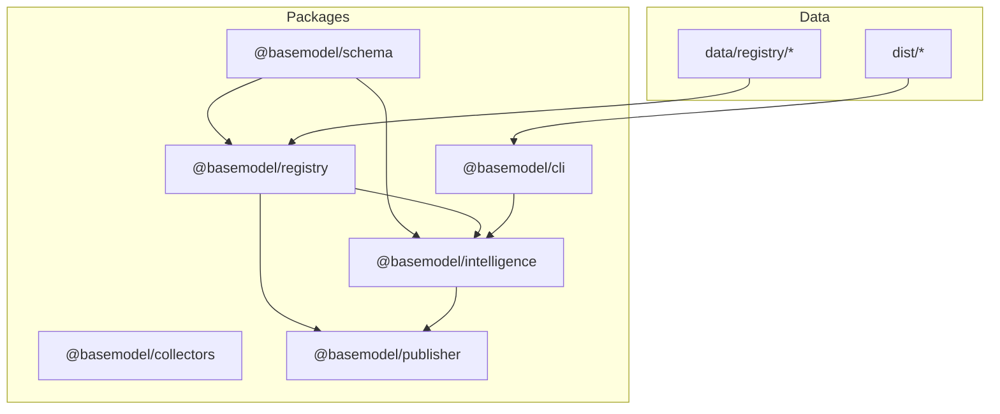

**Diagram sources**
- [03_Architecture.md:37-44](file://docs/03_Architecture.md#L37-L44)
- [04_Pipeline.md:64-84](file://docs/04_Pipeline.md#L64-L84)

**Section sources**
- [README.md:10-30](file://README.md#L10-L30)
- [03_Architecture.md:37-44](file://docs/03_Architecture.md#L37-L44)

## Core Components
The intelligence layer exposes an engine and feature modules:
- IntelligenceEngine: Holds validated snapshots of models, providers, capabilities, and pricing. Provides initialization and hydration paths.
- Search: Filters models by provider, modalities, flags, and context window.
- Alternatives: Suggests comparable models based on modality coverage, context window thresholds, function calling parity, and router endpoint exclusions.
- Cost: Computes cost efficiency and tier classification using blended per-1M token costs.

These components operate over canonical data from the registry and do not modify it. They are designed to be extended via additional features or by composing new algorithms around the engine snapshot.

**Section sources**
- [engine.ts:1-92](file://packages/intelligence/src/core/engine.ts#L1-L92)
- [search.ts:1-52](file://packages/intelligence/src/features/search.ts#L1-L52)
- [alternatives.ts:35-71](file://packages/intelligence/src/features/alternatives.ts#L35-L71)
- [cost.ts:31-86](file://packages/intelligence/src/features/cost.ts#L31-L86)

## Architecture Overview
BaseModel’s architecture separates discovery, registry, intelligence, and publishing layers. The intelligence layer consumes canonical data and produces derived insights without altering source records. Plugins for discovery (gateway plugins) are isolated and executed securely.

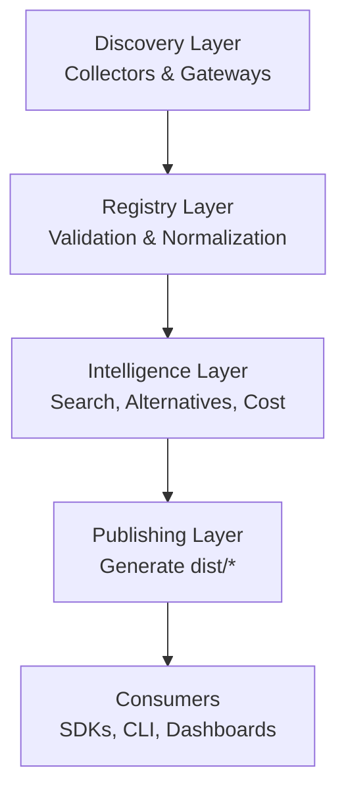

**Diagram sources**
- [03_Architecture.md:5-30](file://docs/03_Architecture.md#L5-L30)
- [04_Pipeline.md:16-30](file://docs/04_Pipeline.md#L16-L30)

**Section sources**
- [03_Architecture.md:5-30](file://docs/03_Architecture.md#L5-L30)
- [04_Pipeline.md:16-30](file://docs/04_Pipeline.md#L16-L30)

## Detailed Component Analysis

### Intelligence Engine and Snapshot Lifecycle
The engine manages lifecycle and data integrity:
- Hydration accepts a validated snapshot containing models, providers, capabilities, and pricing.
- Initialization loads registry data in Node.js environments; browser-like environments must hydrate manually.
- ensureLoaded guards operations until data is ready.

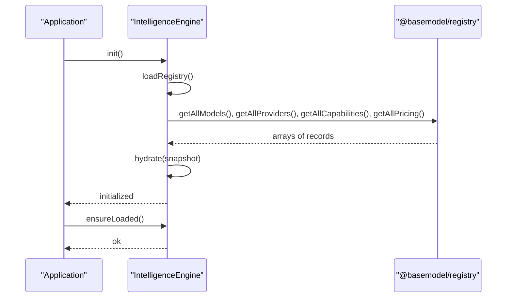

**Diagram sources**
- [engine.ts:44-92](file://packages/intelligence/src/core/engine.ts#L44-L92)

**Section sources**
- [engine.ts:1-92](file://packages/intelligence/src/core/engine.ts#L1-L92)

### Search Extension Points
Search filters models by:
- providerIds: restrict to specific providers
- modalities: require all requested modalities
- flags: boolean fields on Model must be true
- minContextWindow: enforce minimum context size

To extend search:
- Add new criteria to the filter interface
- Implement matching logic in the search function
- Update tests to cover new conditions

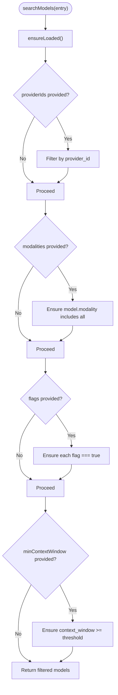

**Diagram sources**
- [search.ts:18-52](file://packages/intelligence/src/features/search.ts#L18-L52)

**Section sources**
- [search.ts:1-52](file://packages/intelligence/src/features/search.ts#L1-52)

### Alternatives Recommendation Logic
Alternatives selection enforces:
- Full modality superset match
- Context window at least 50% of original
- Function calling parity if original supports it
- Exclusion of OpenRouter router endpoints
- Collapse duplicates across resellers preferring first-party

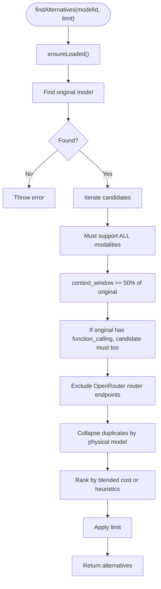

**Diagram sources**
- [alternatives.ts:35-71](file://packages/intelligence/src/features/alternatives.ts#L35-L71)

**Section sources**
- [alternatives.ts:35-71](file://packages/intelligence/src/features/alternatives.ts#L35-L71)

### Cost Efficiency and Tier Classification
Cost calculation uses:
- Token pricing records for input/output per 1M tokens
- Blended cost formula to derive tiers
- Source priority to pick best provenance
- Free detection when any record indicates free pricing

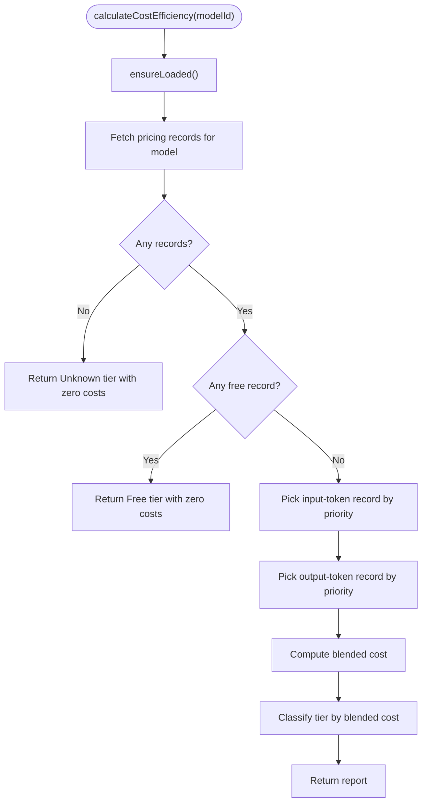

**Diagram sources**
- [cost.ts:31-86](file://packages/intelligence/src/features/cost.ts#L31-L86)

**Section sources**
- [cost.ts:31-86](file://packages/intelligence/src/features/cost.ts#L31-L86)

### Gateway Plugin Architecture and Security
Gateway plugins enable custom collection logic:
- Simple openai-compatible gateways declare baseUrl and secretKeyName
- Custom gateways implement collect(secrets) running in an isolated worker
- Only approved secrets are injected; path traversal is blocked
- Verifier loads metadata in a worker before execution

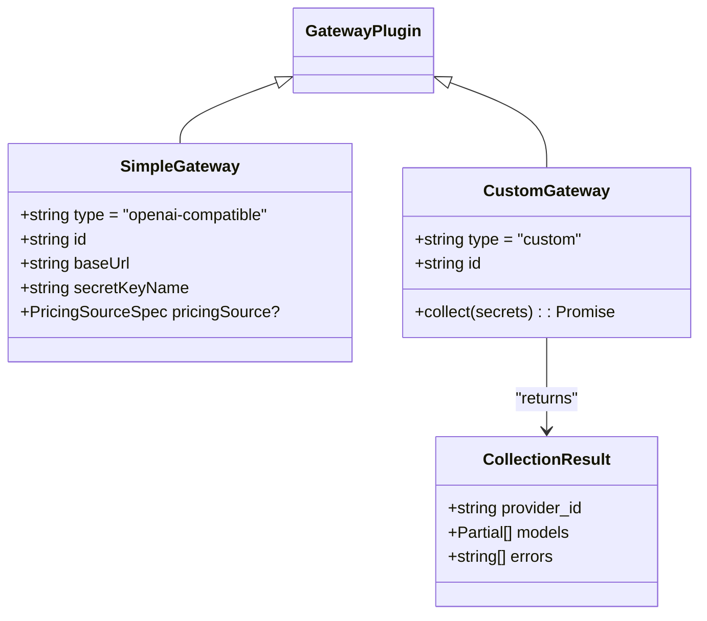

**Diagram sources**
- [collector.ts:52-88](file://packages/collectors/src/core/collector.ts#L52-L88)
- [collector.ts:1-23](file://packages/collectors/src/core/collector.ts#L1-L23)

**Section sources**
- [collector.ts:1-88](file://packages/collectors/src/core/collector.ts#L1-L88)
- [08_Gateway_Plugin_Security.md:1-36](file://docs/08_Gateway_Plugin_Security.md#L1-L36)

### Plugin Execution Boundary and Isolation
Plugins execute in isolated workers with strict environment controls:
- Path resolution ensures plugins reside within the gateways directory
- Worker process receives only allowed secrets via environment
- Timeouts and exit codes are enforced
- Descriptor extraction validates plugin structure before execution

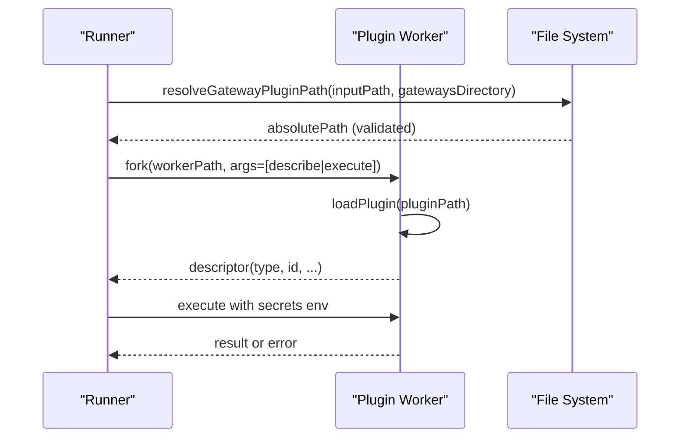

**Diagram sources**
- [runner.ts:113-154](file://packages/collectors/src/core/runner.ts#L113-L154)
- [plugin-worker.ts:58-97](file://packages/collectors/src/core/plugin-worker.ts#L58-L97)
- [plugin-path.test.ts:1-31](file://packages/collectors/src/__tests__/plugin-path.test.ts#L1-L31)

**Section sources**
- [runner.ts:113-154](file://packages/collectors/src/core/runner.ts#L113-L154)
- [plugin-worker.ts:58-97](file://packages/collectors/src/core/plugin-worker.ts#L58-L97)
- [plugin-path.test.ts:1-31](file://packages/collectors/src/__tests__/plugin-path.test.ts#L1-L31)

### Development Workflow for Custom Analyzers
To create custom intelligence modules:
- Use the IntelligenceEngine snapshot to read canonical data
- Implement new features under the intelligence package
- Validate inputs against @basemodel/schema types
- Write unit tests using Vitest
- Build and export via the package entrypoint

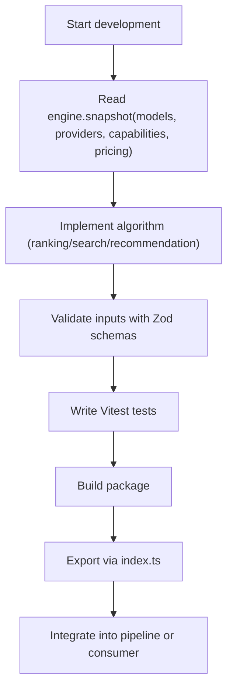

[No sources needed since this diagram shows conceptual workflow, not actual code structure]

**Section sources**
- [intelligence.test.ts:1-49](file://packages/intelligence/src/__tests__/intelligence.test.ts#L1-L49)
- [package.json (intelligence):1-49](file://packages/intelligence/package.json#L1-L49)

### Configuration System for Deploying Custom Modules
Configuration and deployment touchpoints:
- Package exports define module entrypoints for consumers
- Registry files under data/registry/ hold canonical records
- dist/ contains generated datasets consumed by clients
- CLI commands expose intelligence queries

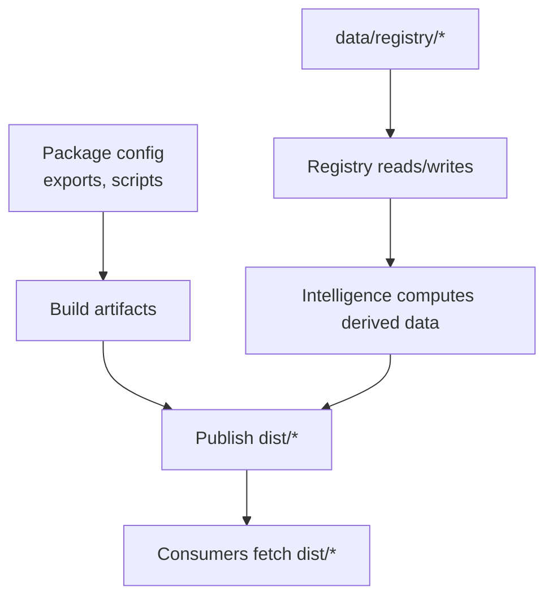

**Diagram sources**
- [package.json (intelligence):1-49](file://packages/intelligence/package.json#L1-L49)
- [04_Pipeline.md:64-84](file://docs/04_Pipeline.md#L64-L84)

**Section sources**
- [07_Developer_Access.md:1-113](file://docs/07_Developer_Access.md#L1-L113)
- [04_Pipeline.md:64-84](file://docs/04_Pipeline.md#L64-L84)

## Dependency Analysis
The intelligence package depends on schema and registry packages. The collector package defines plugin contracts and isolation mechanisms.

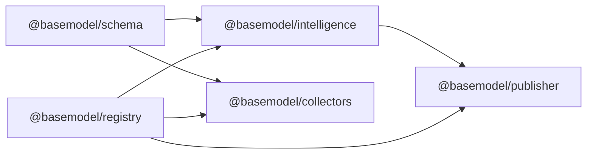

**Diagram sources**
- [package.json (intelligence):38-41](file://packages/intelligence/package.json#L38-L41)
- [03_Architecture.md:37-44](file://docs/03_Architecture.md#L37-L44)

**Section sources**
- [package.json (intelligence):1-49](file://packages/intelligence/package.json#L1-L49)
- [03_Architecture.md:37-44](file://docs/03_Architecture.md#L37-L44)

## Performance Considerations
- Prefer filtering early in search to reduce iteration overhead
- Cache repeated lookups in client applications when appropriate
- Avoid heavy computations inside hot paths; precompute where possible
- Use efficient comparisons for modalities and flags
- For alternatives, short-circuit checks after failing constraints
- Leverage tier definitions and blended cost calculations consistently

[No sources needed since this section provides general guidance]

## Troubleshooting Guide
Common issues and resolutions:
- Engine not initialized: Call init() in Node.js or hydrate() in browsers
- Invalid snapshot: Ensure schema compliance for models, providers, capabilities, pricing
- Plugin path errors: Verify plugins reside within gateways directory and use .ts/.js extensions
- Secret leakage prevention: Ensure only registered secrets are passed to workers
- Timeout or worker exit: Investigate plugin execution and resource usage

**Section sources**
- [engine.ts:58-92](file://packages/intelligence/src/core/engine.ts#L58-L92)
- [plugin-path.test.ts:1-31](file://packages/collectors/src/__tests__/plugin-path.test.ts#L1-L31)
- [runner.ts:113-154](file://packages/collectors/src/core/runner.ts#L113-L154)

## Conclusion
BaseModel provides a robust foundation for extending intelligence through custom algorithms and plugins. The engine and feature modules offer clear extension points for search enhancements, ranking algorithms, and recommendation logic. Secure plugin execution and strong schema validation ensure reliability and safety. By following the development workflow and configuration guidelines, you can deploy domain-tuned intelligence modules that integrate seamlessly with the existing system.

[No sources needed since this section summarizes without analyzing specific files]

## Appendices

### Example Customizations
- Industry-specific scoring: Extend alternatives ranking with domain weights applied to capability matches and context windows
- Proprietary benchmark integration: Add benchmark-derived scores to cost efficiency reports
- Domain-tuned recommendation engines: Customize alternative selection criteria based on industry modalities and feature flags

[No sources needed since this section provides general guidance]

### Version Compatibility and Deployment
- Maintain compatibility with schema versions used by registry and intelligence layers
- Align dist outputs with consumer expectations
- Use CI pipelines to validate changes and regenerate datasets
- Review security docs when adding new gateways or secrets

**Section sources**
- [04_Pipeline.md:16-30](file://docs/04_Pipeline.md#L16-L30)
- [08_Gateway_Plugin_Security.md:1-36](file://docs/08_Gateway_Plugin_Security.md#L1-L36)