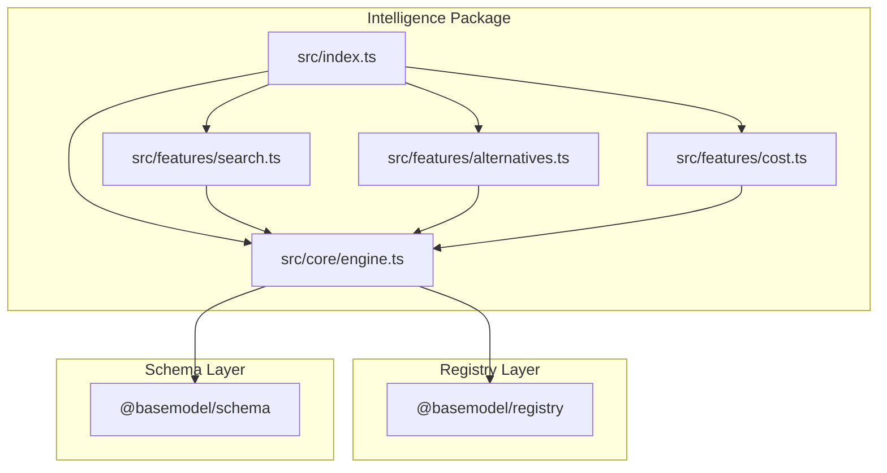
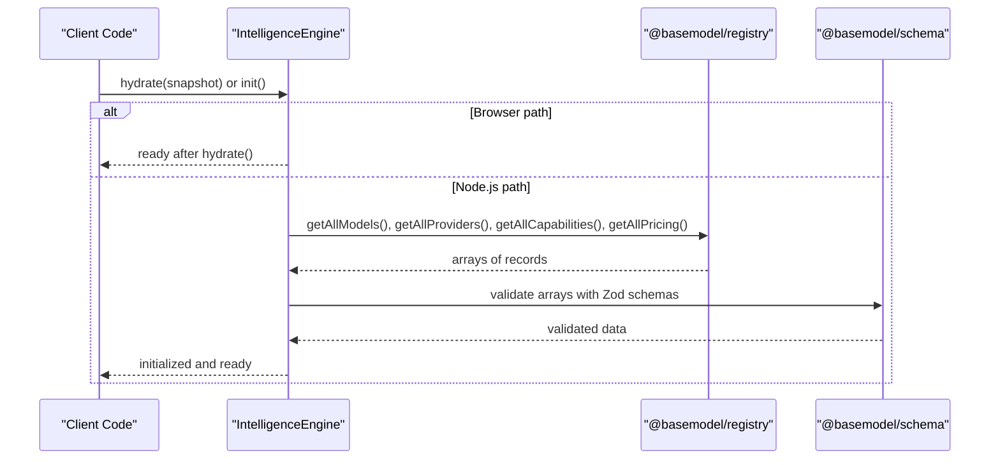
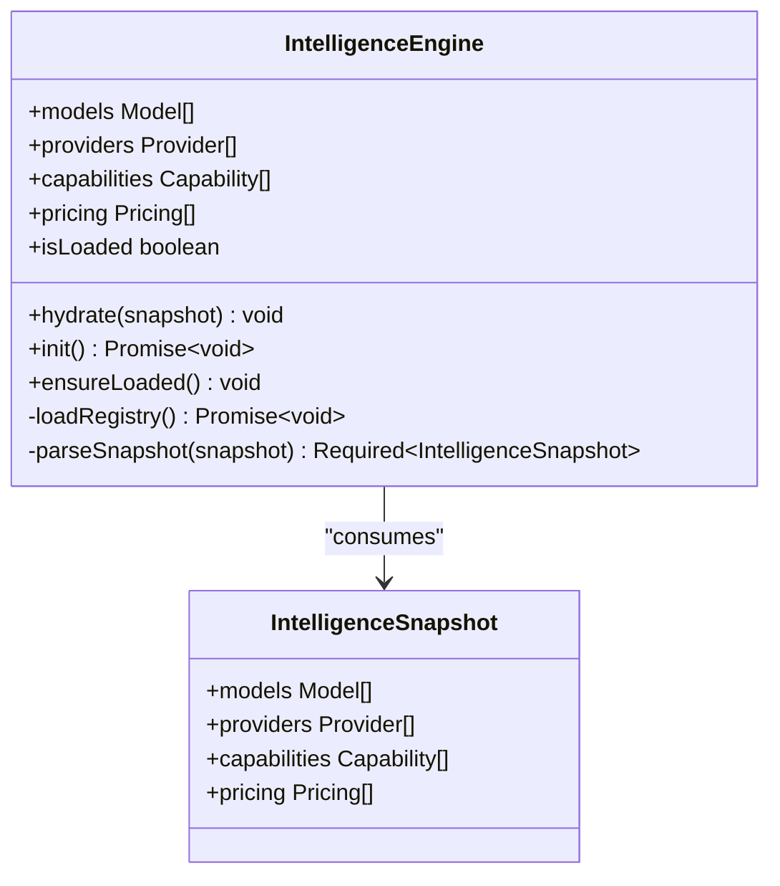
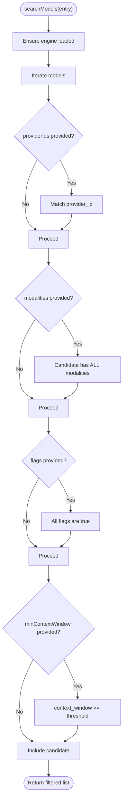
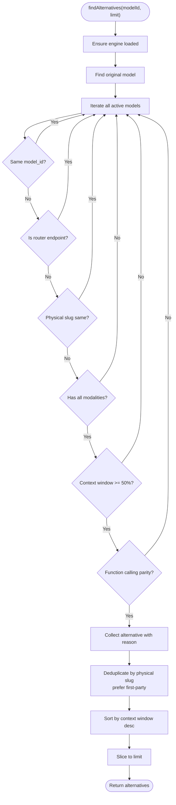
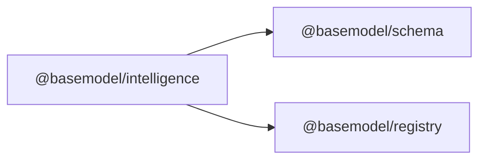

# Intelligence & Analytics

<cite>
**Referenced Files in This Document**
- [README.md](file://README.md)
- [03_Architecture.md](file://docs/03_Architecture.md)
- [05_Data_Model.md](file://docs/05_Data_Model.md)
- [package.json](file://packages/intelligence/package.json)
- [index.ts](file://packages/intelligence/src/index.ts)
- [engine.ts](file://packages/intelligence/src/core/engine.ts)
- [search.ts](file://packages/intelligence/src/features/search.ts)
- [alternatives.ts](file://packages/intelligence/src/features/alternatives.ts)
- [cost.ts](file://packages/intelligence/src/features/cost.ts)
- [intelligence.test.ts](file://packages/intelligence/src/__tests__/intelligence.test.ts)
</cite>

## Table of Contents
1. Introduction
2. Project Structure
3. Core Components
4. Architecture Overview
5. Detailed Component Analysis
6. Dependency Analysis
7. Performance Considerations
8. Troubleshooting Guide
9. Conclusion
10. Appendices

## Introduction
This document explains BaseModel’s intelligence and analytics capabilities that derive rankings, recommendations, and insights from the canonical model registry data. It covers:
- How the system computes derived intelligence over providers, models, capabilities, pricing, and benchmarks
- The search functionality for semantic model discovery and filtering
- The recommendation engine for alternatives based on use cases and constraints
- Examples of intelligence queries, result interpretation, and customization options
- Data sources used for intelligence generation including benchmarks, pricing, and community feedback

BaseModel is a data layer that discovers, validates, normalizes, stores, analyzes, and publishes structured knowledge about AI models. The intelligence layer does not modify canonical records; it derives insights from them.

**Section sources**
- [README.md:1-61](file://README.md#L1-L61)
- [03_Architecture.md:23-29](file://docs/03_Architecture.md#L23-L29)

## Project Structure
The intelligence capability resides in the @basemodel/intelligence package. It depends on @basemodel/schema (canonical types and Zod schemas) and @basemodel/registry (read access to canonical records). Generated datasets include providers, models, capabilities, licenses, APIs, benchmarks, pricing, and intelligence outputs.

**Diagram sources**
- [index.ts:1-15](file://packages/intelligence/src/index.ts#L1-L15)
- [engine.ts:1-92](file://packages/intelligence/src/core/engine.ts#L1-L92)
- [search.ts:1-53](file://packages/intelligence/src/features/search.ts#L1-L53)
- [alternatives.ts:1-118](file://packages/intelligence/src/features/alternatives.ts#L1-L118)
- [cost.ts:1-118](file://packages/intelligence/src/features/cost.ts#L1-L118)

**Section sources**
- [README.md:11-30](file://README.md#L11-L30)
- [package.json:1-50](file://packages/intelligence/package.json#L1-L50)
- [03_Architecture.md:37-44](file://docs/03_Architecture.md#L37-L44)

## Core Components
- IntelligenceEngine: A validated, in-memory snapshot of registry data with safe initialization and hydration paths for Node.js and browser environments.
- Search: Structured filtering by provider, modalities, boolean flags, and minimum context window.
- Alternatives: Recommendation of comparable models using modality inclusion, context window tolerance, function-calling parity, router endpoint exclusion, and deduplication across providers.
- Cost: Heuristics for cost-related insights (module present for future or current cost analysis features).

Key responsibilities:
- Defensive validation of input snapshots against canonical schemas
- Lazy, thread-safe initialization with retry semantics
- Deterministic, reproducible filtering and ranking heuristics

**Section sources**
- [engine.ts:1-92](file://packages/intelligence/src/core/engine.ts#L1-L92)
- [search.ts:1-53](file://packages/intelligence/src/features/search.ts#L1-L53)
- [alternatives.ts:1-118](file://packages/intelligence/src/features/alternatives.ts#L1-L118)
- [cost.ts:1-118](file://packages/intelligence/src/features/cost.ts#L1-L118)

## Architecture Overview
The intelligence layer consumes canonical registry data and produces derived insights without altering source records. It integrates with the registry via dynamic imports in Node.js and supports manual hydration in browsers.

**Diagram sources**
- [engine.ts:44-82](file://packages/intelligence/src/core/engine.ts#L44-L82)

**Section sources**
- [03_Architecture.md:23-29](file://docs/03_Architecture.md#L23-L29)
- [engine.ts:1-92](file://packages/intelligence/src/core/engine.ts#L1-L92)

## Detailed Component Analysis

### IntelligenceEngine
The engine holds a validated snapshot of models, providers, capabilities, and pricing. It ensures type safety through schema validation and provides both lazy initialization and explicit hydration.

- Validation: All arrays are validated against canonical schemas before hydration.
- Initialization: In Node.js, the engine dynamically imports the registry package and loads all required datasets. In browsers, users must call hydrate() with a pre-fetched snapshot.
- Concurrency: Concurrent init() calls share a single load promise; failures reset the promise to allow retries.

**Diagram sources**
- [engine.ts:4-92](file://packages/intelligence/src/core/engine.ts#L4-L92)

**Section sources**
- [engine.ts:1-92](file://packages/intelligence/src/core/engine.ts#L1-L92)

### Search Functionality
Structured search filters models by:
- providerIds: restrict to specific providers
- modalities: require all requested modalities
- flags: require boolean fields to be true
- minContextWindow: enforce a minimum context length

**Diagram sources**
- [search.ts:18-52](file://packages/intelligence/src/features/search.ts#L18-L52)

Usage examples:
- Find all text-generation models from OpenAI with function calling and at least 128k context window.
- Narrow results to multimodal models supporting vision and audio.

Customization:
- Extend criteria by adding new fields to SearchCriteria and corresponding filter logic.
- Combine multiple flags to express complex feature requirements.

**Section sources**
- [search.ts:1-53](file://packages/intelligence/src/features/search.ts#L1-L53)

### Recommendations and Alternatives
The alternatives engine suggests comparable models based on:
- Modality inclusion: candidates must support all modalities of the original
- Context window tolerance: candidates may have up to 50% smaller context windows
- Function calling parity: if the original supports function calling, so must the candidate
- Router endpoint exclusion: OpenRouter auto/fusion endpoints are excluded
- Deduplication: physical model slugs are normalized; first-party providers preferred over routers

Ranking heuristic:
- Sort by descending context window, then by model_id lexicographically for stability

**Diagram sources**
- [alternatives.ts:45-117](file://packages/intelligence/src/features/alternatives.ts#L45-L117)

Interpretation:
- Each result includes the recommended model and a human-readable reason explaining why it qualifies.
- Results are stable and deterministic given the same registry snapshot.

Customization:
- Adjust thresholds (e.g., context window ratio) or add additional constraints like open-weight preference.
- Integrate scoring functions to rank beyond context window.

**Section sources**
- [alternatives.ts:1-118](file://packages/intelligence/src/features/alternatives.ts#L1-L118)

### Cost Insights
The cost module exposes heuristics for cost-related intelligence. While the exact implementation details are encapsulated within the module, typical usage involves:
- Comparing pricing tiers across providers
- Estimating cost per token or per output unit
- Identifying cost-efficient alternatives under constraints

Integration points:
- Use the engine’s pricing dataset alongside model metadata to compute cost-per-capability estimates.
- Combine with search and alternatives to recommend cost-effective models meeting functional requirements.

Note: Refer to the cost module file for precise API surface and behavior.

**Section sources**
- [cost.ts:1-118](file://packages/intelligence/src/features/cost.ts#L1-L118)

## Dependency Analysis
The intelligence package depends on:
- @basemodel/schema: Canonical types and Zod schemas for validation
- @basemodel/registry: Read access to canonical datasets (models, providers, capabilities, pricing)

**Diagram sources**
- [package.json:38-41](file://packages/intelligence/package.json#L38-L41)

Coupling and cohesion:
- Cohesion: Each feature module focuses on a single concern (search, alternatives, cost).
- Coupling: Engine centralizes data access and validation; features depend only on the engine interface.

Potential circular dependencies:
- None observed; features depend on the engine, which depends on registry and schema.

External integration points:
- Dynamic import of registry in Node.js environment
- Manual hydration in browser environments

**Section sources**
- [package.json:1-50](file://packages/intelligence/package.json#L1-L50)
- [engine.ts:69-82](file://packages/intelligence/src/core/engine.ts#L69-L82)

## Performance Considerations
- Snapshot validation occurs once during hydration; subsequent operations are O(n) over models for filtering.
- Search filters are simple predicates; consider indexing by provider_id or modality sets for large registries.
- Alternatives computation performs a full scan with constant-time checks per candidate; sorting is O(k log k) where k is number of candidates.
- Avoid repeated engine initialization; reuse a single instance.

Optimization opportunities:
- Precompute indices for frequent filters (e.g., modality sets, provider lists).
- Cache alternative results keyed by model_id and constraint parameters.
- Stream large datasets when loading in Node.js to reduce memory pressure.

[No sources needed since this section provides general guidance]

## Troubleshooting Guide
Common issues and resolutions:
- Not initialized error: Call await engine.init() in Node.js or engine.hydrate(snapshot) in browsers before querying.
- Invalid snapshot error: Ensure all arrays conform to canonical schemas; check field names and types.
- Model not found: Verify model_id format matches registry conventions (provider_id/slug).
- Empty search results: Review criteria constraints; relax modalities or flags if overly restrictive.

Diagnostic tips:
- Log the snapshot structure before hydration to confirm expected fields.
- Inspect engine.isLoaded flag to verify initialization state.
- Use the test suite to validate assumptions about registry shape and behavior.

**Section sources**
- [engine.ts:84-91](file://packages/intelligence/src/core/engine.ts#L84-L91)
- [engine.ts:11-22](file://packages/intelligence/src/core/engine.ts#L11-L22)
- [alternatives.ts:52-55](file://packages/intelligence/src/features/alternatives.ts#L52-L55)
- [intelligence.test.ts:1-118](file://packages/intelligence/src/__tests__/intelligence.test.ts#L1-118)

## Conclusion
BaseModel’s intelligence layer transforms canonical registry data into actionable insights:
- Deterministic search enables precise model discovery
- Robust alternatives engine recommends comparable models with clear reasoning
- Cost heuristics support economical decision-making
- Strong validation and separation of concerns ensure reliability and extensibility

Adopt these components to build applications that discover, compare, and select AI models based on functional requirements, performance characteristics, and cost constraints.

[No sources needed since this section summarizes without analyzing specific files]

## Appendices

### Data Sources for Intelligence Generation
- Benchmarks: Evaluation results linked to models provide performance signals used in ranking and comparison.
- Pricing: Per-model pricing records enable cost efficiency analysis and alternative selection.
- Community feedback: Optional signals can be integrated to adjust rankings or highlight popular choices.

These sources feed into the intelligence layer indirectly through the registry datasets consumed by the engine.

**Section sources**
- [05_Data_Model.md:80-108](file://docs/05_Data_Model.md#L80-L108)
- [README.md:19-30](file://README.md#L19-L30)

### Example Intelligence Queries
- Semantic discovery: “Find models supporting vision and tool-calling with open weights.”
- Constraint-based search: “List providers offering embeddings with at least 8k context window.”
- Alternative recommendation: “Suggest alternatives for claude-sonnet-5 with larger context windows.”
- Cost-aware selection: “Recommend the most cost-effective text-generation model with function calling.”

Interpretation guidelines:
- Always verify modality support and feature flags match your workload.
- Compare context windows and function-calling capabilities for compatibility.
- Use reasons provided by alternatives to understand trade-offs.

[No sources needed since this section provides general guidance]