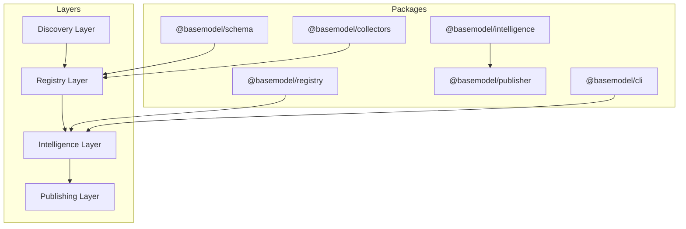
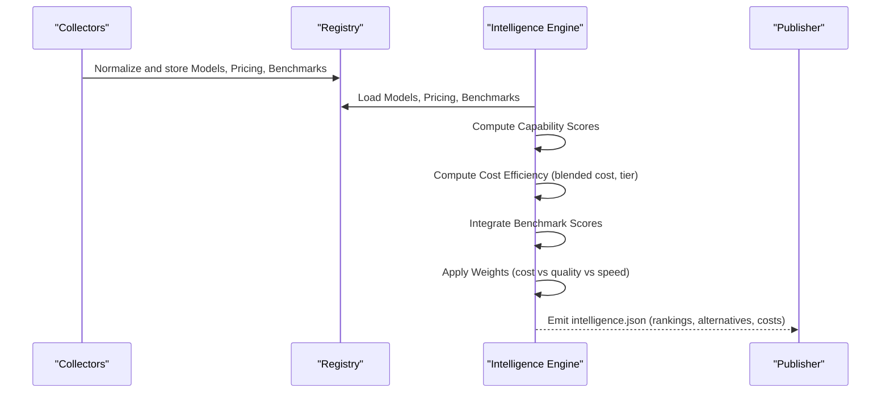
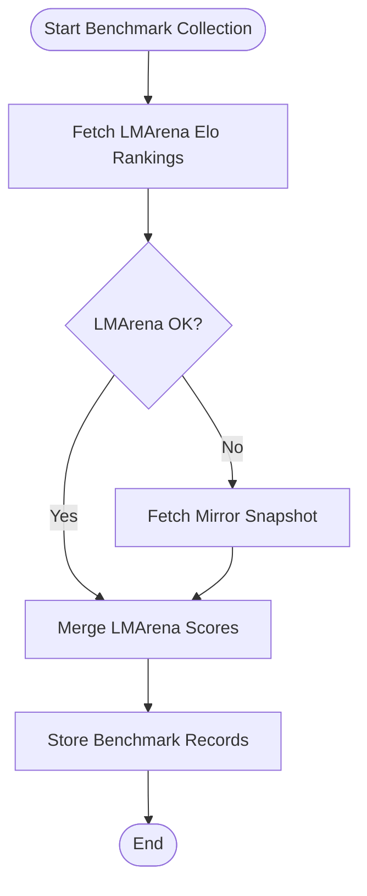
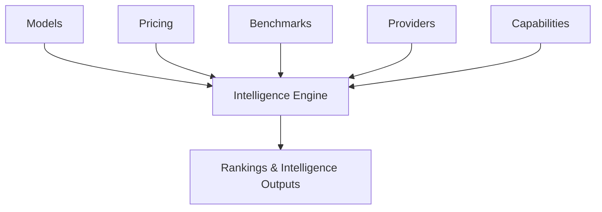

# Ranking Algorithms

<cite>
**Referenced Files in This Document**
- [README.md](file://README.md)
- [03_Architecture.md](file://docs/03_Architecture.md)
- [04_Pipeline.md](file://docs/04_Pipeline.md)
- [05_Data_Model.md](file://docs/05_Data_Model.md)
- [collect.yml](file://.github/workflows/collect.yml)
- [intelligence.test.ts](file://packages/intelligence/src/__tests__/intelligence.test.ts)
- [meta.json](file://data/registry/meta.json)
</cite>

## Table of Contents
1. [Introduction](#introduction)
2. [Project Structure](#project-structure)
3. [Core Components](#core-components)
4. [Architecture Overview](#architecture-overview)
5. [Detailed Component Analysis](#detailed-component-analysis)
6. [Dependency Analysis](#dependency-analysis)
7. [Performance Considerations](#performance-considerations)
8. [Troubleshooting Guide](#troubleshooting-guide)
9. [Conclusion](#conclusion)
10. [Appendices](#appendices)

## Introduction
This document explains the ranking algorithms and multi-factor scoring system used by BaseModel to evaluate and score AI models across multiple dimensions. It covers how capability scores, pricing efficiency, benchmark performance, provider reliability, and community adoption metrics are integrated into a unified ranking. It also documents how weights can be adjusted for different use cases (cost vs quality vs speed), how benchmarks are integrated from standardized tests, how pricing analysis computes cost-per-token and value efficiency, and how rankings update when new models or data become available.

BaseModel is an open-source intelligence platform that discovers, validates, normalizes, stores, analyzes, and publishes structured knowledge about AI models. The intelligence layer derives search, alternatives, and cost information from registry data without modifying canonical records. Generated datasets include providers, models, capabilities, licenses, APIs, benchmarks, pricing, and intelligence outputs.

**Section sources**
- [README.md:10-30](file://README.md#L10-L30)
- [03_Architecture.md:23-30](file://docs/03_Architecture.md#L23-L30)

## Project Structure
BaseModel organizes functionality into layered packages:
- Schema: Canonical types and Zod schemas
- Registry: Storage, validation, and merge utilities
- Collectors: Provider and gateway collectors
- Intelligence: Derived rankings, search, and recommendations
- Publisher: Dataset generation for dist/
- CLI: Command-line interface for querying intelligence

The pipeline moves data through discovery, collection, validation, normalization, registry storage, intelligence derivation, generation, and publication. Benchmarks and pricing enrichment are part of this pipeline, feeding into the intelligence layer.

**Diagram sources**
- [03_Architecture.md:37-44](file://docs/03_Architecture.md#L37-L44)
- [04_Pipeline.md:54-62](file://docs/04_Pipeline.md#L54-L62)

**Section sources**
- [README.md:10-17](file://README.md#L10-L17)
- [03_Architecture.md:37-44](file://docs/03_Architecture.md#L37-L44)
- [04_Pipeline.md:54-62](file://docs/04_Pipeline.md#L54-L62)

## Core Components
- Intelligence Engine: Loads models, providers, capabilities, and pricing; exposes search, alternatives, and cost efficiency functions.
- Cost Efficiency: Computes blended cost per token and assigns tiers (free, budget, balanced, premium).
- Alternatives: Suggests cross-provider alternatives based on modalities, function calling, context window, and physical model identity.
- Benchmark Integration: Pulls performance data from LMArena, Open LLM Leaderboard, and Mirror snapshots.
- Pricing Enrichment: Derives pricing from provider catalogs, OpenRouter, and Hugging Face Inference Providers; propagates tier for router-reserved models.

Key behaviors validated by tests:
- Blended cost calculation uses input/output pricing with defined blending formula.
- Unknown pricing yields Unknown tier; zero-cost input/output yields Free tier.
- Alternatives exclude router endpoints like openrouter/auto and avoid recommending identical physical models re-served under different provider slugs.

**Section sources**
- [intelligence.test.ts:1-284](file://packages/intelligence/src/__tests__/intelligence.test.ts#L1-L284)
- [04_Pipeline.md:190-203](file://docs/04_Pipeline.md#L190-L203)

## Architecture Overview
The ranking system integrates multiple data sources and computations:
- Capability Scores: Derived from normalized capability metadata associated with models.
- Pricing Efficiency: Computed via blended cost-per-token and tier classification.
- Benchmark Performance: Aggregated from standardized tests and leaderboards.
- Provider Reliability: Inferred from enrichment outcomes, error logs, and lifecycle status.
- Community Adoption: Captured via leaderboard presence and snapshot frequency.

**Diagram sources**
- [04_Pipeline.md:54-62](file://docs/04_Pipeline.md#L54-L62)
- [04_Pipeline.md:93-126](file://docs/04_Pipeline.md#L93-L126)
- [04_Pipeline.md:127-162](file://docs/04_Pipeline.md#L127-L162)

## Detailed Component Analysis

### Multi-Factor Scoring System
The ranking algorithm combines several factors:
- Capability Score: Based on model capabilities (e.g., text, image, audio, embedding, function calling, structured output).
- Pricing Efficiency: Blended cost per 1M tokens using input/output pricing; tier classification (free, budget, balanced, premium).
- Benchmark Performance: Scores from standardized evaluations (e.g., MMLU-PRO, GPQA, LMArena Elo).
- Provider Reliability: Derived from enrichment success, error logs, and lifecycle status.
- Community Adoption: Presence in leaderboards and snapshots.

Weighting by Use Case Priorities:
- Cost-focused: Higher weight on pricing efficiency and free/budget tiers.
- Quality-focused: Higher weight on benchmark performance and capability coverage.
- Speed-focused: Higher weight on low-latency indicators (context window, throughput proxies) and benchmark speed-related metrics if available.

Blended Cost Formula:
- Blended cost = (input * 3 + output * 1) / 4
- Tier thresholds:
  - free: both input and output $0
  - budget: blended < $0.50
  - balanced: blended >= $0.50 and <= $5
  - premium: blended > $5

**Section sources**
- [05_Data_Model.md:95-108](file://docs/05_Data_Model.md#L95-L108)
- [04_Pipeline.md:190-203](file://docs/04_Pipeline.md#L190-L203)
- [intelligence.test.ts:116-157](file://packages/intelligence/src/__tests__/intelligence.test.ts#L116-L157)

### Benchmark Integration
Benchmark data is collected from three public sources:
- LMArena: Elo rankings for text/webdev/vision
- Open LLM Leaderboard: Benchmark scores (MMLU-PRO, GPQA, etc.)
- Mirror: Daily text/code leaderboard snapshot

Fallback behavior:
- If LMArena is unreachable or rate-limited, the pipeline falls back to Mirror snapshot to ensure ranked data is still emitted.

Optional Hugging Face token:
- Increases rate limits for LMArena and Open LLM Leaderboard; without it, Mirror fallback still produces ranked text/code data.

**Diagram sources**
- [04_Pipeline.md:93-126](file://docs/04_Pipeline.md#L93-L126)

**Section sources**
- [04_Pipeline.md:93-126](file://docs/04_Pipeline.md#L93-L126)

### Pricing Analysis
Pricing enrichment derives cost-per-token and value efficiency:
- Sources:
  - Provider pricingSource (gateway-declared catalog)
  - OpenRouter aggregated pricing
  - Hugging Face Inference Providers for open-weight models
- Tier propagation:
  - Router-reserved models inherit coarse tier from first-party sources; prices are never copied between providers.
- Failure handling:
  - If all primary pricing sources fail, the run is marked fatal; meta.json records errors and source statuses.

Blended cost and tier definitions are applied consistently across models.

**Section sources**
- [04_Pipeline.md:127-162](file://docs/04_Pipeline.md#L127-L162)
- [04_Pipeline.md:190-203](file://docs/04_Pipeline.md#L190-L203)
- [meta.json:1-18](file://data/registry/meta.json#L1-L18)

### Custom Ranking Configurations and Weight Adjustments
While the repository does not expose a runtime configuration API for weights, the design allows domain-specific scoring criteria by adjusting:
- Capability weights: Emphasize specific capabilities (e.g., vision, tool-calling) based on use case.
- Benchmark emphasis: Increase importance of certain benchmarks aligned with task domains.
- Pricing sensitivity: Adjust cost weight relative to quality/speed priorities.
- Reliability filters: Exclude models with frequent enrichment failures or deprecated status.

Example adjustments:
- Cost-first: Increase pricing efficiency weight; prefer free/budget tiers.
- Quality-first: Increase benchmark performance weight; prioritize high Elo and MMLU-PRO scores.
- Speed-first: Increase context window and latency-proxy weights; favor models with proven throughput.

These adjustments can be implemented within the intelligence layer’s scoring logic, leveraging the canonical data model and enrichment outputs.

[No sources needed since this section provides general guidance]

### Data Updates and Ranking Refresh
Rankings update when:
- New models are added to the registry.
- Pricing changes are enriched from provider catalogs, OpenRouter, or Hugging Face.
- Benchmark results are refreshed from LMArena, Open LLM Leaderboard, or Mirror.
- Lifecycle status changes (active, preview, deprecated, discontinued) due to reconciliation.

Automation:
- Nightly collection and enrichment via GitHub Actions.
- Publisher regenerates datasets including intelligence.json.
- meta.json tracks freshness and errors.

**Section sources**
- [04_Pipeline.md:163-188](file://docs/04_Pipeline.md#L163-L188)
- [collect.yml:64-75](file://.github/workflows/collect.yml#L64-L75)
- [meta.json:1-18](file://data/registry/meta.json#L1-L18)

## Dependency Analysis
The ranking system depends on:
- Registry data: Models, Pricing, Benchmarks, Providers, Capabilities
- Intelligence engine: Search, alternatives, cost efficiency
- Pipeline automation: Collectors, enrich step, publisher

**Diagram sources**
- [05_Data_Model.md:23-136](file://docs/05_Data_Model.md#L23-L136)
- [04_Pipeline.md:54-62](file://docs/04_Pipeline.md#L54-L62)

**Section sources**
- [05_Data_Model.md:23-136](file://docs/05_Data_Model.md#L23-L136)
- [04_Pipeline.md:54-62](file://docs/04_Pipeline.md#L54-L62)

## Performance Considerations
- Benchmark collection should handle rate limits gracefully; optional Hugging Face token improves throughput.
- Pricing enrichment must fail loudly when all sources fail to prevent stale data.
- Intelligence computations should be efficient, avoiding unnecessary recomputation by caching derived scores where possible.
- Tier propagation ensures consistent cost signals across router-reserved models.

[No sources needed since this section provides general guidance]

## Troubleshooting Guide
Common issues and resolutions:
- Missing pricing: Results in Unknown tier; verify enrichment sources and provider catalogs.
- Rate limiting on benchmark sources: Fallback to Mirror snapshot; consider adding BENCHMARKS_FETCH_TOKEN.
- Fatal enrichment runs: Check meta.json for errors; ensure OpenRouter and provider catalogs are accessible.
- Stale data: Verify generated_at timestamps in datasets and updated_at in registry records.

**Section sources**
- [04_Pipeline.md:190-216](file://docs/04_Pipeline.md#L190-L216)
- [meta.json:1-18](file://data/registry/meta.json#L1-L18)

## Conclusion
BaseModel’s ranking algorithms integrate capability scores, pricing efficiency, benchmark performance, provider reliability, and community adoption into a cohesive evaluation framework. The system supports flexible weighting for different use cases, robust benchmark integration with fallback mechanisms, and reliable pricing enrichment with clear tier definitions. Automated pipelines ensure timely updates, while failure handling and metadata provide transparency and trustworthiness.

[No sources needed since this section summarizes without analyzing specific files]

## Appendices

### Example Ranking Configuration Patterns
- Cost-focused: High pricing weight, prefer free/budget tiers, lower benchmark emphasis.
- Quality-focused: High benchmark weight, prioritize high Elo and domain-specific scores.
- Speed-focused: Emphasize context window and latency proxies, balance cost and quality.

[No sources needed since this section provides general guidance]