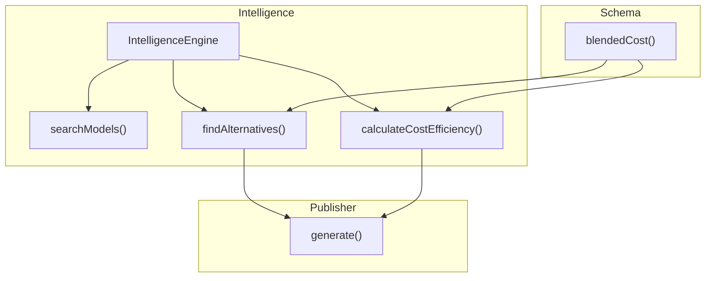
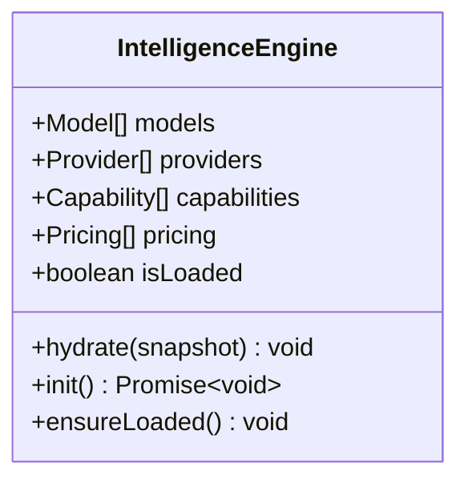
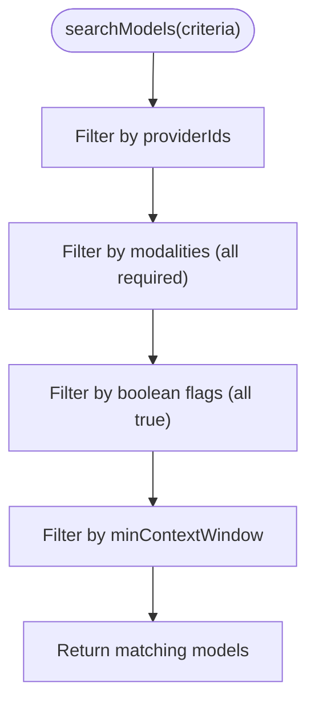
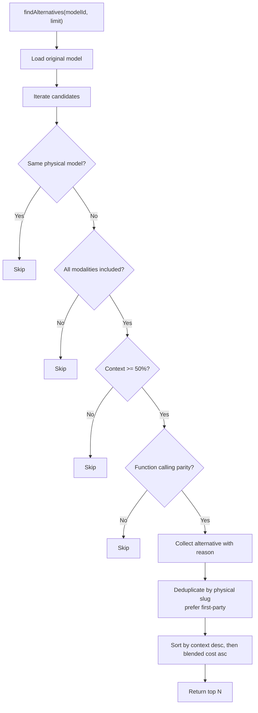
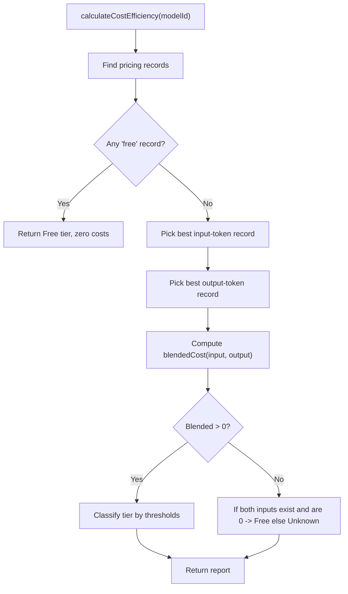
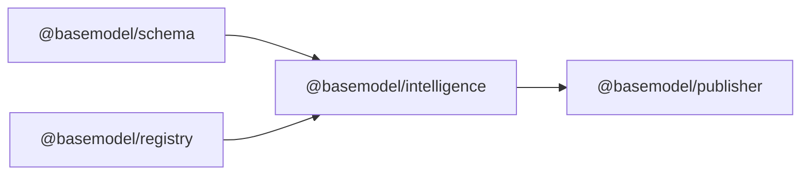

# Recommendation Engine

<cite>
**Referenced Files in This Document**
- [README.md](file://README.md)
- [03_Architecture.md](file://docs/03_Architecture.md)
- [engine.ts](file://packages/intelligence/src/core/engine.ts)
- [alternatives.ts](file://packages/intelligence/src/features/alternatives.ts)
- [search.ts](file://packages/intelligence/src/features/search.ts)
- [cost.ts](file://packages/intelligence/src/features/cost.ts)
- [index.ts](file://packages/intelligence/src/index.ts)
- [generate.ts](file://packages/publisher/src/generate.ts)
- [cost.ts (schema)](file://packages/schema/src/cost.ts)
- [intelligence.test.ts](file://packages/intelligence/src/__tests__/intelligence.test.ts)
</cite>

## Table of Contents
1. Introduction
2. Project Structure
3. Core Components
4. Architecture Overview
5. Detailed Component Analysis
6. Dependency Analysis
7. Performance Considerations
8. Troubleshooting Guide
9. Conclusion

## Introduction
This document explains the BaseModel recommendation engine that suggests alternative models based on requirements and constraints. It covers:
- Similarity matching across providers with equivalent capabilities
- Constraint satisfaction for hard requirements such as cost, performance thresholds, and feature flags
- Scoring and ranking that balances cost-effectiveness, capability match, and reliability
- Example queries, result explanations, and customization strategies for domain-specific needs

BaseModel’s intelligence layer derives search, alternatives, and cost information from canonical registry data without modifying it. The publisher consumes this intelligence to generate public datasets used by downstream systems.

**Section sources**
- [README.md](file://README.md)
- [03_Architecture.md](file://docs/03_Architecture.md)

## Project Structure
The recommendation engine lives in the intelligence package and integrates with schema definitions and the publisher pipeline.



**Diagram sources**
- [engine.ts](file://packages/intelligence/src/core/engine.ts)
- [search.ts](file://packages/intelligence/src/features/search.ts)
- [alternatives.ts](file://packages/intelligence/src/features/alternatives.ts)
- [cost.ts](file://packages/intelligence/src/features/cost.ts)
- [cost.ts (schema)](file://packages/schema/src/cost.ts)
- [generate.ts](file://packages/publisher/src/generate.ts)

**Section sources**
- [README.md](file://README.md)
- [03_Architecture.md](file://docs/03_Architecture.md)

## Core Components
- IntelligenceEngine: Holds a validated snapshot of models, providers, capabilities, and pricing; ensures initialization before use.
- searchModels(): Filters models by provider, modalities, boolean flags, and minimum context window.
- findAlternatives(): Finds comparable alternatives to a given model using modality inclusion, context window tolerance, function-calling parity, router filtering, and deduplication by physical slug; ranks by context window then blended cost.
- calculateCostEfficiency(): Computes per-model blended cost and tier using deterministic source priority for pricing records.
- Publisher integration: Generates intelligence records including cost tiers and top alternatives for each model.

**Section sources**
- [engine.ts](file://packages/intelligence/src/core/engine.ts)
- [search.ts](file://packages/intelligence/src/features/search.ts)
- [alternatives.ts](file://packages/intelligence/src/features/alternatives.ts)
- [cost.ts](file://packages/intelligence/src/features/cost.ts)
- [generate.ts](file://packages/publisher/src/generate.ts)

## Architecture Overview
The recommendation engine is part of the intelligence layer. It reads from the registry via the engine’s snapshot and produces derived insights consumed by the publisher.

```mermaid
sequenceDiagram
participant Caller as "Caller"
participant Engine as "IntelligenceEngine"
participant Search as "searchModels()"
participant Alt as "findAlternatives()"
participant Cost as "calculateCostEfficiency()"
participant Schema as "blendedCost()"
participant Pub as "Publisher.generate()"
Caller->>Engine : hydrate({models, providers, capabilities, pricing})
Caller->>Search : searchModels(criteria)
Search-->>Caller : filtered models
Caller->>Alt : findAlternatives(modelId, limit)
Alt->>Schema : blendedCost(input, output)
Alt-->>Caller : ranked alternatives
Caller->>Cost : calculateCostEfficiency(modelId)
Cost->>Schema : blendedCost(input, output)
Cost-->>Caller : cost report
Pub->>Engine : init/hydrate
Pub->>Cost : calculateCostEfficiency(...)
Pub->>Alt : findAlternatives(...)
Pub-->>Pub : write intelligence.json
```

**Diagram sources**
- [engine.ts](file://packages/intelligence/src/core/engine.ts)
- [search.ts](file://packages/intelligence/src/features/search.ts)
- [alternatives.ts](file://packages/intelligence/src/features/alternatives.ts)
- [cost.ts](file://packages/intelligence/src/features/cost.ts)
- [cost.ts (schema)](file://packages/schema/src/cost.ts)
- [generate.ts](file://packages/publisher/src/generate.ts)

## Detailed Component Analysis

### IntelligenceEngine
- Purpose: Centralized, validated snapshot of registry data; provides ensureLoaded() to guard operations.
- Initialization: Supports async init() for Node environments or manual hydrate() for browser-safe usage.
- Data integrity: Parses and validates snapshots against canonical schemas; throws on invalid data.



**Diagram sources**
- [engine.ts](file://packages/intelligence/src/core/engine.ts)

**Section sources**
- [engine.ts](file://packages/intelligence/src/core/engine.ts)

### Search and Constraint Satisfaction (searchModels)
- Inputs: providerIds, modalities (must all be supported), flags (boolean fields must be true), minContextWindow.
- Behavior: Returns models satisfying all provided hard constraints.
- Use cases: Budget-driven provider filtering, modality-only workloads, enforcing minimum context windows, requiring features like function calling or structured output.



**Diagram sources**
- [search.ts](file://packages/intelligence/src/features/search.ts)

**Section sources**
- [search.ts](file://packages/intelligence/src/features/search.ts)

### Alternative Recommendations (findAlternatives)
- Goal: Suggest comparable models across providers with equivalent capabilities.
- Hard constraints:
  - Must support all modalities of the original model
  - Context window at least 50% of the original
  - If original supports function calling, candidate must too
  - Exclude OpenRouter router endpoints
  - Collapse same physical model served by multiple routers; prefer first-party provider
- Ranking:
  - Primary: larger context window preferred
  - Secondary: lower blended cost breaks ties
  - Tertiary: stable lexicographic ordering
- Output includes a human-readable reason explaining why the alternative is relevant.



**Diagram sources**
- [alternatives.ts](file://packages/intelligence/src/features/alternatives.ts)
- [cost.ts (schema)](file://packages/schema/src/cost.ts)

**Section sources**
- [alternatives.ts](file://packages/intelligence/src/features/alternatives.ts)

### Cost Efficiency and Scoring (calculateCostEfficiency)
- Deterministic pricing selection:
  - Prefer the model’s own provider catalog
  - Then OpenRouter aggregate
  - Then other gateways
  - Then Hugging Face
  - Records without provenance rank last
- Free detection:
  - Any “free” pricing type marks the model free
  - Both input and output priced at 0 also treated as free
- Blended cost:
  - Uses weighted average of input/output costs per 1M tokens
- Tier classification:
  - Free, Budget-Friendly, Balanced, Premium, Unknown



**Diagram sources**
- [cost.ts](file://packages/intelligence/src/features/cost.ts)
- [cost.ts (schema)](file://packages/schema/src/cost.ts)

**Section sources**
- [cost.ts](file://packages/intelligence/src/features/cost.ts)
- [cost.ts (schema)](file://packages/schema/src/cost.ts)

### Publisher Integration
- For each model, the publisher computes:
  - Cost tier and blended cost per 1M
  - Top alternatives with reasons
- Outputs intelligence.json alongside other datasets for consumption by UIs and downstream tools.

```mermaid
sequenceDiagram
participant Gen as "generate()"
participant Eng as "IntelligenceEngine"
participant Cost as "calculateCostEfficiency()"
participant Alt as "findAlternatives()"
Gen->>Eng : hydrate(models, providers, capabilities, pricing)
loop over models
Gen->>Cost : calculateCostEfficiency(model_id)
Gen->>Alt : findAlternatives(model_id, 3)
Gen->>Gen : build intelligence record
end
Gen-->>Gen : write intelligence.json
```

**Diagram sources**
- [generate.ts](file://packages/publisher/src/generate.ts)
- [cost.ts](file://packages/intelligence/src/features/cost.ts)
- [alternatives.ts](file://packages/intelligence/src/features/alternatives.ts)

**Section sources**
- [generate.ts](file://packages/publisher/src/generate.ts)

## Dependency Analysis
- IntelligenceEngine depends on @basemodel/schema for validation and on @basemodel/registry for loading data in Node environments.
- Features depend on the schema’s blendedCost utility for consistent scoring.
- Publisher depends on IntelligenceEngine and features to enrich model records.



**Diagram sources**
- [engine.ts](file://packages/intelligence/src/core/engine.ts)
- [cost.ts (schema)](file://packages/schema/src/cost.ts)
- [generate.ts](file://packages/publisher/src/generate.ts)

**Section sources**
- [engine.ts](file://packages/intelligence/src/core/engine.ts)
- [cost.ts (schema)](file://packages/schema/src/cost.ts)
- [generate.ts](file://packages/publisher/src/generate.ts)

## Performance Considerations
- Filtering is linear over the model set; keep criteria tight to minimize scans.
- Alternatives computation performs per-candidate checks and sorting; limit results to reduce overhead.
- Pricing lookups iterate pricing records; deterministic source priority avoids repeated normalization.
- Reuse a single IntelligenceEngine instance to avoid re-hydration costs.

[No sources needed since this section provides general guidance]

## Troubleshooting Guide
- Engine not initialized: Ensure init() or hydrate() is called before any intelligence operation.
- Invalid snapshot: Validate inputs against schema; errors indicate malformed registry data.
- No alternatives returned:
  - Candidate lacks required modalities
  - Context window below 50% threshold
  - Missing function calling when required
  - Router endpoints excluded or same physical model collapsed
- Unknown cost tier:
  - Missing pricing records
  - Mixed or incomplete token pricing
- Deterministic pricing preference:
  - Provider’s own catalog takes precedence over aggregates

**Section sources**
- [engine.ts](file://packages/intelligence/src/core/engine.ts)
- [alternatives.ts](file://packages/intelligence/src/features/alternatives.ts)
- [cost.ts](file://packages/intelligence/src/features/cost.ts)
- [intelligence.test.ts](file://packages/intelligence/src/__tests__/intelligence.test.ts)

## Conclusion
The BaseModel recommendation engine combines constraint-based filtering, similarity matching, and cost-aware ranking to deliver actionable model suggestions. By leveraging deterministic pricing selection and robust deduplication, it provides reliable cross-provider alternatives tailored to functional and budgetary needs. Consumers can extend criteria through search filters and rely on built-in cost efficiency metrics to balance performance and cost.

[No sources needed since this section summarizes without analyzing specific files]