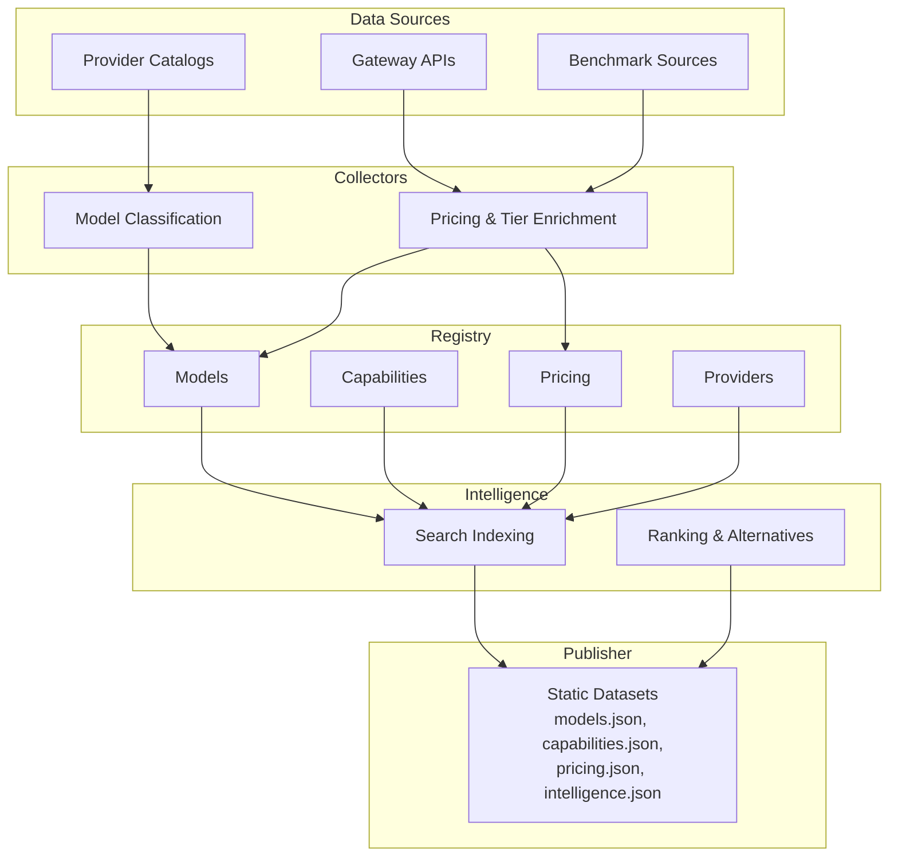
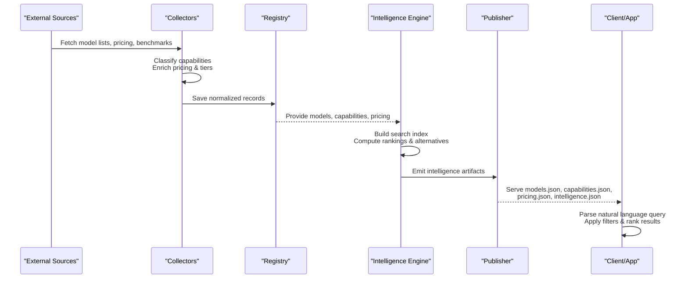
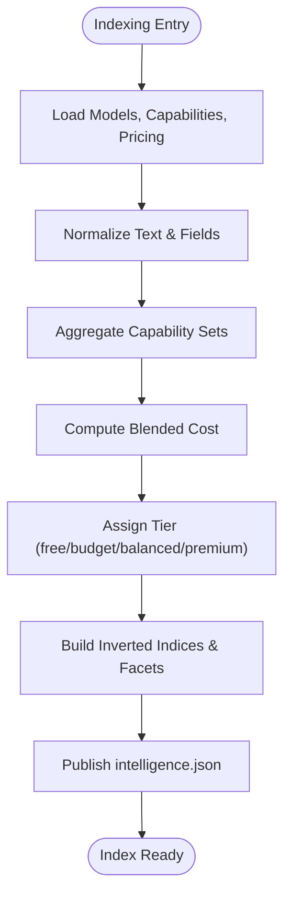
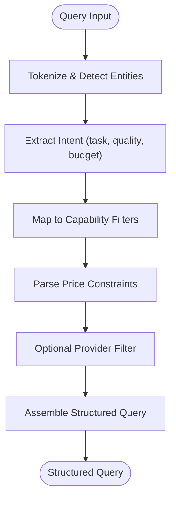
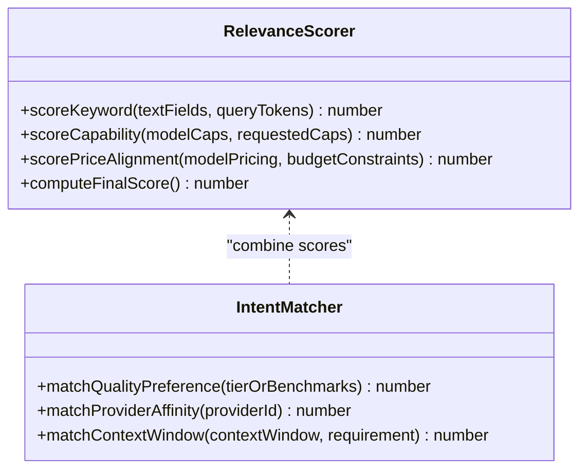
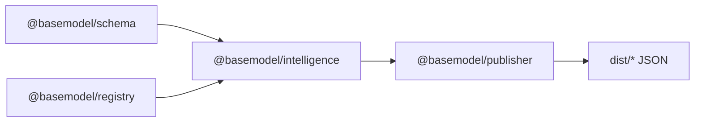

# Search & Discovery

<cite>
**Referenced Files in This Document**
- [README.md](file://README.md)
- [03_Architecture.md](file://docs/03_Architecture.md)
- [04_Pipeline.md](file://docs/04_Pipeline.md)
- [05_Data_Model.md](file://docs/05_Data_Model.md)
- [generate.ts](file://packages/publisher/src/generate.ts)
- [model-classify.ts](file://packages/collectors/src/core/model-classify.ts)
- [enrich.test.ts](file://packages/collectors/src/__tests__/enrich.test.ts)
- [package.json](file://packages/intelligence/package.json)
</cite>

## Table of Contents
1. [Introduction](#introduction)
2. [Project Structure](#project-structure)
3. [Core Components](#core-components)
4. [Architecture Overview](#architecture-overview)
5. [Detailed Component Analysis](#detailed-component-analysis)
6. [Dependency Analysis](#dependency-analysis)
7. [Performance Considerations](#performance-considerations)
8. [Troubleshooting Guide](#troubleshooting-guide)
9. [Conclusion](#conclusion)
10. [Appendices](#appendices)

## Introduction
This document explains BaseModel’s search and discovery capabilities that enable semantic model finding and filtering. It covers how the system indexes model metadata, capabilities, pricing, and descriptions; how natural language queries are parsed into structured filters; how results are ranked by relevance and user intent; and how caching and optimization techniques support high-performance querying. The intelligence layer derives search-ready datasets from registry data and publishes them for consumers to query efficiently.

## Project Structure
BaseModel is organized into layered packages:
- Schema defines canonical types used across the system.
- Registry stores validated, normalized records (providers, models, capabilities, pricing, etc.).
- Collectors discover and enrich provider data, including capability classification and pricing enrichment.
- Intelligence computes derived insights such as search indices, alternatives, and cost tiers.
- Publisher generates static datasets (including intelligence.json) consumed by clients.
- CLI exposes intelligence queries from the terminal.

**Diagram sources**
- [03_Architecture.md:1-77](file://docs/03_Architecture.md#L1-L77)
- [04_Pipeline.md:1-232](file://docs/04_Pipeline.md#L1-L232)
- [generate.ts:112-243](file://packages/publisher/src/generate.ts#L112-L243)

**Section sources**
- [README.md:10-30](file://README.md#L10-L30)
- [03_Architecture.md:1-77](file://docs/03_Architecture.md#L1-L77)
- [04_Pipeline.md:1-85](file://docs/04_Pipeline.md#L1-L85)

## Core Components
- Model classification: Determines modality and feature flags (e.g., vision, audio, embedding, image generation) based on model identifiers and patterns.
- Pricing enrichment: Normalizes per-token pricing from multiple catalogs, assigns cost tiers, and propagates tier information for resold models.
- Intelligence engine: Builds search-ready structures from registry data and publishes intelligence.json for downstream consumers.
- Data model: Canonical entities (Provider, Model, Capability, Pricing, Benchmark, API, License) define the schema used for indexing and filtering.

Key responsibilities:
- Normalize heterogeneous source data into consistent fields for search.
- Derive capability and pricing signals to power filtering and ranking.
- Generate stable, versioned datasets optimized for fast client-side or server-side search.

**Section sources**
- [model-classify.ts:63-132](file://packages/collectors/src/core/model-classify.ts#L63-L132)
- [enrich.test.ts:1-466](file://packages/collectors/src/__tests__/enrich.test.ts#L1-L466)
- [generate.ts:112-243](file://packages/publisher/src/generate.ts#L112-L243)
- [05_Data_Model.md:23-136](file://docs/05_Data_Model.md#L23-L136)

## Architecture Overview
The search pipeline integrates discovery, collection, normalization, registry storage, intelligence derivation, and publication.

**Diagram sources**
- [04_Pipeline.md:1-85](file://docs/04_Pipeline.md#L1-L85)
- [generate.ts:112-243](file://packages/publisher/src/generate.ts#L112-L243)

**Section sources**
- [03_Architecture.md:1-77](file://docs/03_Architecture.md#L1-L77)
- [04_Pipeline.md:1-85](file://docs/04_Pipeline.md#L1-L85)

## Detailed Component Analysis

### Search Indexing System
The indexing system prepares model metadata, capabilities, pricing, and descriptions for optimal search performance. It leverages normalized fields defined by the data model and enriched signals from collectors.

- Inputs:
  - Models: identifiers, names, descriptions, modality, feature flags (vision, audio, embedding, reasoning).
  - Capabilities: normalized capability IDs and names.
  - Pricing: per-token costs, blended cost, tier classification.
  - Providers: provider identity and context.
- Processing:
  - Normalize text fields for tokenization and matching.
  - Aggregate capability sets per model.
  - Compute blended cost and assign tier categories.
  - Build inverted indices and searchable facets for fast filtering.
- Outputs:
  - Static datasets (intelligence.json) with precomputed search structures.
  - Facets for capability, price range, provider, and tier.

**Diagram sources**
- [05_Data_Model.md:23-136](file://docs/05_Data_Model.md#L23-L136)
- [04_Pipeline.md:127-204](file://docs/04_Pipeline.md#L127-L204)
- [generate.ts:218-243](file://packages/publisher/src/generate.ts#L218-L243)

**Section sources**
- [05_Data_Model.md:23-136](file://docs/05_Data_Model.md#L23-L136)
- [04_Pipeline.md:127-204](file://docs/04_Pipeline.md#L127-L204)
- [generate.ts:218-243](file://packages/publisher/src/generate.ts#L218-L243)

### Query Parsing and Natural Language Understanding
Natural language queries like “best cheap text generation model” or “vision models under $0.01 per token” are parsed into structured filters:
- Intent extraction: Identify primary task (text generation, vision, embeddings), quality preference (“best”), and budget constraints (“cheap”, “under $0.01”).
- Capability mapping: Map terms to capability IDs (e.g., “text generation” → text modality + function calling if applicable; “vision” → vision_support).
- Price parsing: Extract numeric thresholds and units, normalize to per-1M tokens, and compare against blended cost or input/output prices.
- Provider scoping: Optional provider-specific filters extracted from named providers.
- Performance-tier hints: Infer tier preferences (budget vs premium) from descriptors.

[No sources needed since this diagram shows conceptual workflow, not actual code structure]

### Filtering System
Filters supported include:
- Capability-based: Modality (text, image, audio, video), embedding, vision, reasoning, function calling, structured output.
- Price-range: Blended cost thresholds, per-input/per-output limits, free-only.
- Provider-specific: Filter by provider_id or slug variants.
- Performance-tier: free, budget, balanced, premium.

Filter application:
- Pre-filter via facets (capability, provider, tier).
- Post-filter using precise field checks (modality flags, pricing values).
- Combine AND/OR logic for complex queries.

**Section sources**
- [05_Data_Model.md:41-136](file://docs/05_Data_Model.md#L41-L136)
- [04_Pipeline.md:190-204](file://docs/04_Pipeline.md#L190-L204)

### Ranking and Relevance Scoring
Ranking balances relevance scoring and user intent:
- Relevance scoring:
  - Keyword match strength in name/description/capability fields.
  - Capability alignment with requested modality/features.
  - Proximity of pricing to budget constraints.
- User intent matching:
  - Quality preference boosts top-tier or benchmark-aligned models.
  - Provider affinity if specified.
  - Context window and feature flags aligned with use case.
- Output:
  - Ranked list with score breakdown and filter applicability notes.

[No sources needed since this diagram shows conceptual workflow, not actual code structure]

### Examples of Complex Queries and Results Interpretation
- Example queries:
  - “Best cheap text generation model”: High relevance for text modality, low blended cost, strong keyword matches, boosted by quality indicators.
  - “Vision models under $0.01 per token”: Vision capability required, blended cost or input price below threshold, provider-neutral unless specified.
  - “Embedding models from Google with structured output”: Capability set includes embedding and structured_output, provider_id equals google.
- Result interpretation:
  - Top results show highest combined relevance and intent alignment.
  - Secondary results may satisfy hard constraints but have lower relevance or higher cost.
  - Filter applicability notes explain why certain models were excluded.

[No sources needed since this section provides general guidance]

## Dependency Analysis
The intelligence package depends on schema and registry packages to read canonical data and compute derived insights. The publisher consumes registry and intelligence outputs to generate static datasets.

**Diagram sources**
- [package.json:1-50](file://packages/intelligence/package.json#L1-L50)
- [generate.ts:112-243](file://packages/publisher/src/generate.ts#L112-L243)

**Section sources**
- [package.json:1-50](file://packages/intelligence/package.json#L1-L50)
- [generate.ts:112-243](file://packages/publisher/src/generate.ts#L112-L243)

## Performance Considerations
Optimization techniques:
- Precomputed indices: intelligence.json contains inverted indices and facets for fast client/server queries.
- Faceted filtering: Use capability, provider, and tier facets to reduce candidate sets early.
- Caching strategies:
  - Cache intelligence.json snapshots keyed by schema_version and source_revision.
  - Cache query results for repeated identical queries within a session or short TTL.
  - Cache capability mappings and tier definitions to avoid recomputation.
- Batch processing:
  - Bulk load models, capabilities, and pricing once per process.
  - Avoid per-query I/O by operating on in-memory structures.
- Efficient parsing:
  - Normalize inputs once and reuse tokenized forms.
  - Use numeric comparisons for price thresholds rather than string parsing at query time.

[No sources needed since this section provides general guidance]

## Troubleshooting Guide
Common issues and resolutions:
- Stale datasets:
  - Ensure regeneration after registry updates; check generated_at and schema_version.
- Missing pricing:
  - Verify enrichment sources availability; fallback behavior documented in pipeline.
- Incorrect capability classification:
  - Review model identifier patterns and classification rules; update patterns if necessary.
- Query parsing errors:
  - Validate natural language inputs; ensure unit normalization for pricing constraints.
- Performance regressions:
  - Monitor cache hit rates; adjust TTLs and dataset sizes.

**Section sources**
- [04_Pipeline.md:163-217](file://docs/04_Pipeline.md#L163-L217)
- [generate.ts:112-243](file://packages/publisher/src/generate.ts#L112-L243)

## Conclusion
BaseModel’s search and discovery system transforms heterogeneous model data into a unified, searchable knowledge base. By normalizing capabilities, enriching pricing, and deriving intelligence artifacts, it enables powerful natural language queries, robust filtering, and intelligent ranking. With precomputed indices and caching strategies, the system supports high-performance querying suitable for both client-side and server-side applications.

[No sources needed since this section summarizes without analyzing specific files]

## Appendices
- Data model reference: See canonical entities and identifiers for precise field usage in indexing and filtering.
- Pipeline stages: Understand discovery, collection, validation, normalization, registry, intelligence, generation, and publication phases.

**Section sources**
- [05_Data_Model.md:137-169](file://docs/05_Data_Model.md#L137-L169)
- [04_Pipeline.md:1-85](file://docs/04_Pipeline.md#L1-L85)