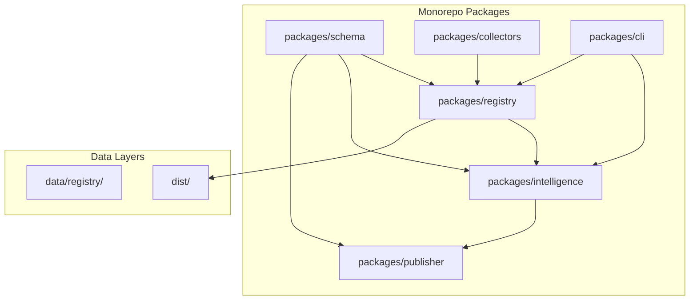
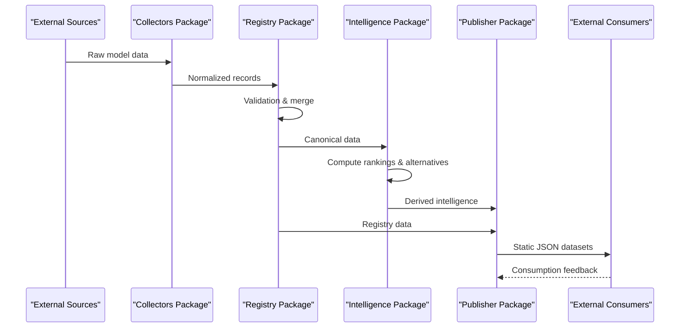
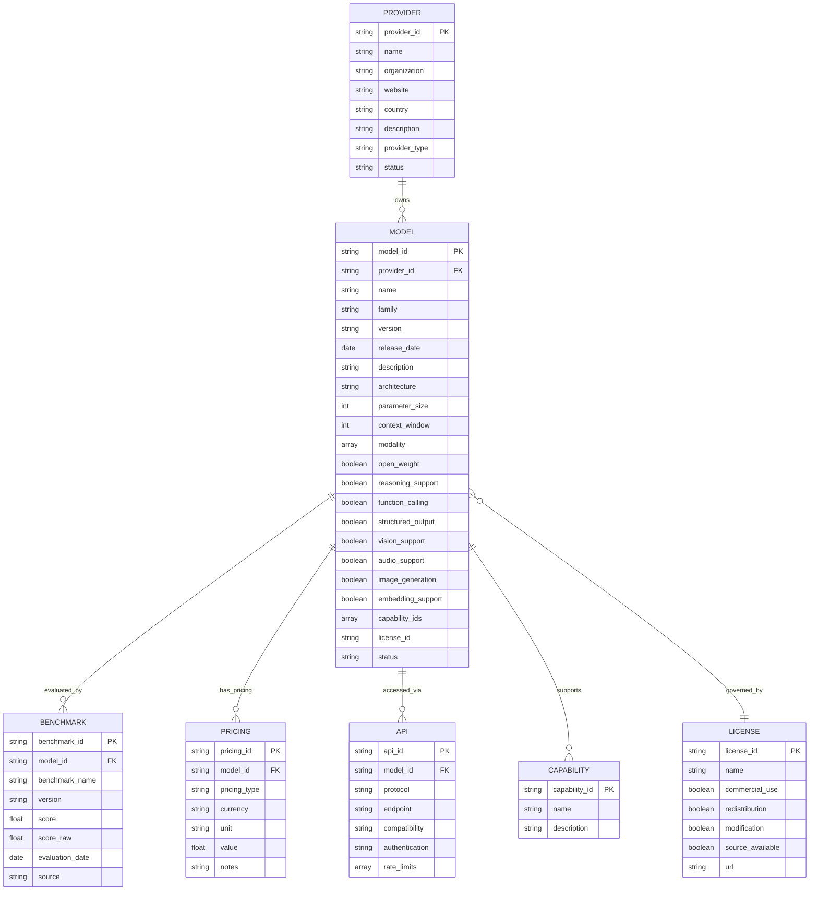
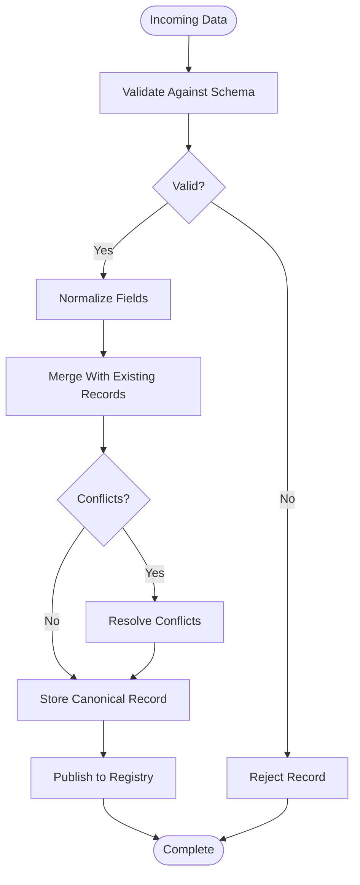
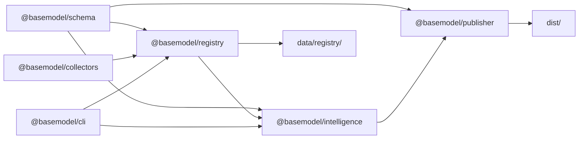

# Project Overview

<cite>
**Referenced Files in This Document**
- [README.md](file://README.md)
- [01_Vision.md](file://docs/01_Vision.md)
- [02_Philosophy.md](file://docs/02_Philosophy.md)
- [03_Architecture.md](file://docs/03_Architecture.md)
- [05_Data_Model.md](file://docs/05_Data_Model.md)
- [CONTRIBUTING.md](file://CONTRIBUTING.md)
- [package.json](file://package.json)
- [pnpm-workspace.yaml](file://pnpm-workspace.yaml)
- [meta.json](file://data/registry/meta.json)
- [openai.json](file://data/registry/providers/openai.json)
- [chat-latest.json](file://data/registry/models/openai/chat-latest.json)
</cite>

## Table of Contents
1. [Introduction](#introduction)
2. [Project Structure](#project-structure)
3. [Core Components](#core-components)
4. [Architecture Overview](#architecture-overview)
5. [Detailed Component Analysis](#detailed-component-analysis)
6. [Dependency Analysis](#dependency-analysis)
7. [Performance Considerations](#performance-considerations)
8. [Troubleshooting Guide](#troubleshooting-guide)
9. [Conclusion](#conclusion)
10. [Appendices](#appendices)

## Introduction
BaseModel is an open-source AI model intelligence platform that discovers, validates, normalizes, stores, analyzes, and publishes structured knowledge about AI models. It is not an inference runtime, model host, chatbot, coding assistant, or end-user application. Instead, it serves as the foundational data layer for the AI ecosystem, enabling developers to discover, compare, evaluate, and integrate AI models through a unified interface.

The project’s vision is to standardize AI model information across providers, enable intelligent comparisons, and provide a single source of truth for model capabilities, pricing, benchmarks, and API compatibility. Its target audience includes developers building AI applications, runtime systems, agent frameworks, IDE extensions, developer tools, research tooling, analytics platforms, and open-source applications.

Key differentiators include:
- Provider-agnostic normalization of heterogeneous model metadata into a canonical schema
- Automated discovery, validation, and publication pipelines
- Static, cacheable datasets for reliable consumption by downstream systems
- Focus on data quality and provenance over completeness
- Extensible plugin architecture for collectors, benchmarks, and ranking strategies

BaseModel operates as a monorepo infrastructure that powers the broader AI development community by providing trusted, continuously updated model intelligence without executing models or hosting user interfaces.

**Section sources**
- [README.md:1-10](file://README.md#L1-L10)
- [01_Vision.md:1-10](file://docs/01_Vision.md#L1-L10)
- [01_Vision.md:54-76](file://docs/01_Vision.md#L54-L76)
- [02_Philosophy.md:1-12](file://docs/02_Philosophy.md#L1-L12)

## Project Structure
BaseModel is organized as a pnpm monorepo with clearly separated packages, each owning a specific responsibility within the pipeline from discovery to publication. The repository layout emphasizes modularity, stability, and extensibility:

- packages/schema: Canonical Zod schemas and TypeScript types defining the domain model
- packages/registry: Registry storage, validation, and merge utilities for canonical records
- packages/collectors: Provider and gateway collectors for discovering and ingesting model data
- packages/intelligence: Derived rankings, search, and recommendations computed from registry data
- packages/publisher: Dataset generation for static outputs published to dist/
- packages/cli: Command-line interface for querying intelligence and interacting with the system

Canonical records live under data/registry/, while generated datasets are written to dist/. The workspace configuration centralizes dependency management and build orchestration across packages.

**Diagram sources**
- [README.md:11-17](file://README.md#L11-L17)
- [03_Architecture.md:37-44](file://docs/03_Architecture.md#L37-L44)

**Section sources**
- [README.md:11-17](file://README.md#L11-L17)
- [pnpm-workspace.yaml:1-3](file://pnpm-workspace.yaml#L1-L3)
- [package.json:17-25](file://package.json#L17-L25)

## Core Components
BaseModel’s core components work together to transform raw provider data into structured, normalized intelligence:

- Discovery Layer: Identifies and collects data from provider sites, model catalogs, documentation pages, and benchmark sources through gateway and provider collectors
- Registry Layer: Stores canonical records after validation and normalization, serving as the source of truth for providers, models, capabilities, pricing, licenses, APIs, and benchmarks
- Intelligence Layer: Derives search, alternatives, and cost information from registry data without modifying canonical records
- Publishing Layer: Converts registry and intelligence data into public static JSON datasets for consumption by external systems

Each component adheres to strict boundaries and responsibilities, ensuring that BaseModel remains focused on data intelligence rather than inference execution or user-facing features.

**Section sources**
- [03_Architecture.md:7-35](file://docs/03_Architecture.md#L7-L35)
- [03_Architecture.md:46-57](file://docs/03_Architecture.md#L46-L57)

## Architecture Overview
The BaseModel architecture follows a layered approach that separates concerns and enables independent evolution of each component. The system processes data through a well-defined pipeline from discovery to publication, with clear boundaries between layers.

**Diagram sources**
- [03_Architecture.md:7-35](file://docs/03_Architecture.md#L7-L35)
- [03_Architecture.md:59-72](file://docs/03_Architecture.md#L59-L72)

## Detailed Component Analysis

### Data Model and Schema Design
The BaseModel data model defines canonical entities that represent real-world concepts in the AI ecosystem. Each entity has a stable identifier system and normalized fields that abstract away provider-specific variations.

**Diagram sources**
- [05_Data_Model.md:25-136](file://docs/05_Data_Model.md#L25-L136)

### Registry and Validation System
The registry layer serves as the authoritative source for all canonical records, implementing comprehensive validation and normalization processes. It handles the complexity of merging data from multiple sources while maintaining data integrity and consistency.

**Diagram sources**
- [03_Architecture.md:15-22](file://docs/03_Architecture.md#L15-L22)

### Intelligence and Analytics Engine
The intelligence layer computes derived insights from registry data without modifying canonical records. This includes rankings, alternative model suggestions, cost analysis, and capability-based searches.

**Section sources**
- [03_Architecture.md:23-29](file://docs/03_Architecture.md#L23-L29)
- [05_Data_Model.md:137-152](file://docs/05_Data_Model.md#L137-L152)

### Publishing and Distribution Pipeline
The publishing layer converts both registry and intelligence data into static JSON datasets optimized for caching, mirroring, and consumption by external systems. These datasets include providers, models, capabilities, licenses, APIs, benchmarks, pricing, and intelligence information.

**Section sources**
- [03_Architecture.md:31-35](file://docs/03_Architecture.md#L31-L35)
- [README.md:19-30](file://README.md#L19-L30)

## Dependency Analysis
BaseModel’s monorepo structure creates clear dependencies between packages while maintaining loose coupling through well-defined interfaces. The dependency flow follows the data pipeline from collection to publication.

**Diagram sources**
- [03_Architecture.md:37-44](file://docs/03_Architecture.md#L37-L44)
- [pnpm-workspace.yaml:1-3](file://pnpm-workspace.yaml#L1-L3)

**Section sources**
- [03_Architecture.md:37-44](file://docs/03_Architecture.md#L37-L44)
- [package.json:17-25](file://package.json#L17-L25)

## Performance Considerations
BaseModel prioritizes performance through several key strategies:

- **Static First Approach**: Published datasets are static files that can be cached, mirrored, and served efficiently
- **Schema Validation**: Early validation prevents expensive processing of invalid data
- **Modular Architecture**: Independent packages allow for targeted optimizations and parallel processing
- **Normalized Data**: Canonical representations reduce computational overhead in downstream consumers
- **Automation-First**: Automated pipelines ensure consistent performance characteristics

The system is designed to handle large-scale model registries (currently covering 1,540+ models) while maintaining fast query response times and efficient dataset generation.

## Troubleshooting Guide
Common issues and their resolutions in the BaseModel ecosystem:

### Data Quality Issues
- **Validation Failures**: Check schema definitions in packages/schema and ensure incoming data conforms to expected formats
- **Missing Provenance**: Verify source URLs and attribution fields in collector implementations
- **Inconsistent Pricing**: Cross-reference pricing data across multiple sources and validate currency conversions

### Collection Pipeline Problems
- **Provider API Changes**: Update collector implementations when provider endpoints or response formats change
- **Authentication Failures**: Verify secret configurations and API key validity in collector settings
- **Rate Limiting**: Implement appropriate retry logic and backoff strategies in collectors

### Registry Maintenance
- **Record Conflicts**: Use the merge strategy defined in registry package to resolve conflicting data from multiple sources
- **Schema Evolution**: Follow backward-compatible changes when updating canonical schemas
- **Coverage Gaps**: Monitor coverage metrics in registry metadata to identify missing model information

**Section sources**
- [CONTRIBUTING.md:26-51](file://CONTRIBUTING.md#L26-L51)
- [meta.json:14-16](file://data/registry/meta.json#L14-L16)

## Conclusion
BaseModel represents a foundational infrastructure layer for the AI ecosystem, providing standardized, validated, and continuously updated model intelligence. By focusing on data quality, provider neutrality, and automation-first principles, it enables developers to build sophisticated AI applications without getting bogged down in the complexity of managing model metadata across diverse providers.

The platform’s success lies in its ability to answer critical questions about model capabilities, pricing, and compatibility without requiring manual investigation of dozens of sources. As the AI landscape continues to evolve rapidly, BaseModel provides the stable foundation necessary for reliable model integration and comparison.

For developers building AI applications, BaseModel offers the essential data layer needed to make informed decisions about model selection, integration, and deployment strategies. Its open-source nature and commitment to transparency make it an ideal choice for organizations seeking to build robust, maintainable AI-powered solutions.

## Appendices

### Development Environment Setup
BaseModel requires Node.js 20+ and pnpm 9+ for development. The monorepo structure allows for parallel development across packages while maintaining consistent standards through shared tooling and configuration.

### Contributing Guidelines
Contributions should focus on improving data quality, correctness, reproducibility, and usability of published datasets. The contribution process emphasizes small, focused pull requests with comprehensive testing and documentation updates.

**Section sources**
- [CONTRIBUTING.md:1-17](file://CONTRIBUTING.md#L1-L17)
- [package.json:12-15](file://package.json#L12-L15)