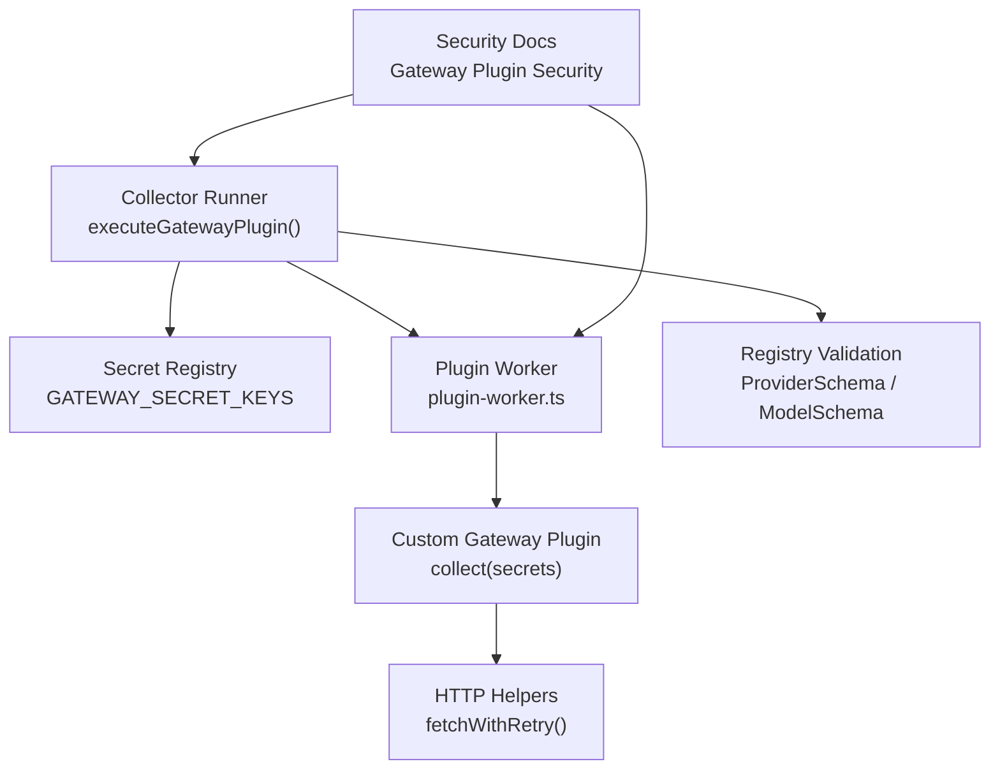
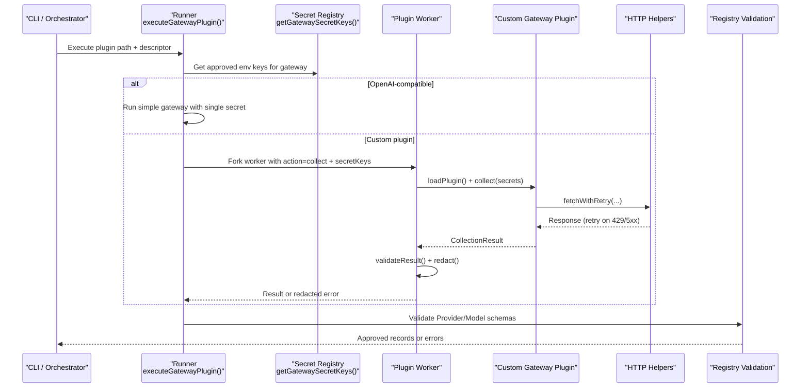
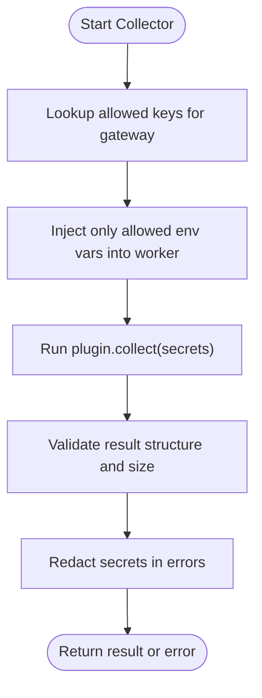
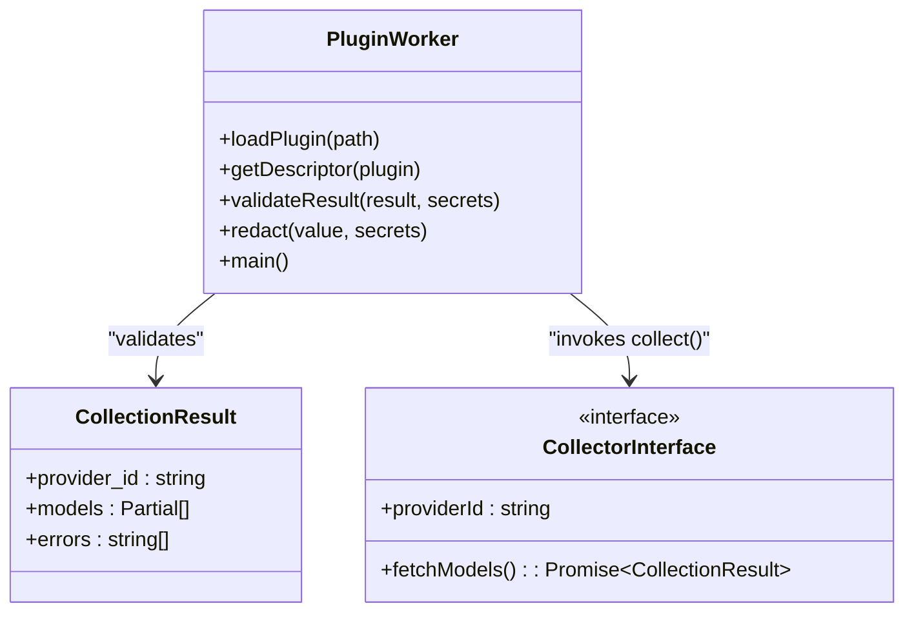
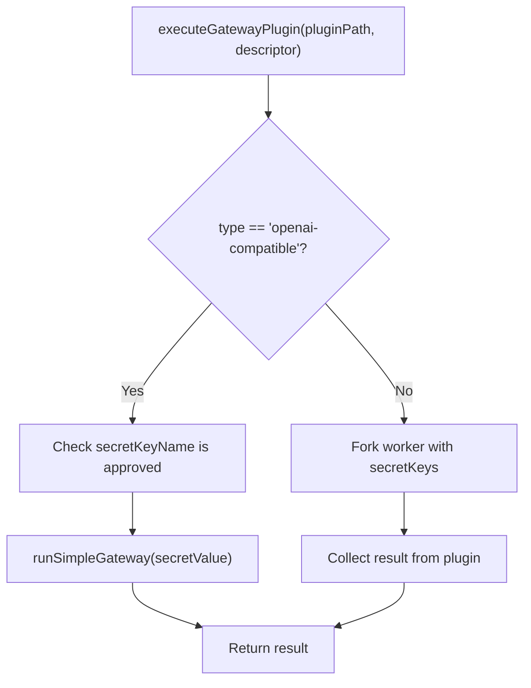
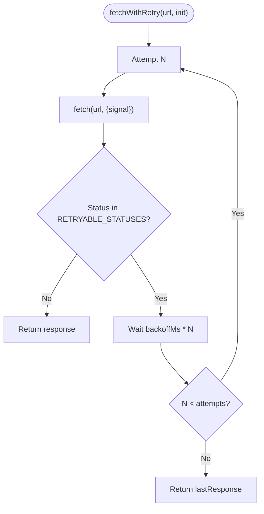
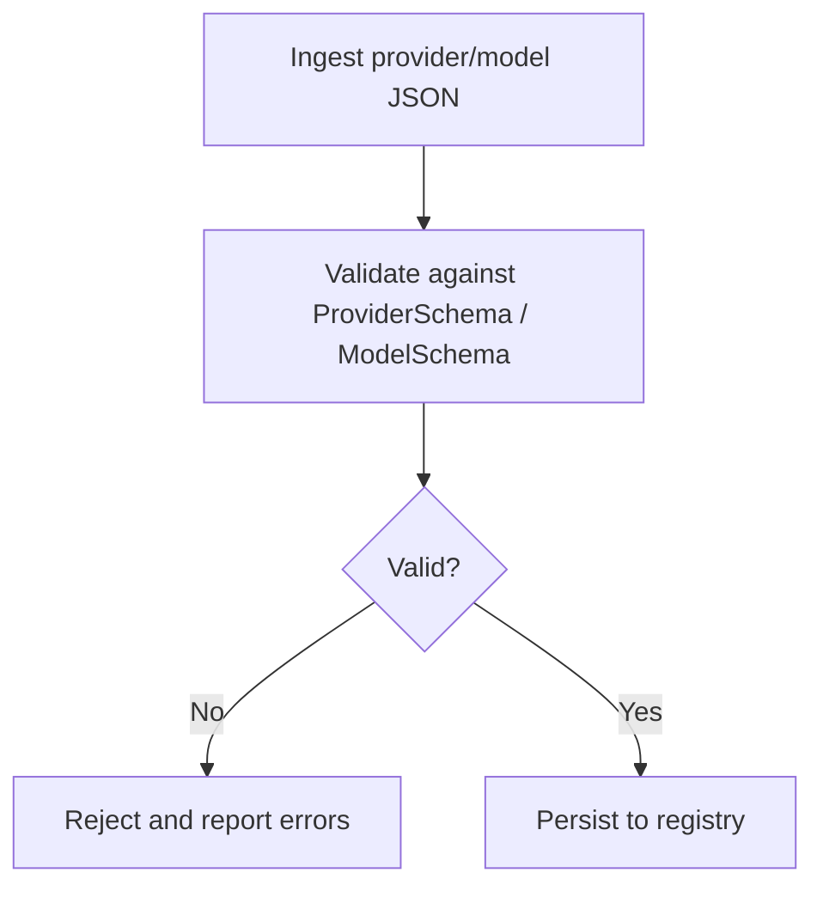
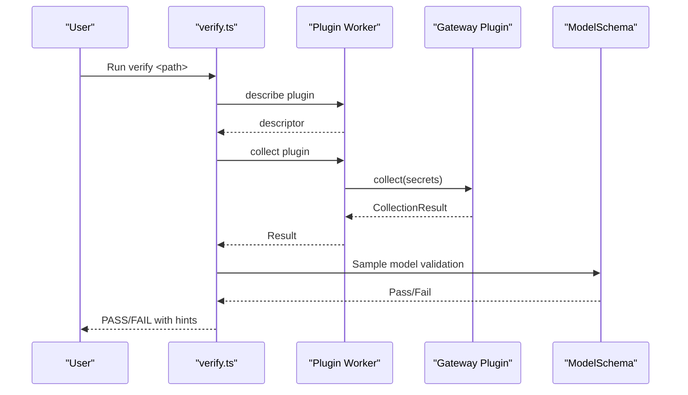
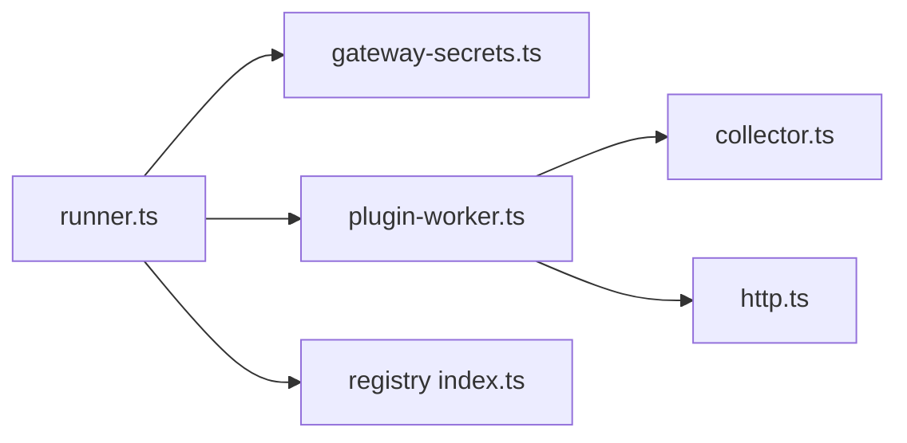

# Authentication & Security

<cite>
**Referenced Files in This Document**
- [README.md](file://README.md)
- [08_Gateway_Plugin_Security.md](file://docs/08_Gateway_Plugin_Security.md)
- [gateway-secrets.ts](file://packages/collectors/src/core/gateway-secrets.ts)
- [plugin-worker.ts](file://packages/collectors/src/core/plugin-worker.ts)
- [runner.ts](file://packages/collectors/src/core/runner.ts)
- [http.ts](file://packages/collectors/src/core/http.ts)
- [collector.ts](file://packages/collectors/src/core/collector.ts)
- [verify.ts](file://packages/collectors/src/core/verify.ts)
- [index.ts](file://packages/registry/src/index.ts)
- [provider.test.ts](file://packages/registry/src/__tests__/provider.test.ts)
- [model.test.ts](file://packages/registry/src/__tests__/model.test.ts)
- [unregistered-gateway.ts](file://packages/collectors/src/__tests__/fixtures/unregistered-gateway.ts)
</cite>

## Table of Contents
1. [Introduction](#introduction)
2. [Project Structure](#project-structure)
3. [Core Components](#core-components)
4. [Architecture Overview](#architecture-overview)
5. [Detailed Component Analysis](#detailed-component-analysis)
6. [Dependency Analysis](#dependency-analysis)
7. [Performance Considerations](#performance-considerations)
8. [Troubleshooting Guide](#troubleshooting-guide)
9. [Conclusion](#conclusion)

## Introduction
This document explains authentication and security considerations when integrating AI model providers with BaseModel’s collectors and registry. It covers credential management, secure storage of API keys, environment variable configuration, provider authentication patterns (API keys, OAuth flows, signed requests), input/output validation, logging hygiene, privacy compliance, rate limiting, and monitoring for suspicious activity. The guidance is grounded in the repository’s collector runtime, plugin worker isolation, secret registry, HTTP helpers, and schema validations.

## Project Structure
BaseModel organizes authentication and security around:
- A central secret registry that whitelists which environment variables each gateway may access.
- An isolated plugin worker that executes custom collectors with only approved secrets.
- Shared HTTP utilities that implement retry/backoff for transient failures.
- Schema validation to ensure safe, normalized data entering the registry.
- Documentation outlining plugin boundaries and security posture.

**Diagram sources**
- [runner.ts:216-238](file://packages/collectors/src/core/runner.ts#L216-L238)
- [gateway-secrets.ts:1-26](file://packages/collectors/src/core/gateway-secrets.ts#L1-L26)
- [plugin-worker.ts:1-113](file://packages/collectors/src/core/plugin-worker.ts#L1-L113)
- [http.ts:1-38](file://packages/collectors/src/core/http.ts#L1-L38)
- [index.ts:1-48](file://packages/registry/src/index.ts#L1-L48)
- [08_Gateway_Plugin_Security.md:1-36](file://docs/08_Gateway_Plugin_Security.md#L1-L36)

**Section sources**
- [README.md:1-61](file://README.md#L1-L61)
- [08_Gateway_Plugin_Security.md:1-36](file://docs/08_Gateway_Plugin_Security.md#L1-L36)

## Core Components
- Secret Registry: Centralized mapping from gateway IDs to allowed environment variable names. Only these keys are passed into plugins.
- Plugin Worker: Isolated process that loads a plugin, injects only approved secrets, executes collect(), validates outputs, and redacts secrets in error messages.
- Runner: Orchestrates execution, enforces secret approval, and runs simple OpenAI-compatible gateways or delegates to the worker for custom plugins.
- HTTP Helpers: Retry/backoff for transient upstream errors to avoid silent failures.
- Schema Validation: Ensures provider and model records conform to canonical schemas before being stored in the registry.

Key responsibilities:
- Credential scoping per gateway.
- Process isolation for untrusted code.
- Output sanitization and size limits.
- Safe retries without masking real errors.
- Strict schema enforcement for data integrity.

**Section sources**
- [gateway-secrets.ts:1-26](file://packages/collectors/src/core/gateway-secrets.ts#L1-L26)
- [plugin-worker.ts:1-113](file://packages/collectors/src/core/plugin-worker.ts#L1-L113)
- [runner.ts:216-238](file://packages/collectors/src/core/runner.ts#L216-L238)
- [http.ts:1-38](file://packages/collectors/src/core/http.ts#L1-L38)
- [collector.ts:1-23](file://packages/collectors/src/core/collector.ts#L1-L23)
- [index.ts:1-48](file://packages/registry/src/index.ts#L1-L48)

## Architecture Overview
The collector runtime enforces least-privilege access to credentials and isolates plugin execution. Secrets are never inferred from plugin declarations; they must be explicitly registered. Plugins run in a separate process and can only see their approved environment variables. All external network calls use shared helpers with retry/backoff. Outputs are validated against strict schemas and size limits.

**Diagram sources**
- [runner.ts:216-238](file://packages/collectors/src/core/runner.ts#L216-L238)
- [gateway-secrets.ts:1-26](file://packages/collectors/src/core/gateway-secrets.ts#L1-L26)
- [plugin-worker.ts:1-113](file://packages/collectors/src/core/plugin-worker.ts#L1-L113)
- [http.ts:1-38](file://packages/collectors/src/core/http.ts#L1-L38)
- [index.ts:1-48](file://packages/registry/src/index.ts#L1-L48)

## Detailed Component Analysis

### Secret Registry and Environment Configuration
- Purpose: Define exactly which environment variables each gateway may read.
- Enforcement: Only keys listed here are injected into the plugin worker. Unregistered keys are ignored.
- Best practices:
  - Store secrets in environment variables managed by your platform (e.g., CI secrets manager, OS keychain).
  - Never hardcode keys in source or config files.
  - Rotate keys regularly and scope them per environment.

**Diagram sources**
- [gateway-secrets.ts:1-26](file://packages/collectors/src/core/gateway-secrets.ts#L1-L26)
- [plugin-worker.ts:99-112](file://packages/collectors/src/core/plugin-worker.ts#L99-L112)

**Section sources**
- [gateway-secrets.ts:1-26](file://packages/collectors/src/core/gateway-secrets.ts#L1-L26)
- [plugin-worker.ts:99-112](file://packages/collectors/src/core/plugin-worker.ts#L99-L112)

### Plugin Worker Isolation and Output Sanitization
- Isolation: Plugins execute in a child process via fork, minimizing exposure to the host.
- Input control: Only pre-approved secret keys are passed to the plugin.
- Output validation: Enforces shape, size limits, and checks for accidental secret leakage in results.
- Error handling: Errors are redacted to remove any configured secret values.

**Diagram sources**
- [plugin-worker.ts:1-113](file://packages/collectors/src/core/plugin-worker.ts#L1-L113)
- [collector.ts:1-23](file://packages/collectors/src/core/collector.ts#L1-L23)

**Section sources**
- [plugin-worker.ts:1-113](file://packages/collectors/src/core/plugin-worker.ts#L1-L113)
- [collector.ts:1-23](file://packages/collectors/src/core/collector.ts#L1-L23)

### Runner Orchestration and Secret Approval
- Responsibilities:
  - Resolve allowed secret keys for a given gateway ID.
  - For OpenAI-compatible gateways, pass the single required secret directly.
  - For custom plugins, spawn a worker with the approved secret keys.
  - Throw clear errors if a plugin requests an unapproved secret.

**Diagram sources**
- [runner.ts:216-238](file://packages/collectors/src/core/runner.ts#L216-L238)

**Section sources**
- [runner.ts:216-238](file://packages/collectors/src/core/runner.ts#L216-L238)

### HTTP Reliability and Rate Limiting
- Retries: Transient statuses (e.g., 429, 5xx) trigger exponential backoff.
- Timeouts: Each attempt uses a fresh timeout signal to avoid poisoning retries.
- Guidance:
  - Use fetchWithRetry for all upstream calls.
  - Configure reasonable timeouts and backoff parameters per provider.
  - Monitor 429 rates and adjust concurrency/backoff accordingly.

**Diagram sources**
- [http.ts:1-38](file://packages/collectors/src/core/http.ts#L1-L38)

**Section sources**
- [http.ts:1-38](file://packages/collectors/src/core/http.ts#L1-L38)

### Schema Validation and Data Integrity
- Provider and model records are validated against canonical schemas before storage.
- Tests enforce constraints such as valid URLs, status enums, and required fields.
- Benefits:
  - Prevents malformed or unsafe data from entering the registry.
  - Provides early failure feedback during verification and nightly runs.

**Diagram sources**
- [index.ts:1-48](file://packages/registry/src/index.ts#L1-L48)
- [provider.test.ts:1-62](file://packages/registry/src/__tests__/provider.test.ts#L1-L62)
- [model.test.ts:39-56](file://packages/registry/src/__tests__/model.test.ts#L39-L56)

**Section sources**
- [index.ts:1-48](file://packages/registry/src/index.ts#L1-L48)
- [provider.test.ts:1-62](file://packages/registry/src/__tests__/provider.test.ts#L1-L62)
- [model.test.ts:39-56](file://packages/registry/src/__tests__/model.test.ts#L39-L56)

### Verification Workflow
- The verifier loads plugin metadata in an isolated worker, then executes collection and samples models for schema validation.
- It provides actionable hints for common failures (e.g., missing or invalid API keys).

**Diagram sources**
- [verify.ts:24-69](file://packages/collectors/src/core/verify.ts#L24-L69)

**Section sources**
- [verify.ts:24-69](file://packages/collectors/src/core/verify.ts#L24-L69)

### Provider-Specific Authentication Patterns
- API Keys: Most gateways rely on environment variables like OPENAI_API_KEY, ANTHROPIC_API_KEY, GOOGLE_AI_API_KEY, etc. These are whitelisted in the secret registry and injected into the plugin worker.
- OAuth Flows: Not implemented in the collector runtime itself. If your integration requires OAuth, perform token acquisition outside the plugin and pass tokens via approved secrets or request signing mechanisms supported by the provider.
- Signed Requests: Implement signature generation within the plugin using only approved secrets. Ensure signatures do not leak into logs or responses.

Guidance:
- Keep provider-specific auth logic inside the plugin.
- Do not expose raw tokens in logs or error messages.
- Prefer short-lived tokens where possible.

**Section sources**
- [gateway-secrets.ts:1-26](file://packages/collectors/src/core/gateway-secrets.ts#L1-L26)
- [plugin-worker.ts:99-112](file://packages/collectors/src/core/plugin-worker.ts#L99-L112)

### Security Best Practices
- Request sanitization:
  - Validate inputs at the boundary; reject malformed payloads early.
  - Avoid echoing user content into logs or error messages.
- Input validation:
  - Use schema validation for all incoming data destined for the registry.
- Output filtering:
  - Strip sensitive fields from responses before returning to consumers.
- Vulnerability protection:
  - Treat plugins as untrusted; rely on process isolation and secret whitelisting.
  - Enforce size limits to prevent memory exhaustion.
- Sensitive data handling:
  - Never log secrets; redact them in errors and diagnostics.
  - Scope secrets to minimum necessary permissions.
- Privacy compliance:
  - Minimize collection of personal data.
  - Provide data retention policies and deletion capabilities where applicable.

**Section sources**
- [plugin-worker.ts:32-46](file://packages/collectors/src/core/plugin-worker.ts#L32-L46)
- [08_Gateway_Plugin_Security.md:1-36](file://docs/08_Gateway_Plugin_Security.md#L1-L36)

### Monitoring and Suspicious Activity
- Metrics to track:
  - 429/5xx rates and retry counts.
  - Latency percentiles per provider.
  - Secret injection events and validation failures.
- Alerts:
  - Spike in unauthorized errors (e.g., 401).
  - Unexpected large payloads or repeated validation failures.
- Auditing:
  - Log non-sensitive operational metrics.
  - Record plugin execution outcomes without secrets.

[No sources needed since this section provides general guidance]

## Dependency Analysis
The collector system has clear boundaries and minimal coupling:
- Runner depends on the secret registry and either a simple gateway executor or the plugin worker.
- Plugin worker depends on the collector interface and performs validation/redaction.
- HTTP helpers are used by plugins for resilient networking.
- Registry validation ensures data integrity independently of collectors.

**Diagram sources**
- [runner.ts:216-238](file://packages/collectors/src/core/runner.ts#L216-L238)
- [gateway-secrets.ts:1-26](file://packages/collectors/src/core/gateway-secrets.ts#L1-L26)
- [plugin-worker.ts:1-113](file://packages/collectors/src/core/plugin-worker.ts#L1-L113)
- [collector.ts:1-23](file://packages/collectors/src/core/collector.ts#L1-L23)
- [http.ts:1-38](file://packages/collectors/src/core/http.ts#L1-L38)
- [index.ts:1-48](file://packages/registry/src/index.ts#L1-L48)

**Section sources**
- [runner.ts:216-238](file://packages/collectors/src/core/runner.ts#L216-L238)
- [gateway-secrets.ts:1-26](file://packages/collectors/src/core/gateway-secrets.ts#L1-L26)
- [plugin-worker.ts:1-113](file://packages/collectors/src/core/plugin-worker.ts#L1-L113)
- [collector.ts:1-23](file://packages/collectors/src/core/collector.ts#L1-L23)
- [http.ts:1-38](file://packages/collectors/src/core/http.ts#L1-L38)
- [index.ts:1-48](file://packages/registry/src/index.ts#L1-L48)

## Performance Considerations
- Use fetchWithRetry to reduce flaky failures and improve throughput under transient errors.
- Tune backoff and timeouts based on provider behavior and SLAs.
- Enforce MAX_PLUGIN_MODELS and MAX_PLUGIN_RESPONSE_BYTES to bound memory usage.
- Batch requests where providers allow it, respecting rate limits.

[No sources needed since this section provides general guidance]

## Troubleshooting Guide
Common issues and resolutions:
- Unauthorized errors:
  - Ensure the correct API key is set in the environment and matches the provider’s expectations.
  - Check that the secret name is registered for the gateway.
- Zero models returned:
  - Review errors array; upstream limitations or missing credentials often cause empty results.
- Secret leakage detection:
  - The worker rejects results containing configured secrets; sanitize plugin output.
- Schema validation failures:
  - Fix field types, enums, and required attributes according to schemas.

Useful references:
- Non-retryable HTTP failures provide actionable hints about missing or invalid keys.
- Verifier reports sample schema validation results to quickly identify structural issues.

**Section sources**
- [runner.test.ts:147-159](file://packages/collectors/src/__tests__/runner.test.ts#L147-L159)
- [verify.ts:24-69](file://packages/collectors/src/core/verify.ts#L24-L69)
- [plugin-worker.ts:32-46](file://packages/collectors/src/core/plugin-worker.ts#L32-L46)
- [unregistered-gateway.ts:1-16](file://packages/collectors/src/__tests__/fixtures/unregistered-gateway.ts#L1-L16)

## Conclusion
BaseModel’s collector architecture enforces strong security boundaries through a centralized secret registry, isolated plugin execution, strict output validation, and resilient HTTP handling. By following the documented practices—environment-based credential management, careful logging, schema validation, and proactive monitoring—you can integrate multiple AI providers securely and reliably while maintaining privacy and compliance.

[No sources needed since this section summarizes without analyzing specific files]