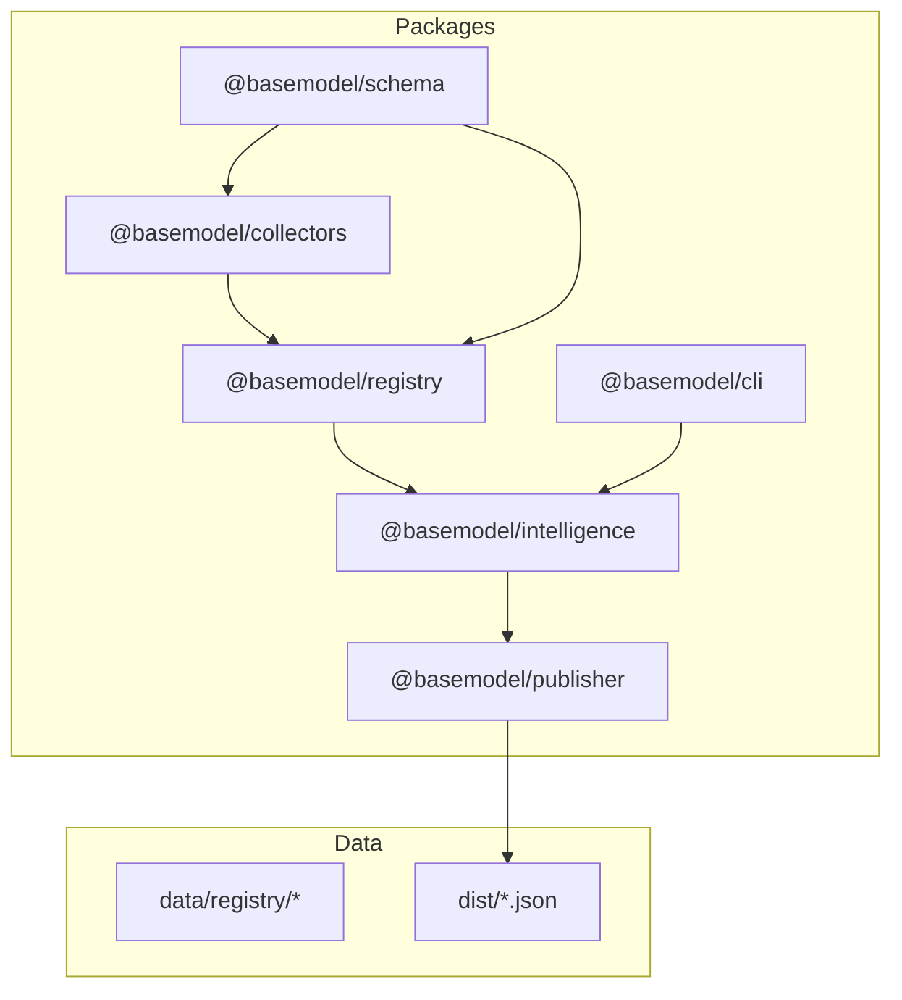
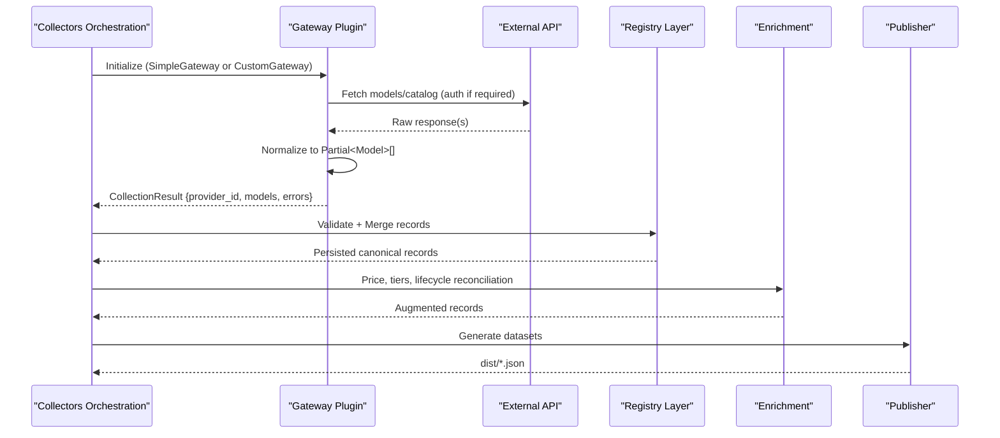
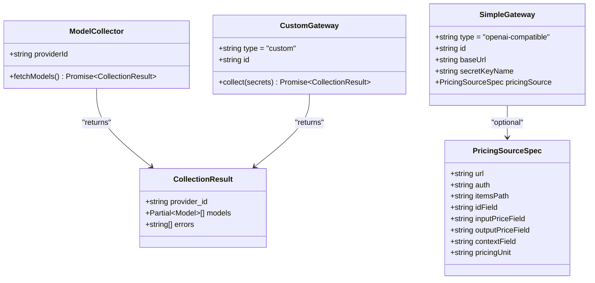
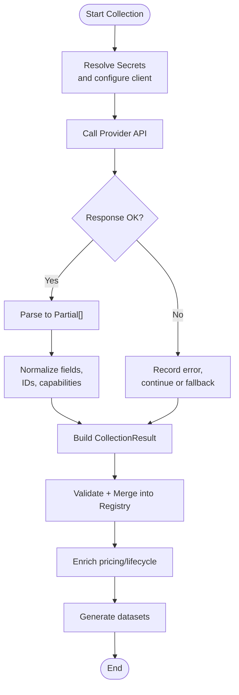
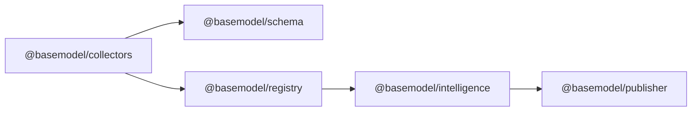

# Collector Architecture & Implementation

<cite>
**Referenced Files in This Document**
- [README.md](file://README.md)
- [03_Architecture.md](file://docs/03_Architecture.md)
- [04_Pipeline.md](file://docs/04_Pipeline.md)
- [collector.ts](file://packages/collectors/src/core/collector.ts)
- [package.json](file://packages/collectors/package.json)
</cite>

## Table of Contents
1. [Introduction](#introduction)
2. [Project Structure](#project-structure)
3. [Core Components](#core-components)
4. [Architecture Overview](#architecture-overview)
5. [Detailed Component Analysis](#detailed-component-analysis)
6. [Dependency Analysis](#dependency-analysis)
7. [Performance Considerations](#performance-considerations)
8. [Troubleshooting Guide](#troubleshooting-guide)
9. [Conclusion](#conclusion)
10. [Appendices](#appendices)

## Introduction
This document explains the collector architecture and implementation patterns used by BaseModel to discover, collect, normalize, and publish AI model data from external providers. It focuses on the gateway pattern for provider integrations, the base interfaces and abstract methods collectors must implement, end-to-end data flow through the registry, error handling, retry strategies, rate limiting, and practical guidance for building custom collectors. It also includes examples grounded in existing OpenAI-compatible and custom gateways and provides testing strategies for mocking external APIs and validating transformations.

## Project Structure
BaseModel is organized into packages that separate concerns: schema definitions, registry storage and validation, collectors for discovery and collection, intelligence for derived insights, publisher for dataset generation, and a CLI for querying. The collectors package implements both OpenAI-compatible gateway plugins and custom gateway plugins to fetch provider data and normalize it into canonical records consumed by the registry.

**Diagram sources**
- [03_Architecture.md:1-77](file://docs/03_Architecture.md#L1-L77)
- [README.md:10-30](file://README.md#L10-L30)

**Section sources**
- [README.md:10-30](file://README.md#L10-L30)
- [03_Architecture.md:1-77](file://docs/03_Architecture.md#L1-L77)

## Core Components
The collectors layer defines the core abstractions and plugin metadata that standardize how provider integrations are implemented and executed.

Key elements:
- ModelCollector interface: Declares providerId and fetchModels() for provider-specific collectors.
- CollectionResult: Aggregates normalized Partial<Model> records along with errors and the originating provider_id.
- GatewayPlugin types:
  - SimpleGateway: Declarative configuration for OpenAI-compatible endpoints, including optional pricingSource catalog ingestion.
  - CustomGateway: Encapsulates full collection logic via collect(secrets), executed in an isolated worker process.
- PricingSourceSpec: Optional declarative mapping to a provider’s pricing catalog endpoint and field paths.

These components enable two integration patterns:
- OpenAI-compatible gateway: Configure baseUrl, secretKeyName, and optional pricingSource; the runtime handles HTTP calls and normalization according to the OpenAI-compatible /models shape.
- Custom gateway: Provide a collect function that performs authentication, requests, parsing, and normalization, returning a CollectionResult.

**Section sources**
- [collector.ts:1-89](file://packages/collectors/src/core/collector.ts#L1-L89)

## Architecture Overview
The collector architecture follows a layered pipeline: Discovery → Collection → Validation → Normalization → Registry → Intelligence → Generation → Publication. Collectors operate within the Discovery and Collection stages, producing normalized records that the Registry validates and persists. Enrichment augments records with pricing and lifecycle information before publishing.

**Diagram sources**
- [04_Pipeline.md:1-232](file://docs/04_Pipeline.md#L1-L232)
- [collector.ts:1-89](file://packages/collectors/src/core/collector.ts#L1-L89)

## Detailed Component Analysis

### Gateway Pattern and Base Interfaces
The gateway pattern abstracts provider differences behind a uniform interface. Two plugin types are supported:
- SimpleGateway: Declarative OpenAI-compatible configuration.
- CustomGateway: Programmatic collect(secrets) implementation.

Both return a standardized CollectionResult, ensuring consistent downstream processing.

**Diagram sources**
- [collector.ts:1-89](file://packages/collectors/src/core/collector.ts#L1-L89)

**Section sources**
- [collector.ts:1-89](file://packages/collectors/src/core/collector.ts#L1-L89)

### Data Flow From External APIs Through Collectors to the Registry
Collectors orchestrate the following steps:
- Authentication using approved secrets resolved by secretKeyName (for SimpleGateway) or passed directly (for CustomGateway).
- Requesting provider endpoints (e.g., OpenAI-compatible /models or custom endpoints).
- Parsing responses into Partial<Model> records.
- Returning a CollectionResult with provider_id, models, and any errors encountered during collection.
- Registry validation and normalization ensure schema compliance and canonical identifiers.
- Enrichment adds pricing, cost tiers, and lifecycle status based on declared catalogs and aggregate sources.

**Diagram sources**
- [04_Pipeline.md:1-232](file://docs/04_Pipeline.md#L1-L232)
- [collector.ts:1-89](file://packages/collectors/src/core/collector.ts#L1-L89)

**Section sources**
- [04_Pipeline.md:1-232](file://docs/04_Pipeline.md#L1-L232)
- [collector.ts:1-89](file://packages/collectors/src/core/collector.ts#L1-L89)

### Error Handling, Retry Mechanisms, and Rate Limiting Strategies
- Error isolation: Invalid or malformed records are rejected early and logged; valid records continue through the pipeline.
- Fallback behavior: When primary sources fail (e.g., Hugging Face datasets-server rate-limited), the pipeline falls back to alternative sources (Mirror snapshot) to maintain availability.
- Failure modes: If all primary pricing sources fail, enrichment marks the run as fatal and exits non-zero to prevent committing stale data.
- Lifecycle protection: Reconciliation only runs after successful collections; failures cannot deprecate entire provider catalogs.

Recommendations for collectors:
- Implement retries with exponential backoff for transient network errors and HTTP 429 responses.
- Respect provider rate limits and honor retry-after headers when present.
- Aggregate partial errors per request and include them in CollectionResult.errors for observability.
- Use circuit breakers for unstable endpoints to avoid cascading failures.

**Section sources**
- [04_Pipeline.md:86-217](file://docs/04_Pipeline.md#L86-L217)

### Examples of Existing Collector Implementations
- OpenAI-compatible gateway (SimpleGateway):
  - Configure baseUrl, secretKeyName, and optional pricingSource.
  - The runtime fetches the OpenAI-compatible /models endpoint and normalizes results.
  - Example usage patterns include integrating with providers like OpenRouter or Vercel that expose OpenAI-compatible endpoints.
- Custom gateway (CustomGateway):
  - Implement collect(secrets) to handle authentication, request construction, parsing, and normalization.
  - Suitable for providers with unique APIs or non-standard response shapes.

Note: Concrete implementations live under the collectors package and are invoked by the orchestrator. The patterns above define how to structure your own collectors.

**Section sources**
- [collector.ts:1-89](file://packages/collectors/src/core/collector.ts#L1-L89)
- [04_Pipeline.md:22-36](file://docs/04_Pipeline.md#L22-L36)

### Step-by-Step Guide: Creating a Custom Collector
1. Define a CustomGateway:
   - Set type to "custom".
   - Provide a unique id.
   - Implement collect(secrets) to perform authentication, make requests, parse responses, and return a CollectionResult.
2. Authentication:
   - Resolve secrets from the environment or secure store using secretKeyName (for SimpleGateway) or pass secrets directly (for CustomGateway).
   - Follow provider-specific auth schemes (Bearer tokens, API keys, signed headers).
3. Request and Parsing:
   - Call provider endpoints with appropriate headers and payloads.
   - Handle pagination and streaming where applicable.
   - Map provider fields to Partial<Model> properties consistently.
4. Normalization:
   - Ensure canonical identifiers, capability names, and units match BaseModel schemas.
   - Include updated_at timestamps and status fields as needed.
5. Error Handling:
   - Catch and log errors; add messages to CollectionResult.errors.
   - Implement retries and backoff for transient failures.
6. Testing:
   - Mock external APIs using test utilities or local servers.
   - Validate transformations against schema expectations.
   - Assert CollectionResult structure and content.

**Section sources**
- [collector.ts:1-89](file://packages/collectors/src/core/collector.ts#L1-L89)
- [04_Pipeline.md:22-36](file://docs/04_Pipeline.md#L22-L36)

### Authentication Patterns
- SimpleGateway:
  - Uses secretKeyName to resolve approved secrets at runtime.
  - Supports auth modes 'none' or 'secret' for pricingSource endpoints.
- CustomGateway:
  - Receives secrets map; implement provider-specific authentication flows.
  - Avoid hardcoding credentials; rely on secure secret management.

Best practices:
- Rotate secrets regularly and limit scope.
- Log minimal sensitive information; mask tokens in logs.
- Validate secret presence before making requests.

**Section sources**
- [collector.ts:1-89](file://packages/collectors/src/core/collector.ts#L1-L89)

### Handling Different Response Formats
- Normalize provider-specific fields to BaseModel canonical schema.
- Use dot-path mappings for pricingSource to adapt to different catalog shapes.
- Handle missing or optional fields gracefully; default values should be safe and documented.
- Validate parsed objects against Zod schemas provided by @basemodel/schema.

**Section sources**
- [collector.ts:1-89](file://packages/collectors/src/core/collector.ts#L1-L89)

### Managing Connection Pooling
- Reuse HTTP clients across requests to reduce overhead.
- Configure timeouts and max connections based on provider limits.
- Implement connection pooling at the HTTP client level; avoid creating new connections per request.
- Monitor pool metrics and adjust sizing based on throughput and latency.

[No sources needed since this section provides general guidance]

### Testing Strategies for Collectors
- Unit tests:
  - Mock external APIs to simulate success, failure, and edge cases.
  - Validate normalization functions and field mappings.
  - Assert CollectionResult structure and error aggregation.
- Integration tests:
  - Use sandbox environments or mock servers for provider endpoints.
  - Verify end-to-end flows from request to normalized records.
- Performance tests:
  - Simulate high concurrency and rate limiting scenarios.
  - Measure latency and throughput under load.

Tools:
- Vitest for unit and integration tests.
- Local mock servers or service virtualization tools for API mocking.

**Section sources**
- [package.json:1-41](file://packages/collectors/package.json#L1-L41)

## Dependency Analysis
Collectors depend on schema definitions for canonical types and registry for validation and persistence. The orchestrator coordinates between collectors, registry, enrichment, and publisher.

**Diagram sources**
- [03_Architecture.md:1-77](file://docs/03_Architecture.md#L1-L77)

**Section sources**
- [03_Architecture.md:1-77](file://docs/03_Architecture.md#L1-L77)

## Performance Considerations
- Batch requests where possible to reduce overhead.
- Cache stable catalog responses with appropriate TTLs.
- Implement backpressure to avoid overwhelming providers.
- Optimize parsing and normalization to minimize CPU usage.
- Monitor memory usage for large responses; stream when feasible.

[No sources needed since this section provides general guidance]

## Troubleshooting Guide
Common issues and resolutions:
- Authentication failures:
  - Verify secret resolution and token validity.
  - Check provider documentation for required headers and scopes.
- Rate limiting:
  - Implement retries with exponential backoff.
  - Honor retry-after headers and throttle requests.
- Malformed responses:
  - Add robust parsing with schema validation.
  - Log detailed error messages for debugging.
- Pipeline failures:
  - Inspect CollectionResult.errors for root causes.
  - Review enrichment logs for pricing source failures.

Operational checks:
- Ensure registry validation passes before merging.
- Confirm lifecycle reconciliation runs only after successful collections.
- Validate generated datasets for freshness and completeness.

**Section sources**
- [04_Pipeline.md:86-217](file://docs/04_Pipeline.md#L86-L217)

## Conclusion
The collector architecture in BaseModel provides a flexible and robust framework for integrating with diverse AI model providers. By adhering to the gateway pattern and implementing the defined interfaces, developers can create reliable collectors that normalize and enrich provider data for downstream consumption. Following best practices for authentication, error handling, rate limiting, and testing ensures resilient operations and high-quality data publication.

[No sources needed since this section summarizes without analyzing specific files]

## Appendices

### Commands and Scripts
- Run collection: pnpm --filter @basemodel/collectors run collect
- Verify gateway changes: pnpm --filter @basemodel/collectors run verify <file>
- Type checking: pnpm --filter @basemodel/collectors run typecheck
- Testing: pnpm --filter @basemodel/collectors run test

**Section sources**
- [README.md:42-57](file://README.md#L42-L57)
- [package.json:1-41](file://packages/collectors/package.json#L1-L41)