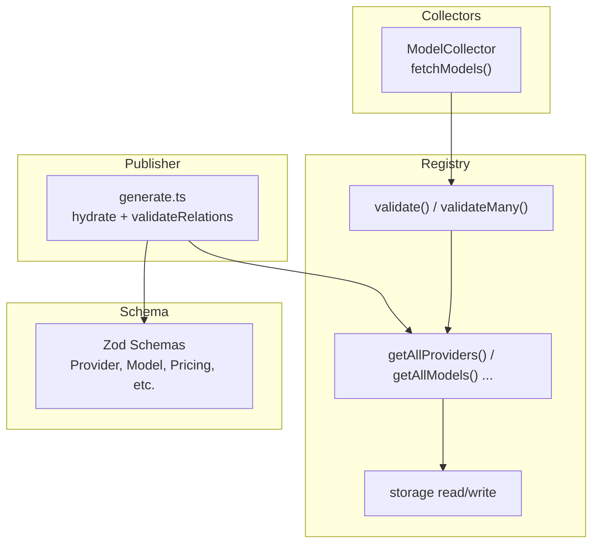
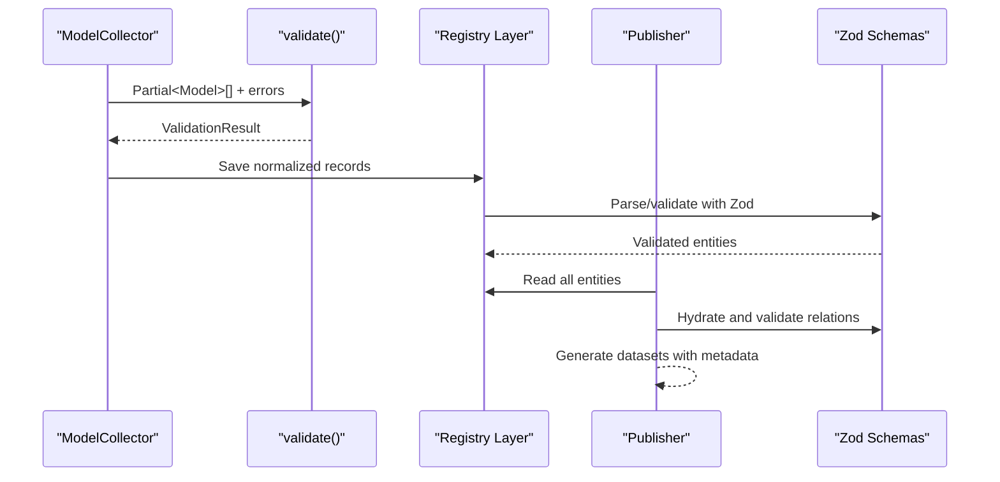
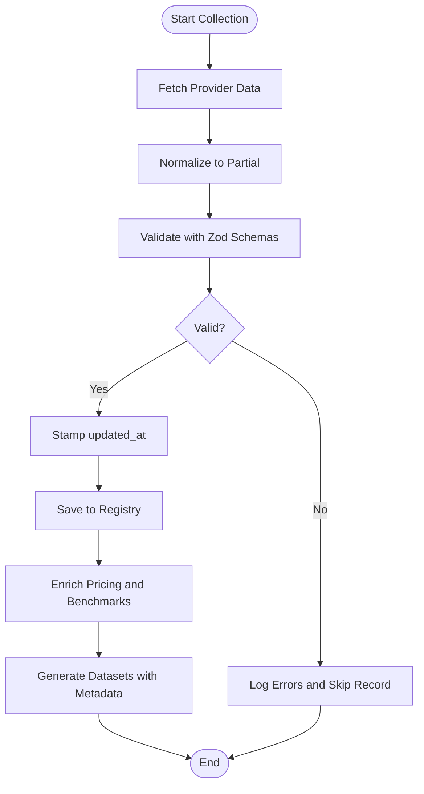
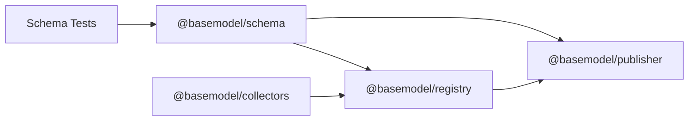

# Data Transformation & Normalization

<cite>
**Referenced Files in This Document**
- [README.md](file://README.md)
- [04_Pipeline.md](file://docs/04_Pipeline.md)
- [05_Data_Model.md](file://docs/05_Data_Model.md)
- [collector.ts](file://packages/collectors/src/core/collector.ts)
- [runner.ts](file://packages/collectors/src/core/runner.ts)
- [index.ts](file://packages/registry/src/index.ts)
- [validation.ts](file://packages/registry/src/validation.ts)
- [generate.ts](file://packages/publisher/src/generate.ts)
- [schema.test.ts](file://packages/schema/src/__tests__/schema.test.ts)
</cite>

## Table of Contents
1. [Introduction](#introduction)
2. [Project Structure](#project-structure)
3. [Core Components](#core-components)
4. [Architecture Overview](#architecture-overview)
5. [Detailed Component Analysis](#detailed-component-analysis)
6. [Dependency Analysis](#dependency-analysis)
7. [Performance Considerations](#performance-considerations)
8. [Troubleshooting Guide](#troubleshooting-guide)
9. [Conclusion](#conclusion)

## Introduction
This document explains how BaseModel transforms and normalizes provider-specific data into the canonical BaseModel schema. It covers field mapping, type conversion, validation, error handling, fallback strategies, versioning, performance optimization, and caching for large datasets and frequent transformations. The transformation pipeline spans collection from providers, normalization to canonical entities (Provider, Model, Capability, Pricing, API, Benchmark, License), registry storage, intelligence derivation, and dataset generation.

## Project Structure
BaseModel is organized into packages that implement distinct layers:
- Schema package defines canonical Zod schemas and TypeScript types.
- Collectors package implements provider and gateway collectors that fetch and normalize data into Partial<Model>.
- Registry package provides validation, normalization helpers, and storage utilities for canonical records.
- Publisher package generates public datasets with metadata and validates relations before writing outputs.

**Diagram sources**
- [collector.ts:1-23](file://packages/collectors/src/core/collector.ts#L1-L23)
- [validation.ts:1-42](file://packages/registry/src/validation.ts#L1-L42)
- [index.ts:1-48](file://packages/registry/src/index.ts#L1-L48)
- [generate.ts:112-145](file://packages/publisher/src/generate.ts#L112-L145)

**Section sources**
- [README.md:11-30](file://README.md#L11-L30)
- [04_Pipeline.md:1-85](file://docs/04_Pipeline.md#L1-L85)

## Core Components
- Canonical schemas define the target structure for all entities: Provider, Model, Capability, Pricing, API, Benchmark, License. These are enforced by Zod schemas used across validation and hydration steps.
- Collectors implement a uniform interface returning Partial<Model> records along with errors, enabling safe partial ingestion and later merging.
- Registry layer performs validation and normalization using Zod schemas and helper functions, stamping freshness timestamps on entities.
- Publisher orchestrates reading registry data, validating relations, hydrating models against schemas, and generating datasets with metadata.

Key responsibilities:
- Field mapping: Convert provider-specific fields to canonical names and structures.
- Type conversion: Normalize units, enums, arrays, and optional fields.
- Validation: Reject malformed or incomplete records early; collect row-level errors.
- Error handling: Isolate invalid records, log errors, continue processing valid ones.
- Fallbacks: Use multiple pricing sources and benchmark sources when primary sources fail.
- Versioning: Include schema_version and source_revision in generated datasets.

**Section sources**
- [05_Data_Model.md:23-169](file://docs/05_Data_Model.md#L23-L169)
- [collector.ts:1-23](file://packages/collectors/src/core/collector.ts#L1-L23)
- [validation.ts:1-42](file://packages/registry/src/validation.ts#L1-L42)
- [index.ts:1-48](file://packages/registry/src/index.ts#L1-L48)
- [generate.ts:112-145](file://packages/publisher/src/generate.ts#L112-L145)

## Architecture Overview
The transformation pipeline follows these stages:
- Discovery identifies sources.
- Collection retrieves structured data from providers and gateways.
- Validation rejects malformed or incomplete records.
- Normalization converts provider-specific representations into canonical BaseModel schemas.
- Registry stores canonical records with updated_at stamps.
- Intelligence derives search, alternatives, and cost tiers without modifying registry data.
- Generation writes public JSON datasets with schema_version, source_revision, generated_at, and count.
- Publication distributes datasets via GitHub Pages or artifacts.

**Diagram sources**
- [collector.ts:1-23](file://packages/collectors/src/core/collector.ts#L1-L23)
- [validation.ts:1-42](file://packages/registry/src/validation.ts#L1-L42)
- [index.ts:1-48](file://packages/registry/src/index.ts#L1-L48)
- [generate.ts:112-145](file://packages/publisher/src/generate.ts#L112-L145)

**Section sources**
- [04_Pipeline.md:1-85](file://docs/04_Pipeline.md#L1-L85)

## Detailed Component Analysis

### Canonical Data Model
The canonical model defines core entities and their relationships:
- Provider: organization details, website, type, status.
- Model: unique identifier, family/version, modality, capabilities, support flags, license reference, status.
- Capability: shared capability definitions.
- Benchmark: evaluation results per model.
- Pricing: per-model pricing with currency, unit, value, notes, source provenance.
- API: access methods including protocol, endpoint, authentication, rate limits.
- License: legal terms and permissions.

Identifiers follow stable conventions:
- provider_id uses kebab-case.
- model_id uses {provider_id}/{model-slug}.

Dataset metadata includes schema_version, source_revision, generated_at, and count.

**Section sources**
- [05_Data_Model.md:23-169](file://docs/05_Data_Model.md#L23-L169)

### Collector Interface and Partial Modeling
Collectors implement a uniform interface:
- providerId identifies the provider.
- fetchModels returns CollectionResult containing Partial<Model>[] and errors.
- Limits enforce MAX_PLUGIN_MODELS and MAX_PLUGIN_RESPONSE_BYTES to prevent oversized responses.

Partial modeling allows incremental normalization where only available fields are mapped, reducing failures and enabling robust merging later.

**Section sources**
- [collector.ts:1-23](file://packages/collectors/src/core/collector.ts#L1-L23)

### Validation and Normalization Utilities
Validation utilities provide:
- validate(schema, raw): non-throwing validation returning success/data or errors.
- validateMany(schema, records): batch validation collecting valid and invalid rows with indices and errors.

Normalization occurs through Zod schema parsing within registry helpers and publisher hydration. Entities are stamped with updated_at timestamps to track freshness.

**Section sources**
- [validation.ts:1-42](file://packages/registry/src/validation.ts#L1-L42)
- [index.ts:34-48](file://packages/registry/src/index.ts#L34-L48)

### Provider Registration and Metadata Handling
When models reference a provider not yet registered, the runner ensures a minimal Provider record is created:
- Derives name and organization from providerId if missing.
- Never fabricates website URLs; only sets known values.
- Validates against ProviderSchema and saves if valid.

This guarantees consistent provider metadata while avoiding fabricated data.

**Section sources**
- [runner.ts:333-363](file://packages/collectors/src/core/runner.ts#L333-L363)

### Publisher Hydration and Relation Validation
The publisher:
- Reads all registry entities up front.
- Validates relations among providers, models, capabilities, and pricing.
- Hydrates models using schema-aware hydration to ensure canonical compliance.
- Generates datasets with metadata including schema_version, source_revision, generated_at.

This step ensures relational integrity and schema compliance before publishing.

**Section sources**
- [generate.ts:112-145](file://packages/publisher/src/generate.ts#L112-L145)

### Pricing Enrichment and Fallback Strategies
Pricing enrichment uses multiple sources:
- Provider-declared pricingSource catalogs.
- OpenRouter aggregated pricing.
- Hugging Face Inference Providers for open-weight models.

Tier propagation applies to router-resold models, copying coarse tier and free flag from upstream providers while preserving per-provider price differences.

Fallback behavior:
- If OpenRouter fails, enrichment continues with provider and Hugging Face sources.
- If all primary sources fail, the run is marked fatal to prevent stale commits.
- Provenance recorded via source field indicates origin.

**Section sources**
- [04_Pipeline.md:127-217](file://docs/04_Pipeline.md#L127-L217)

### Benchmark Sources and Fallbacks
Benchmark data is collected from:
- LMArena Elo rankings.
- Open LLM Leaderboard scores.
- Mirror daily snapshots.

Fallback strategy:
- If LMArena is unreachable or rate-limited, the pipeline falls back to Mirror snapshot.
- Optional Hugging Face token increases limits and improves coverage.

**Section sources**
- [04_Pipeline.md:93-126](file://docs/04_Pipeline.md#L93-L126)

### Schema Enforcement and Examples
Schema tests demonstrate:
- ProviderSchema accepts valid providers, optional website, and updated_at timestamps.
- ProviderSchema rejects invalid provider_id formats and non-web URL schemes.
- ModelSchema enforces model_id format, status enum, context_window constraints, and updated_at.
- PricingSchema supports source provenance and updated_at.

These tests illustrate expected field mappings and validation rules for canonical entities.

**Section sources**
- [schema.test.ts:1-182](file://packages/schema/src/__tests__/schema.test.ts#L1-L182)

### Transformation Pipeline Flowchart

**Diagram sources**
- [collector.ts:1-23](file://packages/collectors/src/core/collector.ts#L1-L23)
- [validation.ts:1-42](file://packages/registry/src/validation.ts#L1-L42)
- [index.ts:34-48](file://packages/registry/src/index.ts#L34-L48)
- [generate.ts:112-145](file://packages/publisher/src/generate.ts#L112-L145)

## Dependency Analysis
Dependencies between components:
- Collectors depend on @basemodel/schema for types and return Partial<Model>.
- Registry depends on @basemodel/schema for Zod schemas and uses validation utilities.
- Publisher depends on registry to read entities and schema for hydration and relation validation.
- Tests validate schema compliance and edge cases.

**Diagram sources**
- [collector.ts:1-23](file://packages/collectors/src/core/collector.ts#L1-L23)
- [index.ts:1-48](file://packages/registry/src/index.ts#L1-L48)
- [generate.ts:112-145](file://packages/publisher/src/generate.ts#L112-L145)
- [schema.test.ts:1-182](file://packages/schema/src/__tests__/schema.test.ts#L1-L182)

**Section sources**
- [03_Architecture.md:37-77](file://docs/03_Architecture.md#L37-L77)

## Performance Considerations
Optimization techniques for large datasets and frequent transformations:
- Batch validation using validateMany reduces overhead and isolates invalid records efficiently.
- Partial modeling minimizes transformation failures and enables incremental updates.
- Stamping updated_at avoids unnecessary reprocessing and helps consumers detect staleness.
- Fallback strategies ensure continuity even when primary sources fail, preventing pipeline stalls.
- Caching strategies can be applied at collector level to cache provider catalogs and at registry level to cache parsed schemas and validated records.
- Limiting response sizes with MAX_PLUGIN_RESPONSE_BYTES prevents memory pressure.
- Parallel fetching of provider catalogs and benchmarks can improve throughput.

[No sources needed since this section provides general guidance]

## Troubleshooting Guide
Common issues and resolutions:
- Invalid records: Use validateMany to identify indices and errors; isolate and log without halting the pipeline.
- Missing provider registration: Ensure ensureProviderRegistered runs to create minimal provider records with validated fields.
- Pricing enrichment failures: Check provider pricingSource configuration and network availability; rely on fallback sources.
- Benchmark collection failures: Configure optional Hugging Face token to increase limits; fallback to Mirror snapshot.
- Schema violations: Review schema tests for expected formats and constraints; adjust field mappings accordingly.

**Section sources**
- [validation.ts:1-42](file://packages/registry/src/validation.ts#L1-L42)
- [runner.ts:333-363](file://packages/collectors/src/core/runner.ts#L333-L363)
- [04_Pipeline.md:127-217](file://docs/04_Pipeline.md#L127-L217)

## Conclusion
BaseModel’s data transformation and normalization pipeline ensures robust, schema-compliant, and versioned canonical records from diverse AI model providers. Through standardized interfaces, strict validation, flexible fallbacks, and performance optimizations, the system maintains data integrity and availability. Consumers benefit from reliable datasets enriched with pricing, benchmarks, and intelligence derived from the registry.

[No sources needed since this section summarizes without analyzing specific files]