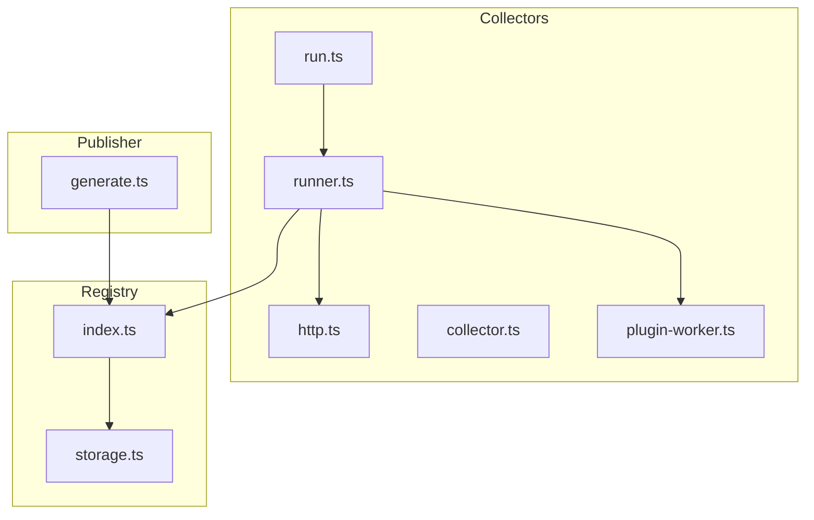
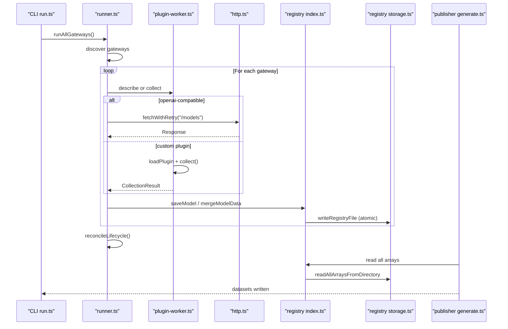
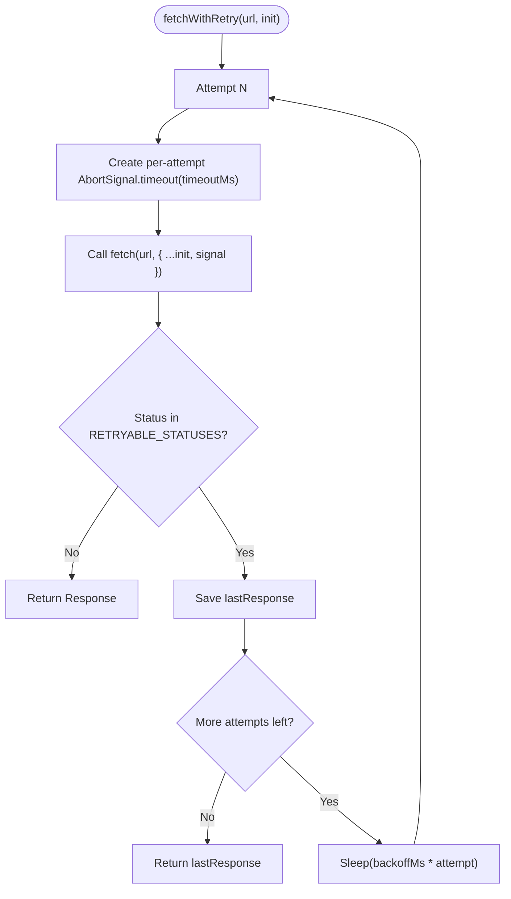
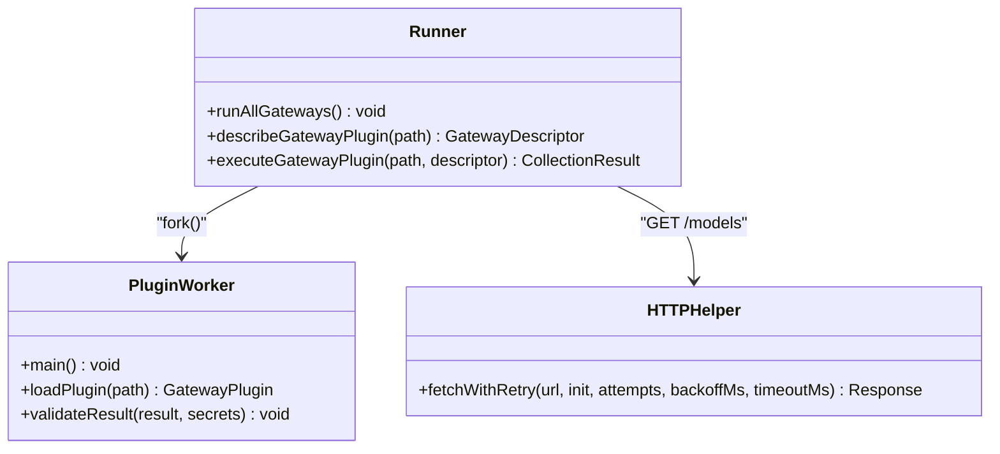
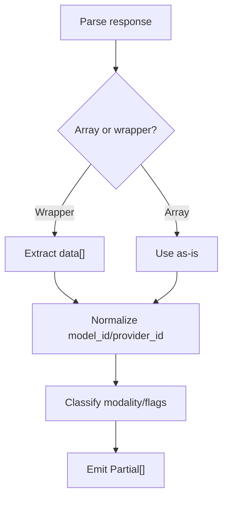
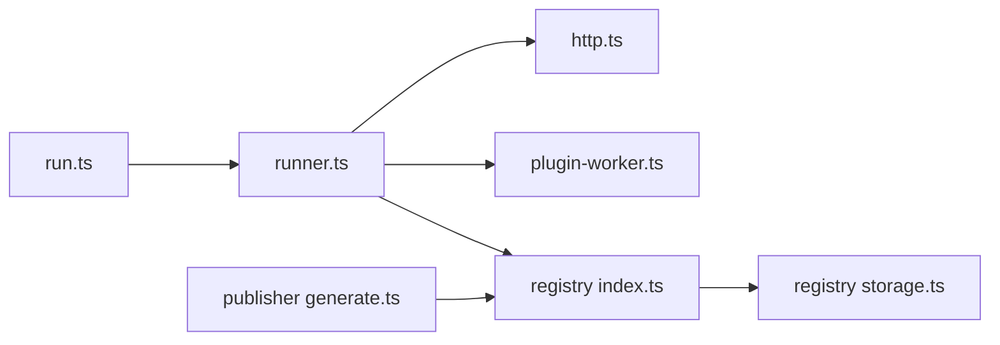

# Performance Optimization

<cite>
**Referenced Files in This Document**
- [README.md](file://README.md)
- [runner.ts](file://packages/collectors/src/core/runner.ts)
- [http.ts](file://packages/collectors/src/core/http.ts)
- [collector.ts](file://packages/collectors/src/core/collector.ts)
- [plugin-worker.ts](file://packages/collectors/src/core/plugin-worker.ts)
- [storage.ts](file://packages/registry/src/storage.ts)
- [index.ts](file://packages/registry/src/index.ts)
- [generate.ts](file://packages/publisher/src/generate.ts)
- [dataset-contract.test.ts](file://packages/publisher/src/__tests__/dataset-contract.test.ts)
- [run.ts](file://packages/collectors/src/run.ts)
</cite>

## Table of Contents
1. Introduction
2. Project Structure
3. Core Components
4. Architecture Overview
5. Detailed Component Analysis
6. Dependency Analysis
7. Performance Considerations
8. Troubleshooting Guide
9. Conclusion
10. Appendices

## Introduction
This document provides performance optimization strategies for implementing provider integrations in the BaseModel collectors pipeline. It focuses on connection handling, request batching, concurrency, caching policies, memory and resource management, network payload optimization, monitoring and profiling, and benchmarking approaches. The guidance is grounded in the repository’s collector runner, HTTP helpers, plugin worker isolation, registry storage, and publisher outputs.

## Project Structure
BaseModel organizes functionality into packages: schema, registry, collectors, intelligence, publisher, and cli. The collectors package orchestrates discovery and execution of gateway plugins, while the registry persists canonical data and the publisher generates datasets.

**Diagram sources**
- [run.ts:1-16](file://packages/collectors/src/run.ts#L1-L16)
- [runner.ts:428-475](file://packages/collectors/src/core/runner.ts#L428-L475)
- [http.ts:1-37](file://packages/collectors/src/core/http.ts#L1-L37)
- [collector.ts:1-23](file://packages/collectors/src/core/collector.ts#L1-L23)
- [plugin-worker.ts:1-113](file://packages/collectors/src/core/plugin-worker.ts#L1-L113)
- [storage.ts:1-164](file://packages/registry/src/storage.ts#L1-L164)
- [index.ts:85-124](file://packages/registry/src/index.ts#L85-L124)
- [generate.ts:219-244](file://packages/publisher/src/generate.ts#L219-L244)

**Section sources**
- [README.md:10-30](file://README.md#L10-L30)

## Core Components
- Collector interface and limits: defines the contract for provider collectors and enforces safe bounds on model counts and response sizes.
- HTTP retry helper: centralizes transient error handling with backoff and per-attempt timeouts.
- Runner and orchestration: discovers gateways, executes them concurrently, persists results, and reconciles lifecycle states.
- Plugin worker isolation: runs custom plugins in isolated child processes with strict validation and secret redaction.
- Registry storage: atomic file writes, rollup persistence for large datasets (benchmarks), and directory utilities.
- Publisher: aggregates registry data into published datasets.

Key implementation references:
- Collector interface and limits: [collector.ts:1-23](file://packages/collectors/src/core/collector.ts#L1-L23)
- Retryable statuses and fetchWithRetry: [http.ts:1-37](file://packages/collectors/src/core/http.ts#L1-L37)
- Gateway execution and concurrency: [runner.ts:428-475](file://packages/collectors/src/core/runner.ts#L428-L475)
- Worker isolation and validation: [plugin-worker.ts:1-113](file://packages/collectors/src/core/plugin-worker.ts#L1-L113)
- Atomic writes and rollups: [storage.ts:56-65](file://packages/registry/src/storage.ts#L56-L65), [storage.ts:126-163](file://packages/registry/src/storage.ts#L126-L163)
- Dataset generation: [generate.ts:219-244](file://packages/publisher/src/generate.ts#L219-L244)

**Section sources**
- [collector.ts:1-23](file://packages/collectors/src/core/collector.ts#L1-L23)
- [http.ts:1-37](file://packages/collectors/src/core/http.ts#L1-L37)
- [runner.ts:428-475](file://packages/collectors/src/core/runner.ts#L428-L475)
- [plugin-worker.ts:1-113](file://packages/collectors/src/core/plugin-worker.ts#L1-L113)
- [storage.ts:56-65](file://packages/registry/src/storage.ts#L56-L65)
- [storage.ts:126-163](file://packages/registry/src/storage.ts#L126-L163)
- [generate.ts:219-244](file://packages/publisher/src/generate.ts#L219-L244)

## Architecture Overview
The collection pipeline discovers gateway plugins, executes them concurrently, normalizes and merges results into the registry, and finally publishes datasets.

**Diagram sources**
- [run.ts:1-16](file://packages/collectors/src/run.ts#L1-L16)
- [runner.ts:428-475](file://packages/collectors/src/core/runner.ts#L428-L475)
- [http.ts:1-37](file://packages/collectors/src/core/http.ts#L1-L37)
- [plugin-worker.ts:1-113](file://packages/collectors/src/core/plugin-worker.ts#L1-L113)
- [index.ts:85-124](file://packages/registry/src/index.ts#L85-L124)
- [storage.ts:56-65](file://packages/registry/src/storage.ts#L56-L65)
- [generate.ts:219-244](file://packages/publisher/src/generate.ts#L219-L244)

## Detailed Component Analysis

### Connection Handling and Retries
- Centralized retry logic uses exponential-ish backoff for transient statuses and per-attempt timeout signals to avoid signal poisoning across retries.
- Recommended practices:
  - Always route external requests through the shared retry helper.
  - Set reasonable timeouts per request; tune backoffMs and attempts based on provider SLAs.
  - Avoid reusing AbortSignal across retries; use per-attempt signals.

**Diagram sources**
- [http.ts:1-37](file://packages/collectors/src/core/http.ts#L1-L37)

**Section sources**
- [http.ts:1-37](file://packages/collectors/src/core/http.ts#L1-L37)

### Concurrency and Isolation
- The runner executes all discovered gateways concurrently using Promise.allSettled, ensuring one failing gateway does not block others.
- Custom plugins run in isolated child processes via fork, with a hard timeout to prevent runaway workers.
- Secrets are whitelisted per gateway and never leaked to plugin code beyond approved keys.

**Diagram sources**
- [runner.ts:113-154](file://packages/collectors/src/core/runner.ts#L113-L154)
- [runner.ts:428-475](file://packages/collectors/src/core/runner.ts#L428-L475)
- [plugin-worker.ts:76-113](file://packages/collectors/src/core/plugin-worker.ts#L76-L113)
- [http.ts:1-37](file://packages/collectors/src/core/http.ts#L1-L37)

**Section sources**
- [runner.ts:428-475](file://packages/collectors/src/core/runner.ts#L428-L475)
- [plugin-worker.ts:1-113](file://packages/collectors/src/core/plugin-worker.ts#L1-L113)

### Request Batching and Normalization
- OpenAI-compatible endpoints return either a wrapper object or a bare array; both are normalized to an array before processing.
- Model IDs are normalized and slugged consistently to avoid collisions and ensure stable identifiers.

**Diagram sources**
- [runner.ts:25-40](file://packages/collectors/src/core/runner.ts#L25-L40)
- [runner.ts:50-56](file://packages/collectors/src/core/runner.ts#L50-L56)

**Section sources**
- [runner.ts:25-40](file://packages/collectors/src/core/runner.ts#L25-L40)
- [runner.ts:50-56](file://packages/collectors/src/core/runner.ts#L50-L56)

### Caching Strategies
- Static data: Registry reads from JSON files; consider in-process caches for hot directories (e.g., capabilities, licenses) when repeatedly accessed within a process lifetime.
- Response caching: Cache upstream catalog responses keyed by URL and headers; implement TTLs aligned with provider update cadence.
- Cache invalidation: Invalidate on explicit refresh triggers or after TTL expiry; prefer versioned keys to support rollback.

[No sources needed since this section provides general guidance]

### Memory Management and Resource Cleanup
- Enforce upper bounds on models per plugin and serialized response size to prevent memory spikes.
- Ensure worker processes terminate on timeout or error; disconnect IPC channels promptly.
- Use atomic writes and temp files to avoid partial state on crashes.

Implementation references:
- Limits and validation: [collector.ts:9-10](file://packages/collectors/src/core/collector.ts#L9-L10), [plugin-worker.ts:32-46](file://packages/collectors/src/core/plugin-worker.ts#L32-L46)
- Worker timeout and cleanup: [runner.ts:136-154](file://packages/collectors/src/core/runner.ts#L136-L154)
- Atomic writes: [storage.ts:56-65](file://packages/registry/src/storage.ts#L56-L65)

**Section sources**
- [collector.ts:9-10](file://packages/collectors/src/core/collector.ts#L9-L10)
- [plugin-worker.ts:32-46](file://packages/collectors/src/core/plugin-worker.ts#L32-L46)
- [runner.ts:136-154](file://packages/collectors/src/core/runner.ts#L136-L154)
- [storage.ts:56-65](file://packages/registry/src/storage.ts#L56-L65)

### Network Payload Optimization
- Prefer minimal payloads: only request fields you need; leverage provider-specific query parameters where available.
- Enable compression at the transport layer if supported by providers.
- Stream large responses when possible to reduce peak memory usage.

[No sources needed since this section provides general guidance]

### Monitoring and Profiling
- Instrument collection runs with metrics:
  - Per-gateway latency, success rate, and error codes.
  - Throughput (models/sec) and memory usage.
- Alert on slow responses and high error rates; track time-to-first-byte for streaming endpoints.
- Use Node.js built-in profilers and heap snapshots to identify leaks during long-running collections.

[No sources needed since this section provides general guidance]

### Benchmarking Approaches
- Use the existing benchmarks dataset and rollup mechanism to compare performance across versions.
- Measure collection runtime, memory footprint, and I/O throughput under realistic loads.
- Compare baseline vs optimized implementations using consistent workloads and environments.

References:
- Benchmarks rollup and reading: [storage.ts:126-163](file://packages/registry/src/storage.ts#L126-L163), [index.ts:94-98](file://packages/registry/src/index.ts#L94-L98)
- Published datasets include benchmarks: [generate.ts:219-226](file://packages/publisher/src/generate.ts#L219-L226)

**Section sources**
- [storage.ts:126-163](file://packages/registry/src/storage.ts#L126-L163)
- [index.ts:94-98](file://packages/registry/src/index.ts#L94-L98)
- [generate.ts:219-226](file://packages/publisher/src/generate.ts#L219-L226)

## Dependency Analysis
The collectors depend on registry APIs for persistence and validation, while the publisher depends on registry reads to produce datasets.

**Diagram sources**
- [run.ts:1-16](file://packages/collectors/src/run.ts#L1-L16)
- [runner.ts:428-475](file://packages/collectors/src/core/runner.ts#L428-L475)
- [http.ts:1-37](file://packages/collectors/src/core/http.ts#L1-L37)
- [plugin-worker.ts:1-113](file://packages/collectors/src/core/plugin-worker.ts#L1-L113)
- [index.ts:85-124](file://packages/registry/src/index.ts#L85-L124)
- [storage.ts:1-164](file://packages/registry/src/storage.ts#L1-L164)
- [generate.ts:219-244](file://packages/publisher/src/generate.ts#L219-L244)

**Section sources**
- [runner.ts:428-475](file://packages/collectors/src/core/runner.ts#L428-L475)
- [index.ts:85-124](file://packages/registry/src/index.ts#L85-L124)
- [storage.ts:1-164](file://packages/registry/src/storage.ts#L1-L164)
- [generate.ts:219-244](file://packages/publisher/src/generate.ts#L219-L244)

## Performance Considerations
- Concurrency: Keep gateway execution concurrent but bounded by system resources; monitor CPU and memory headroom.
- Retries: Tune attempts and backoffMs per provider behavior; avoid excessive retries that amplify load.
- Serialization: Validate and cap result sizes to prevent memory pressure; prefer streaming for large payloads.
- I/O: Batch writes where feasible; use rollups for large datasets to minimize file count overhead.
- Caching: Apply TTL-based caching for static and semi-static data; invalidate on schedule or events.
- Compression: Enable gzip/br where supported to reduce bandwidth and latency.
- Observability: Track key KPIs (latency, errors, throughput, memory) and set alerts for anomalies.

[No sources needed since this section provides general guidance]

## Troubleshooting Guide
Common issues and mitigations:
- Rate limiting and transient failures: rely on retry helper; verify provider quotas and adjust backoff.
- Plugin timeouts: increase PLUGIN_TIMEOUT_MS cautiously; profile plugin code for blocking operations.
- Secret leakage: ensure only approved secret keys are passed to workers; validate results for secrets.
- Data corruption: atomic writes and rollups protect against partial updates; clear directories before rewrite when necessary.

Relevant references:
- Retry behavior and statuses: [http.ts:1-37](file://packages/collectors/src/core/http.ts#L1-L37)
- Worker timeout and exit handling: [runner.ts:136-154](file://packages/collectors/src/core/runner.ts#L136-L154)
- Secret validation and redaction: [plugin-worker.ts:26-46](file://packages/collectors/src/core/plugin-worker.ts#L26-L46)
- Atomic writes and rollups: [storage.ts:56-65](file://packages/registry/src/storage.ts#L56-L65), [storage.ts:126-163](file://packages/registry/src/storage.ts#L126-L163)

**Section sources**
- [http.ts:1-37](file://packages/collectors/src/core/http.ts#L1-L37)
- [runner.ts:136-154](file://packages/collectors/src/core/runner.ts#L136-L154)
- [plugin-worker.ts:26-46](file://packages/collectors/src/core/plugin-worker.ts#L26-L46)
- [storage.ts:56-65](file://packages/registry/src/storage.ts#L56-L65)
- [storage.ts:126-163](file://packages/registry/src/storage.ts#L126-L163)

## Conclusion
By leveraging centralized retries, isolated plugin execution, atomic storage, and careful concurrency control, the collectors pipeline achieves robust and efficient provider integration. Applying caching, payload optimization, and comprehensive observability further enhances performance and reliability. Benchmarking and continuous measurement ensure sustained improvements over time.

[No sources needed since this section summarizes without analyzing specific files]

## Appendices

### Optimized Collector Implementation Checklist
- Use fetchWithRetry for all outbound calls.
- Enforce MAX_PLUGIN_MODELS and MAX_PLUGIN_RESPONSE_BYTES.
- Normalize model IDs and classify capabilities early.
- Persist via registry APIs with atomic writes.
- Reconcile lifecycle states post-collection.

References:
- Limits: [collector.ts:9-10](file://packages/collectors/src/core/collector.ts#L9-L10)
- Retry helper: [http.ts:1-37](file://packages/collectors/src/core/http.ts#L1-L37)
- Normalization and classification: [runner.ts:50-56](file://packages/collectors/src/core/runner.ts#L50-L56)
- Persistence and reconciliation: [runner.ts:365-426](file://packages/collectors/src/core/runner.ts#L365-L426)

**Section sources**
- [collector.ts:9-10](file://packages/collectors/src/core/collector.ts#L9-L10)
- [http.ts:1-37](file://packages/collectors/src/core/http.ts#L1-L37)
- [runner.ts:50-56](file://packages/collectors/src/core/runner.ts#L50-L56)
- [runner.ts:365-426](file://packages/collectors/src/core/runner.ts#L365-L426)

### Performance Benchmarking Examples
- Measure collection duration per gateway and aggregate totals.
- Record memory usage at start/end and peak values.
- Compare throughput before and after optimizations (e.g., enabling compression, adjusting concurrency).

References:
- Benchmarks rollup: [storage.ts:126-163](file://packages/registry/src/storage.ts#L126-L163)
- Published datasets include benchmarks: [generate.ts:219-226](file://packages/publisher/src/generate.ts#L219-L226)
- Contract tests validate dataset structure: [dataset-contract.test.ts:23-57](file://packages/publisher/src/__tests__/dataset-contract.test.ts#L23-L57)

**Section sources**
- [storage.ts:126-163](file://packages/registry/src/storage.ts#L126-L163)
- [generate.ts:219-226](file://packages/publisher/src/generate.ts#L219-L226)
- [dataset-contract.test.ts:23-57](file://packages/publisher/src/__tests__/dataset-contract.test.ts#L23-L57)