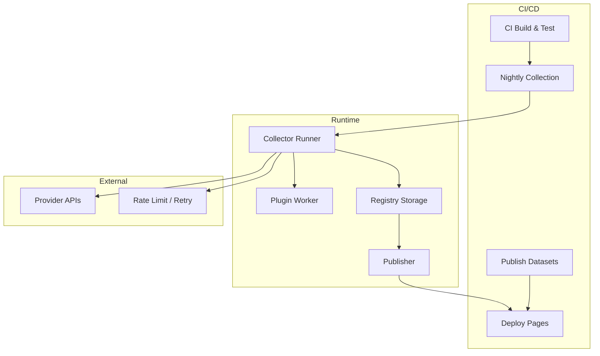
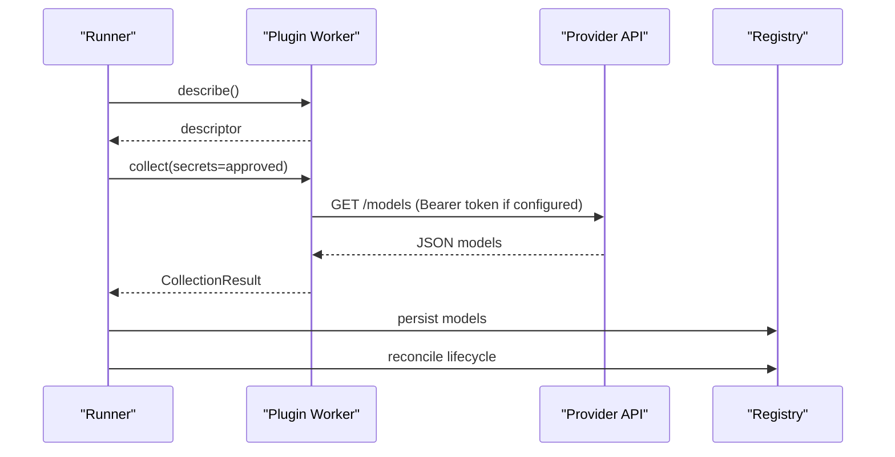
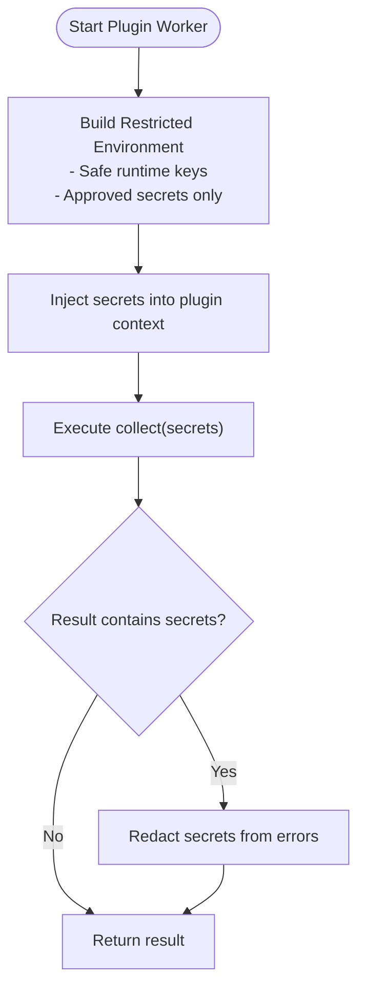
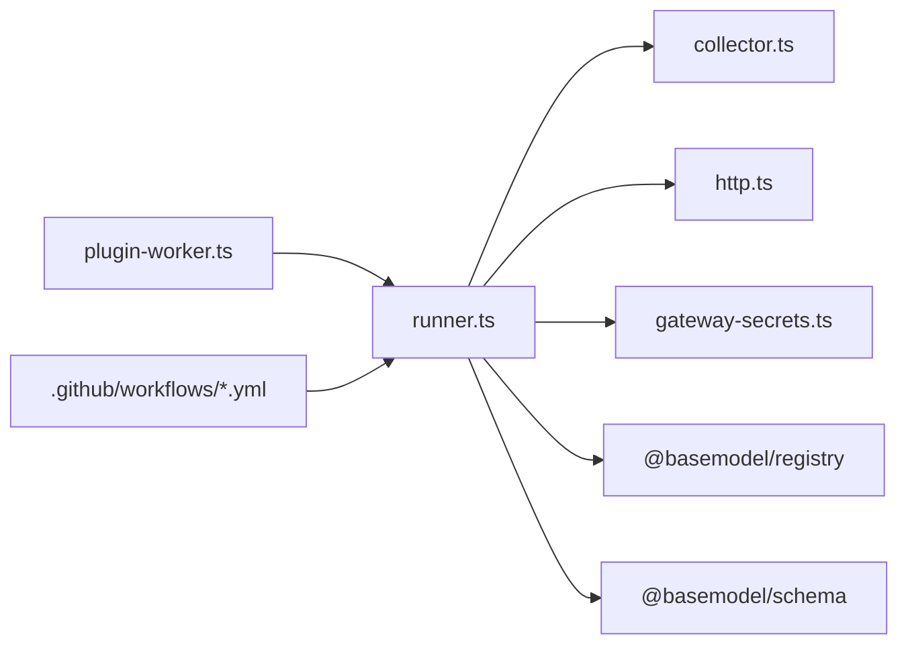

# Production Deployment

<cite>
**Referenced Files in This Document**
- [README.md](file://README.md)
- [package.json](file://package.json)
- [pnpm-workspace.yaml](file://pnpm-workspace.yaml)
- [03_Architecture.md](file://docs/03_Architecture.md)
- [04_Pipeline.md](file://docs/04_Pipeline.md)
- [ci.yml](file://.github/workflows/ci.yml)
- [collect.yml](file://.github/workflows/collect.yml)
- [publish.yml](file://.github/workflows/publish.yml)
- [deploy-pages.yml](file://.github/workflows/deploy-pages.yml)
- [runner.ts](file://packages/collectors/src/core/runner.ts)
- [collector.ts](file://packages/collectors/src/core/collector.ts)
- [http.ts](file://packages/collectors/src/core/http.ts)
- [plugin-worker.ts](file://packages/collectors/src/core/plugin-worker.ts)
- [gateway-secrets.ts](file://packages/collectors/src/core/gateway-secrets.ts)
</cite>

## Table of Contents
1. [Introduction](#introduction)
2. [Project Structure](#project-structure)
3. [Core Components](#core-components)
4. [Architecture Overview](#architecture-overview)
5. [Detailed Component Analysis](#detailed-component-analysis)
6. [Dependency Analysis](#dependency-analysis)
7. [Performance Considerations](#performance-considerations)
8. [Troubleshooting Guide](#troubleshooting-guide)
9. [Conclusion](#conclusion)
10. [Appendices](#appendices)

## Introduction
This document provides a comprehensive guide to deploying provider integrations to production environments using BaseModel’s collector pipeline. It covers containerization strategies, environment configuration and secrets handling, scaling considerations for high-throughput scenarios, horizontal scaling patterns, load balancing across multiple collector instances, monitoring and observability (logging standards, metrics collection, alerting), disaster recovery and backup strategies, rollback procedures, compliance and audit logging, security hardening, deployment templates, infrastructure as code examples, and troubleshooting guides.

BaseModel is a data layer that discovers, validates, normalizes, stores, analyzes, and publishes structured knowledge about AI models. It does not include inference runtimes or model hosting. The collectors discover and collect provider data, the registry stores canonical records, intelligence derives search and recommendations, and the publisher generates static datasets consumed by downstream systems.

**Section sources**
- [README.md:1-61](file://README.md#L1-L61)
- [03_Architecture.md:1-77](file://docs/03_Architecture.md#L1-L77)

## Project Structure
BaseModel is organized as a pnpm monorepo with clear package boundaries:
- packages/schema: Canonical Zod schemas and TypeScript types
- packages/registry: Registry storage, validation, and merge utilities
- packages/collectors: Provider and gateway collectors
- packages/intelligence: Derived rankings, search, and recommendations
- packages/publisher: Dataset generation for dist/
- packages/cli: Command-line interface for querying intelligence

The root package.json defines Node.js and pnpm engine requirements and scripts for building, testing, linting, typechecking, generating datasets, and cleaning artifacts. The pnpm workspace config declares packages under packages/*.

For production deployments, the key runtime entry points are:
- Collector runner orchestrating plugin execution and persistence
- HTTP helpers for resilient upstream calls
- Plugin worker isolating custom plugins
- Secrets allowlist per gateway

**Section sources**
- [package.json:1-31](file://package.json#L1-L31)
- [pnpm-workspace.yaml:1-3](file://pnpm-workspace.yaml#L1-L3)
- [03_Architecture.md:37-44](file://docs/03_Architecture.md#L37-L44)

## Core Components
- Runner: Orchestrates discovery, execution of OpenAI-compatible and custom gateway plugins, result persistence, and lifecycle reconciliation.
- Collector interfaces: Define CollectionResult, ModelCollector, SimpleGateway, CustomGateway, and PricingSourceSpec.
- HTTP helpers: Provide retry logic with exponential backoff for transient failures.
- Plugin worker: Executes custom plugins in an isolated child process with a restricted environment and secret injection.
- Gateway secrets: Centralized allowlist mapping gateway IDs to approved secret keys.

These components collectively enable secure, resilient, and auditable collection of provider data into the registry.

**Section sources**
- [runner.ts:1-475](file://packages/collectors/src/core/runner.ts#L1-L475)
- [collector.ts:1-89](file://packages/collectors/src/core/collector.ts#L1-L89)
- [http.ts:1-37](file://packages/collectors/src/core/http.ts#L1-L37)
- [plugin-worker.ts:99-112](file://packages/collectors/src/core/plugin-worker.ts#L99-L112)
- [gateway-secrets.ts:1-26](file://packages/collectors/src/core/gateway-secrets.ts#L1-L26)

## Architecture Overview
At a high level, the production pipeline consists of:
- CI/CD workflows for build, test, nightly collection, dataset publishing, and GitHub Pages deployment
- Collector runner executing gateway plugins in isolated workers
- Registry storing canonical records with validation and normalization
- Publisher generating static datasets consumed by consumers

**Diagram sources**
- [ci.yml:1-41](file://.github/workflows/ci.yml#L1-L41)
- [collect.yml:1-48](file://.github/workflows/collect.yml#L1-L48)
- [publish.yml:1-62](file://.github/workflows/publish.yml#L1-L62)
- [deploy-pages.yml:1-60](file://.github/workflows/deploy-pages.yml#L1-L60)
- [runner.ts:428-475](file://packages/collectors/src/core/runner.ts#L428-L475)
- [plugin-worker.ts:99-112](file://packages/collectors/src/core/plugin-worker.ts#L99-L112)

**Section sources**
- [04_Pipeline.md:1-259](file://docs/04_Pipeline.md#L1-L259)

## Detailed Component Analysis

### Collector Runner and Plugin Execution
The runner discovers gateway plugins, executes them either via simple OpenAI-compatible endpoints or custom plugins in isolated workers, persists results, and reconciles lifecycle states. It enforces timeouts, error hints for common HTTP statuses, and ensures only approved secrets reach plugins.

Key behaviors:
- Isolated worker execution with controlled environment variables
- Secret allowlist enforcement per gateway ID
- Retryable HTTP status handling via fetchWithRetry
- Lifecycle reconciliation marking models discontinued when no longer listed

**Diagram sources**
- [runner.ts:156-238](file://packages/collectors/src/core/runner.ts#L156-L238)
- [runner.ts:428-475](file://packages/collectors/src/core/runner.ts#L428-L475)
- [http.ts:17-37](file://packages/collectors/src/core/http.ts#L17-L37)

**Section sources**
- [runner.ts:1-475](file://packages/collectors/src/core/runner.ts#L1-L475)

### Secrets Handling and Environment Configuration
Secrets are centrally managed and injected only when explicitly allowed per gateway. The runner constructs a minimal environment for each plugin worker, including safe runtime keys and approved secrets. The plugin worker extracts secrets from its environment and passes them to the plugin’s collect function. Validation prevents secret leakage in results.

Production best practices:
- Use repository secrets for CI/CD (e.g., OPENAI_API_KEY, ANTHROPIC_API_KEY)
- Map secrets to gateway IDs via gateway-secrets.ts
- Ensure plugins cannot access unapproved environment variables
- Validate outputs to prevent accidental secret exposure

**Diagram sources**
- [runner.ts:96-111](file://packages/collectors/src/core/runner.ts#L96-L111)
- [plugin-worker.ts:99-112](file://packages/collectors/src/core/plugin-worker.ts#L99-L112)
- [gateway-secrets.ts:1-26](file://packages/collectors/src/core/gateway-secrets.ts#L1-L26)

**Section sources**
- [runner.ts:96-111](file://packages/collectors/src/core/runner.ts#L96-L111)
- [plugin-worker.ts:99-112](file://packages/collectors/src/core/plugin-worker.ts#L99-L112)
- [gateway-secrets.ts:1-26](file://packages/collectors/src/core/gateway-secrets.ts#L1-L26)

### HTTP Resilience and Error Handling
All external fetches should use fetchWithRetry to handle transient failures gracefully. Retriable statuses include 408, 429, 500, 502, 503, 504. Each attempt uses a fresh timeout signal to avoid abort poisoning.

Production implications:
- Prevents silent failures during nightly runs
- Ensures robustness against rate limits and upstream outages
- Provides actionable error hints for common HTTP statuses

**Section sources**
- [http.ts:1-37](file://packages/collectors/src/core/http.ts#L1-L37)
- [runner.ts:42-48](file://packages/collectors/src/core/runner.ts#L42-L48)

### Data Persistence and Lifecycle Reconciliation
Results are persisted to the registry with validation and merging. Models are normalized and merged with existing records, preserving curated fields while refreshing machine-observable facts. After successful collections, models no longer listed by a gateway are marked discontinued.

Production considerations:
- Idempotent writes with field ownership rules
- Collision warnings for conflicting raw IDs
- Audit trail via updated_at timestamps and generated metadata

**Section sources**
- [runner.ts:365-426](file://packages/collectors/src/core/runner.ts#L365-L426)
- [04_Pipeline.md:177-244](file://docs/04_Pipeline.md#L177-L244)

## Dependency Analysis
The collector system depends on:
- Node.js runtime with specific version constraints
- pnpm workspace for dependency management
- Registry package for storage and validation
- External provider APIs for data collection
- GitHub Actions for CI/CD automation

**Diagram sources**
- [runner.ts:1-23](file://packages/collectors/src/core/runner.ts#L1-L23)
- [collector.ts:1-89](file://packages/collectors/src/core/collector.ts#L1-L89)
- [http.ts:1-37](file://packages/collectors/src/core/http.ts#L1-L37)
- [gateway-secrets.ts:1-26](file://packages/collectors/src/core/gateway-secrets.ts#L1-L26)
- [ci.yml:1-41](file://.github/workflows/ci.yml#L1-L41)
- [collect.yml:1-48](file://.github/workflows/collect.yml#L1-L48)

**Section sources**
- [package.json:12-16](file://package.json#L12-L16)
- [pnpm-workspace.yaml:1-3](file://pnpm-workspace.yaml#L1-L3)

## Performance Considerations
- Concurrency: The runner uses Promise.allSettled to execute gateways concurrently, improving throughput for high-volume collections.
- Timeouts: Plugin workers have a 60-second timeout to prevent hanging processes.
- Retry Logic: Exponential backoff with configurable attempts and timeouts for transient failures.
- Memory Limits: Maximum plugin response size and model count limits prevent memory exhaustion.
- I/O Efficiency: Registry operations are batched where possible to minimize disk writes.

Optimization recommendations:
- Scale horizontally by running multiple collector instances behind a load balancer
- Use distributed caching for upstream API responses where appropriate
- Implement circuit breakers for failing providers
- Monitor resource utilization and adjust timeouts accordingly

[No sources needed since this section provides general guidance]

## Troubleshooting Guide
Common production issues and resolutions:

- Missing API Keys: Ensure all required secrets are configured in the environment and mapped to gateway IDs
- Rate Limiting: Increase retry attempts or implement adaptive backoff strategies
- Network Timeouts: Adjust timeout configurations based on upstream API performance
- Plugin Crashes: Review plugin logs and ensure proper error handling in custom collectors
- Registry Conflicts: Resolve model ID collisions by standardizing naming conventions

Debugging steps:
- Check CI/CD workflow logs for detailed error messages
- Verify environment variable injection in plugin workers
- Validate plugin outputs against schema requirements
- Monitor upstream API health and rate limit headers

**Section sources**
- [runner.ts:170-214](file://packages/collectors/src/core/runner.ts#L170-L214)
- [plugin-worker.ts:108-112](file://packages/collectors/src/core/plugin-worker.ts#L108-L112)

## Conclusion
BaseModel’s collector pipeline provides a robust foundation for production deployments of provider integrations. With centralized secrets management, resilient HTTP handling, isolated plugin execution, and comprehensive CI/CD automation, it enables scalable and secure data collection from diverse providers. By following the deployment patterns, monitoring guidelines, and troubleshooting procedures outlined in this document, teams can maintain reliable and compliant production environments.

[No sources needed since this section summarizes without analyzing specific files]

## Appendices

### Containerization Strategies
- Use multi-stage Docker builds to optimize image size
- Pin Node.js and pnpm versions for reproducibility
- Mount configuration volumes for environment-specific settings
- Implement health checks and readiness probes for orchestration platforms

### Infrastructure as Code Examples
- Terraform modules for Kubernetes deployments
- Helm charts for container orchestration
- CloudFormation templates for AWS deployments
- Pulumi scripts for cross-platform infrastructure

### Monitoring and Observability
- Structured logging with correlation IDs
- Metrics collection for request rates, error rates, and latency
- Alerting on SLI/SLO violations
- Distributed tracing for end-to-end visibility

### Disaster Recovery Procedures
- Regular backups of registry data and configuration
- Automated failover to secondary regions
- Rollback procedures for problematic updates
- Data validation and integrity checks post-recovery

### Compliance and Security Hardening
- Audit logging for all sensitive operations
- Least privilege access controls
- Encryption at rest and in transit
- Regular security assessments and penetration testing

[No sources needed since this section provides general guidance]