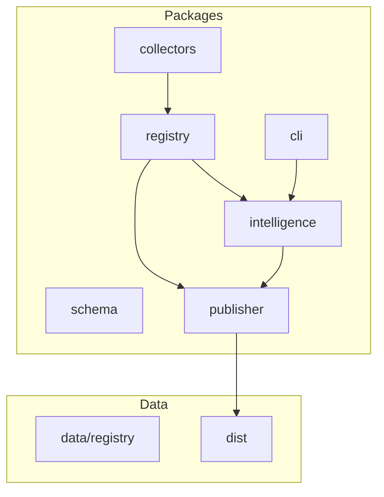
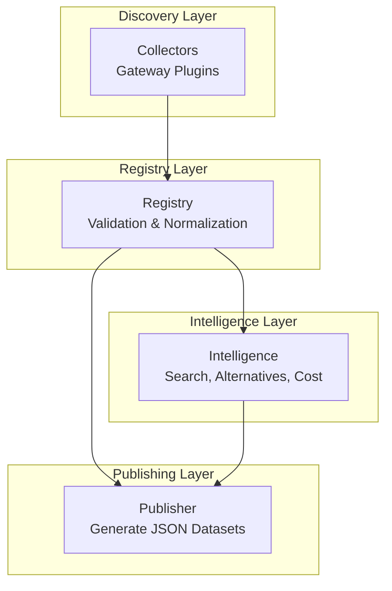
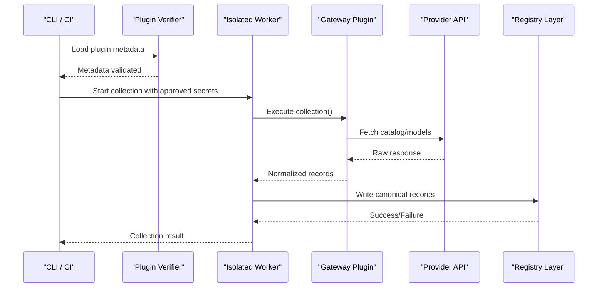
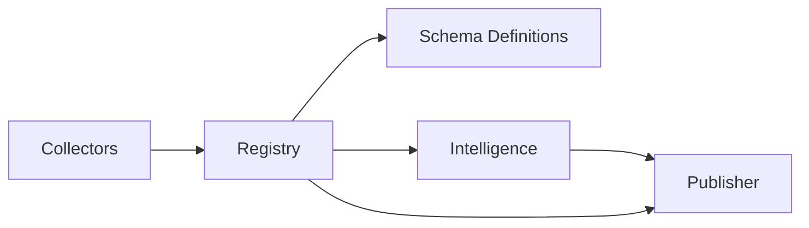

# Provider Integration Guide

<cite>
**Referenced Files in This Document**
- [README.md](file://README.md)
- [03_Architecture.md](file://docs/03_Architecture.md)
- [04_Pipeline.md](file://docs/04_Pipeline.md)
- [07_Developer_Access.md](file://docs/07_Developer_Access.md)
- [08_Gateway_Plugin_Security.md](file://docs/08_Gateway_Plugin_Security.md)
</cite>

## Table of Contents
1. [Introduction](#introduction)
2. [Project Structure](#project-structure)
3. [Core Components](#core-components)
4. [Architecture Overview](#architecture-overview)
5. [Detailed Component Analysis](#detailed-component-analysis)
6. [Dependency Analysis](#dependency-analysis)
7. [Performance Considerations](#performance-considerations)
8. [Troubleshooting Guide](#troubleshooting-guide)
9. [Conclusion](#conclusion)
10. [Appendices](#appendices)

## Introduction
This guide explains how to integrate new AI model providers with BaseModel using the collector architecture and gateway pattern. It covers authentication, rate limiting, error handling, data transformation, testing, security, performance, and monitoring for production deployments. The goal is to help you implement custom collectors that discover, collect, validate, normalize, and publish provider model data into BaseModel’s canonical registry.

BaseModel is a data layer for AI model intelligence: it discovers, validates, normalizes, stores, analyzes, and publishes structured knowledge about models. It does not run inference or host models; instead, it provides datasets consumed by other systems.

**Section sources**
- [README.md:1-61](file://README.md#L1-L61)

## Project Structure
The repository is organized into packages and documentation:
- packages/schema: Canonical Zod schemas and TypeScript types.
- packages/registry: Registry storage, validation, and merge utilities.
- packages/collectors: Provider and gateway collectors (gateway plugins live here).
- packages/intelligence: Derived rankings, search, and recommendations.
- packages/publisher: Dataset generation for dist/.
- packages/cli: Command-line interface for querying intelligence.
- docs: Architecture, pipeline, developer access, and security guidance.
- data/registry: Canonical records for providers, models, capabilities, pricing, licenses, APIs, benchmarks.
- dist: Generated public datasets.

**Diagram sources**
- [03_Architecture.md:1-77](file://docs/03_Architecture.md#L1-L77)

**Section sources**
- [README.md:10-30](file://README.md#L10-L30)
- [03_Architecture.md:37-44](file://docs/03_Architecture.md#L37-L44)

## Core Components
- Discovery Layer: Finds sources (provider sites, catalogs, docs, benchmarks). Implemented via gateway and provider collectors in packages/collectors.
- Registry Layer: Stores canonical records after validation and normalization. Located in packages/registry.
- Intelligence Layer: Derives search, alternatives, and cost information from registry data without modifying canonical records. Located in packages/intelligence.
- Publishing Layer: Converts registry and intelligence data into public datasets written to dist/.

Collectors are responsible for discovery and collection stages. They fetch structured data from official APIs, documentation, or approved sources. Validation and normalization ensure schema compliance and canonical representation before storing in the registry.

**Section sources**
- [03_Architecture.md:7-21](file://docs/03_Architecture.md#L7-L21)
- [03_Architecture.md:23-35](file://docs/03_Architecture.md#L23-L35)
- [03_Architecture.md:31-35](file://docs/03_Architecture.md#L31-L35)
- [04_Pipeline.md:16-42](file://docs/04_Pipeline.md#L16-L42)

## Architecture Overview
BaseModel follows a layered architecture with clear boundaries between discovery, registry, intelligence, and publishing. Collectors operate within the discovery layer, interacting with external providers through gateway plugins.

**Diagram sources**
- [03_Architecture.md:7-35](file://docs/03_Architecture.md#L7-L35)

## Detailed Component Analysis

### Collector Architecture and Gateway Pattern
- Gateway plugins reside under packages/collectors/src/gateways/.
- Each plugin implements a contract that defines metadata, secret requirements, and collection logic.
- The verifier loads plugin metadata in an isolated worker first; custom collection runs in a second worker with only approved secrets.
- Secrets must be registered in a central registry file (gateway-secrets.ts) and are injected per gateway.

**Diagram sources**
- [07_Developer_Access.md:105-113](file://docs/07_Developer_Access.md#L105-L113)
- [08_Gateway_Plugin_Security.md:1-36](file://docs/08_Gateway_Plugin_Security.md#L1-L36)

**Section sources**
- [07_Developer_Access.md:105-113](file://docs/07_Developer_Access.md#L105-L113)
- [08_Gateway_Plugin_Security.md:1-28](file://docs/08_Gateway_Plugin_Security.md#L1-L28)

### Authentication Mechanisms
- Secrets are managed centrally and injected into workers per gateway.
- Only .ts and .js gateway files are accepted; plugin paths must resolve inside packages/collectors/src/gateways/.
- Unregistered gateways receive no secrets; plugins cannot escalate privileges by declaring new secret names.
- CI credentials such as GITHUB_TOKEN are not passed through to plugins.

Best practices:
- Register required secret keys in the central registry before implementing a plugin.
- Use minimal-scoped tokens where possible.
- Avoid logging sensitive values; sanitize requests and responses.

**Section sources**
- [08_Gateway_Plugin_Security.md:6-28](file://docs/08_Gateway_Plugin_Security.md#L6-L28)

### API Rate Limiting and Resilience
- External sources may return HTTP 429 Too Many Requests; pipelines should handle retries and fallbacks.
- For benchmark sources, optional tokens increase limits; otherwise, fallback to Mirror snapshots when primary sources fail.
- Enrichment continues even if one source fails; fatal errors occur only when all primary pricing sources fail.

Recommendations:
- Implement exponential backoff and jitter for retries.
- Track per-source status and errors in enrichment metadata.
- Gracefully degrade to alternative sources when rate-limited or unavailable.

**Section sources**
- [04_Pipeline.md:94-126](file://docs/04_Pipeline.md#L94-L126)
- [04_Pipeline.md:205-217](file://docs/04_Pipeline.md#L205-L217)

### Error Handling and Data Transformation
- Validation rejects malformed or incomplete records before they reach the registry.
- Normalization converts provider-specific representations into canonical BaseModel schemas.
- Invalid records are isolated; valid records continue through the pipeline; errors are logged.
- Enrichment failure modes are explicit: non-fatal partial failures vs. fatal when all sources fail.

Transformation steps:
- Map provider identifiers to canonical IDs.
- Normalize capability names and units (e.g., pricing per token).
- Ensure timestamps follow ISO 8601 and include updated_at fields.

**Section sources**
- [04_Pipeline.md:28-42](file://docs/04_Pipeline.md#L28-L42)
- [04_Pipeline.md:86-92](file://docs/04_Pipeline.md#L86-L92)
- [04_Pipeline.md:163-217](file://docs/04_Pipeline.md#L163-L217)

### Step-by-Step Guide: Implementing a Custom Collector
1. Create a new gateway plugin file under packages/collectors/src/gateways/.
2. Define plugin metadata including name, version, and secretKeyName (for compatibility).
3. Register required secret names in the central gateway-secrets.ts registry.
4. Implement collection logic to fetch provider data and transform it into canonical schemas.
5. Add tests covering success and failure scenarios.
6. Review the plugin and its secret requirements together before merging.

Security checklist:
- Ensure plugin path resolves inside the allowed directory.
- Verify only approved secrets are injected.
- Sanitize inputs and outputs; avoid logging secrets.

**Section sources**
- [08_Gateway_Plugin_Security.md:19-28](file://docs/08_Gateway_Plugin_Security.md#L19-L28)
- [07_Developer_Access.md:105-113](file://docs/07_Developer_Access.md#L105-L113)

### Testing Provider Integrations
- Use the collector verification command to validate plugin changes.
- Run tests locally to ensure collection succeeds under expected conditions.
- Simulate failure cases (rate limits, auth errors, network timeouts) to verify resilience.

Commands:
- pnpm --filter @basemodel/collectors run collect
- pnpm --filter @basemodel/collectors run verify <plugin-file>

**Section sources**
- [README.md:53-57](file://README.md#L53-L57)

### Validating Data Accuracy
- Validate schema compliance using Zod schemas from @basemodel/schema.
- Check identifier formats, URL validity, and timestamp formats.
- Ensure canonical fields (model_id, provider_id, capabilities, pricing units) are correctly normalized.
- Compare against known-good snapshots to detect drift.

**Section sources**
- [04_Pipeline.md:28-42](file://docs/04_Pipeline.md#L28-L42)

### Security Considerations
- Credential management: Centralize secrets; inject per gateway; never hardcode.
- Request sanitization: Strip sensitive headers and payloads; log safe metadata only.
- Compliance: Follow least privilege; audit secret usage; maintain provenance metadata.

**Section sources**
- [08_Gateway_Plugin_Security.md:1-36](file://docs/08_Gateway_Plugin_Security.md#L1-L36)

### Examples of Existing Provider Implementations
- OpenAI-compatible gateway plugins are supported; custom plugins can extend the same contract.
- Benchmark sources include LMArena, Open LLM Leaderboard, and Mirror; these demonstrate fallback strategies and optional token usage.

**Section sources**
- [04_Pipeline.md:24-27](file://docs/04_Pipeline.md#L24-L27)
- [04_Pipeline.md:94-126](file://docs/04_Pipeline.md#L94-L126)

### Templates for Common Integration Patterns
- Standard REST API collection: Fetch models endpoint, parse data array, map to canonical schema.
- Documentation scraping: Extract model listings from HTML/markdown, validate URLs, normalize capabilities.
- Aggregator integration: Consume third-party catalogs (OpenRouter, Hugging Face), propagate tiers, preserve provenance.

[No sources needed since this section provides conceptual templates]

## Dependency Analysis
Collectors depend on external provider APIs and internal registry services. The registry depends on schema definitions and validation utilities. Intelligence depends on registry data to compute derived insights. Publisher depends on both registry and intelligence to generate datasets.

**Diagram sources**
- [03_Architecture.md:37-44](file://docs/03_Architecture.md#L37-L44)

**Section sources**
- [03_Architecture.md:37-44](file://docs/03_Architecture.md#L37-L44)

## Performance Considerations
- Caching: Cache provider responses where appropriate to reduce rate-limit pressure.
- Parallelism: Fetch multiple endpoints concurrently while respecting provider limits.
- Batch processing: Normalize and write records in batches to minimize I/O overhead.
- Monitoring: Track latency, error rates, and throughput per provider; alert on anomalies.

[No sources needed since this section provides general guidance]

## Troubleshooting Guide
Common issues:
- Authentication failures: Verify secret registration and permissions.
- Rate limiting: Implement retries and fallbacks; consider optional tokens.
- Schema validation errors: Inspect raw responses and mapping logic.
- Network timeouts: Configure timeouts and circuit breakers.

Debugging steps:
- Run collector verification to isolate plugin issues.
- Log request/response metadata (sanitized) for analysis.
- Check enrichment metadata for per-source status and errors.

**Section sources**
- [04_Pipeline.md:86-92](file://docs/04_Pipeline.md#L86-L92)
- [04_Pipeline.md:205-217](file://docs/04_Pipeline.md#L205-L217)

## Conclusion
BaseModel’s collector architecture and gateway pattern provide a robust foundation for integrating new AI model providers. By following the outlined steps for implementation, testing, security, and performance optimization, you can build reliable collectors that contribute high-quality data to the registry. Adhering to validation, normalization, and error-handling best practices ensures consistency and trustworthiness across the platform.

[No sources needed since this section summarizes without analyzing specific files]

## Appendices

### Pipeline Stages Reference
- Discovery: Identify sources needing collection.
- Collection: Retrieve structured data from approved sources.
- Validation: Reject malformed or incomplete records.
- Normalization: Convert to canonical schemas.
- Registry: Store canonical records.
- Intelligence: Derive search, alternatives, cost data.
- Generation: Write public JSON datasets.
- Publication: Distribute generated datasets.

**Section sources**
- [04_Pipeline.md:16-84](file://docs/04_Pipeline.md#L16-L84)

### Pricing Enrichment Sources
- Provider pricingSource: Declared per gateway plugin.
- OpenRouter: Aggregated pricing for many models.
- Hugging Face Inference Providers: Open-weight models served by partners.

**Section sources**
- [04_Pipeline.md:127-153](file://docs/04_Pipeline.md#L127-L153)