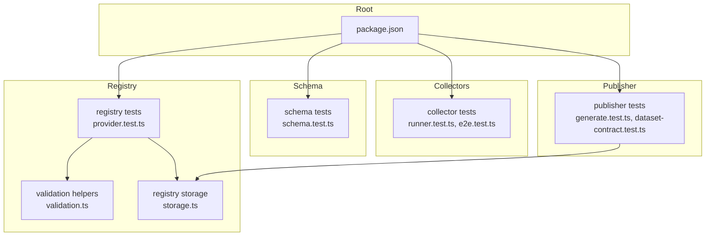
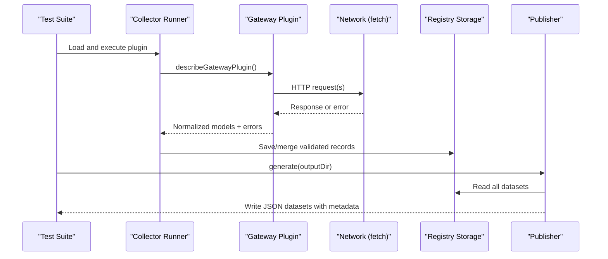
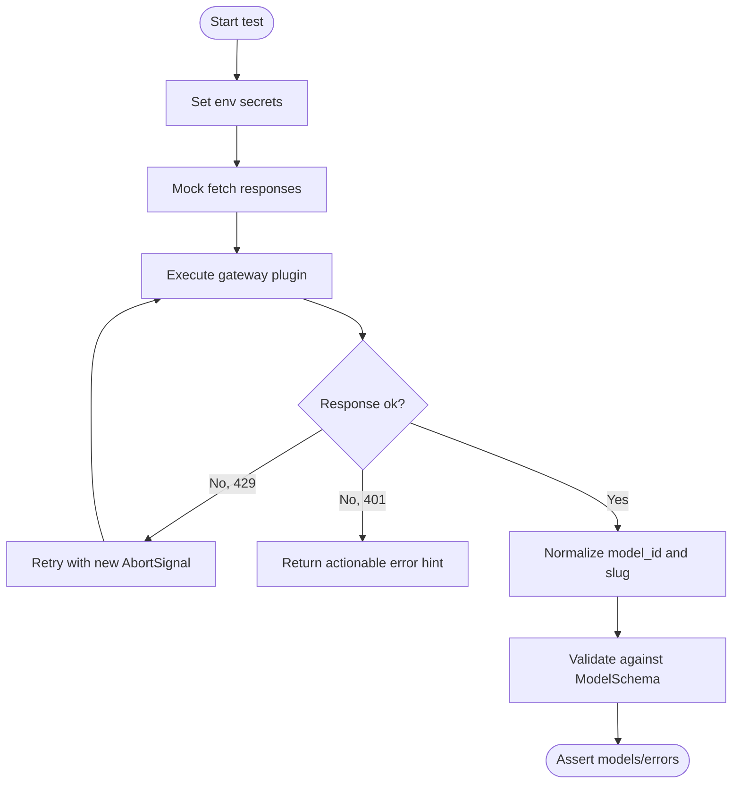
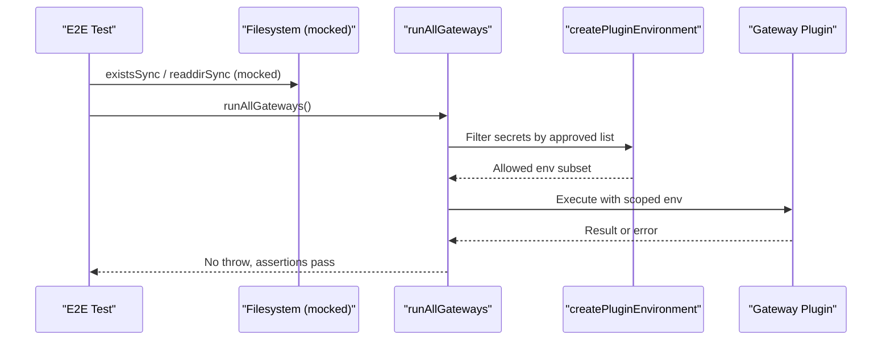
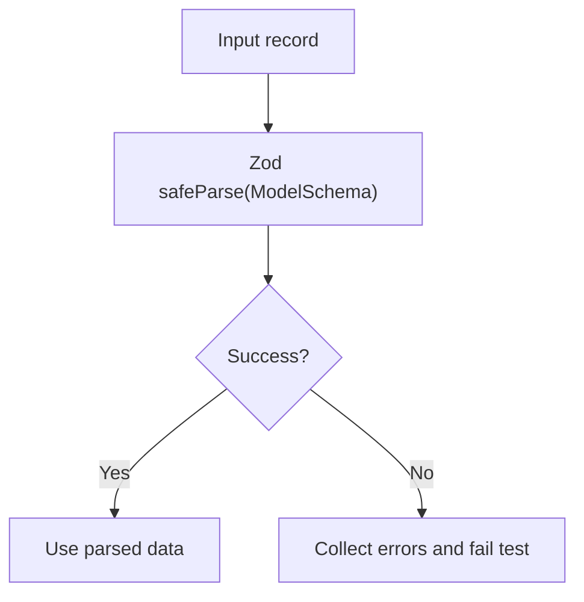
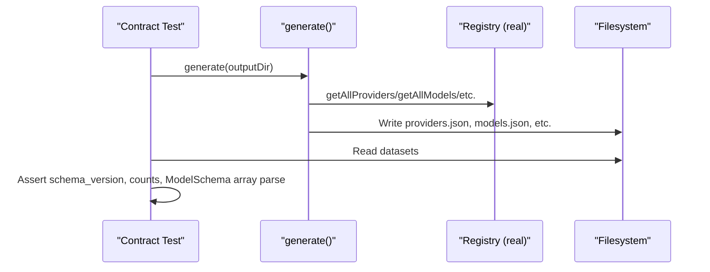
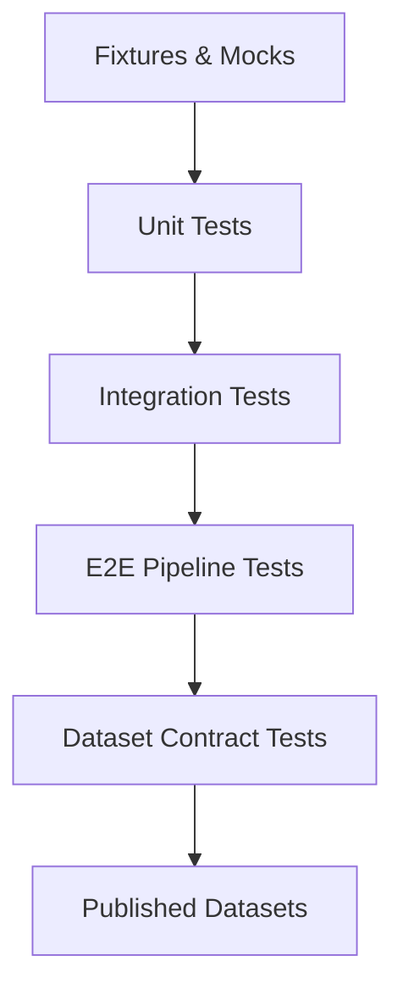
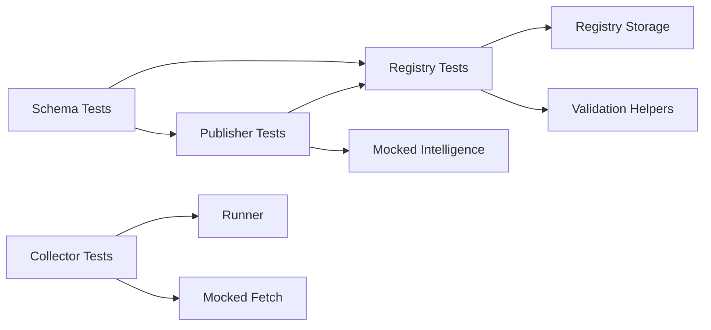

# Testing & Validation

<cite>
**Referenced Files in This Document**
- [package.json](file://package.json)
- [runner.test.ts](file://packages/collectors/src/__tests__/runner.test.ts)
- [e2e.test.ts](file://packages/collectors/src/__tests__/e2e.test.ts)
- [provider.test.ts](file://packages/registry/src/__tests__/provider.test.ts)
- [validation.ts](file://packages/registry/src/validation.ts)
- [schema.test.ts](file://packages/schema/src/__tests__/schema.test.ts)
- [generate.test.ts](file://packages/publisher/src/__tests__/generate.test.ts)
- [dataset-contract.test.ts](file://packages/publisher/src/__tests__/dataset-contract.test.ts)
- [vitest.config.ts](file://packages/registry/vitest.config.ts)
- [storage.ts](file://packages/registry/src/storage.ts)
</cite>

## Table of Contents
1. [Introduction](#introduction)
2. [Project Structure](#project-structure)
3. [Core Components](#core-components)
4. [Architecture Overview](#architecture-overview)
5. [Detailed Component Analysis](#detailed-component-analysis)
6. [Dependency Analysis](#dependency-analysis)
7. [Performance Considerations](#performance-considerations)
8. [Troubleshooting Guide](#troubleshooting-guide)
9. [Conclusion](#conclusion)
10. [Appendices](#appendices)

## Introduction
This document provides comprehensive testing and validation strategies for provider integrations in BaseModel, focusing on unit tests for collectors, integration tests for end-to-end data collection pipelines, schema validation with Zod, and CI-ready practices. It covers mocking external APIs, simulating network failures, validating authentication flows, rate limiting behavior, error handling, edge cases, fixtures, assertion patterns, performance and load testing scenarios, and continuous integration setup guidance.

## Project Structure
BaseModel is a monorepo with packages for collectors, registry, schema, publisher, intelligence, and CLI. Tests are organized per package under src/__tests__ and use Vitest. The root package.json defines shared scripts including test execution across packages.



**Diagram sources**
- [package.json:17-25](file://package.json#L17-L25)
- [runner.test.ts:1-160](file://packages/collectors/src/__tests__/runner.test.ts#L1-L160)
- [e2e.test.ts:1-92](file://packages/collectors/src/__tests__/e2e.test.ts#L1-L92)
- [provider.test.ts:1-63](file://packages/registry/src/__tests__/provider.test.ts#L1-L63)
- [validation.ts:1-42](file://packages/registry/src/validation.ts#L1-L42)
- [storage.ts:1-41](file://packages/registry/src/storage.ts#L1-L41)
- [schema.test.ts:1-182](file://packages/schema/src/__tests__/schema.test.ts#L1-L182)
- [generate.test.ts:1-160](file://packages/publisher/src/__tests__/generate.test.ts#L1-L160)
- [dataset-contract.test.ts:1-106](file://packages/publisher/src/__tests__/dataset-contract.test.ts#L1-L106)

**Section sources**
- [package.json:17-25](file://package.json#L17-L25)

## Core Components
- Schema layer (Zod): Canonical models for providers, models, pricing, capabilities, benchmarks, licenses, and APIs. Validated via safeParse and custom validators.
- Registry layer: File-based registry with deterministic path resolution and helper functions to read/write records. Includes validation utilities that return structured results without throwing.
- Collectors: Gateway plugins that fetch provider model catalogs, normalize IDs, handle retries and timeouts, and enforce secret scoping.
- Publisher: Generates published datasets from the registry, validates relational integrity, and writes metadata-enriched JSON files.

Key responsibilities:
- Unit tests assert normalization, retry logic, and error messages.
- E2E tests validate environment scoping, plugin isolation, and pipeline resilience.
- Contract tests ensure generated datasets conform to expected shapes and counts.

**Section sources**
- [schema.test.ts:1-182](file://packages/schema/src/__tests__/schema.test.ts#L1-L182)
- [validation.ts:1-42](file://packages/registry/src/validation.ts#L1-L42)
- [storage.ts:1-41](file://packages/registry/src/storage.ts#L1-L41)
- [runner.test.ts:1-160](file://packages/collectors/src/__tests__/runner.test.ts#L1-L160)
- [e2e.test.ts:1-92](file://packages/collectors/src/__tests__/e2e.test.ts#L1-L92)
- [generate.test.ts:1-160](file://packages/publisher/src/__tests__/generate.test.ts#L1-L160)
- [dataset-contract.test.ts:1-106](file://packages/publisher/src/__tests__/dataset-contract.test.ts#L1-L106)

## Architecture Overview
The testing architecture spans four layers:
- Schema validation ensures all records conform to canonical types.
- Registry reads/writes validated records deterministically.
- Collectors exercise gateway plugins with mocked I/O and secrets scoping.
- Publisher generates final datasets and contract tests verify their shape and consistency.



**Diagram sources**
- [runner.test.ts:1-160](file://packages/collectors/src/__tests__/runner.test.ts#L1-L160)
- [e2e.test.ts:1-92](file://packages/collectors/src/__tests__/e2e.test.ts#L1-L92)
- [storage.ts:1-41](file://packages/registry/src/storage.ts#L1-L41)
- [generate.test.ts:1-160](file://packages/publisher/src/__tests__/generate.test.ts#L1-L160)

## Detailed Component Analysis

### Collector Unit Testing Strategies
Focus areas:
- Mocking external APIs: Use global fetch mocks to simulate responses and errors.
- Simulating network failures: Return non-ok responses with status codes like 429 and 401.
- Authentication flows: Provide API keys via process.env and assert error hints when invalid.
- Retry and timeout behavior: Assert call counts, fresh AbortSignal per attempt, and transient vs non-retryable errors.

Patterns demonstrated:
- Stubbing fetch to return specific statuses and payloads.
- Verifying normalized model IDs and slugs against schema constraints.
- Ensuring actionable error messages include guidance (e.g., check API key).



**Diagram sources**
- [runner.test.ts:105-159](file://packages/collectors/src/__tests__/runner.test.ts#L105-L159)

**Section sources**
- [runner.test.ts:1-160](file://packages/collectors/src/__tests__/runner.test.ts#L1-L160)

### Collector E2E Pipeline Testing
Focus areas:
- Graceful handling of missing or empty gateways directory.
- Secret scoping: Only centrally approved secrets are passed to plugins.
- Security: Prevent exposure of CI credentials to unregistered plugins; reject plugin results leaking secrets.

Patterns demonstrated:
- Mocking filesystem and registry modules to isolate side effects.
- Using createPluginEnvironment to filter allowed secrets.
- Assertions on error arrays indicating absent secrets and rejection of leaked secrets.



**Diagram sources**
- [e2e.test.ts:1-92](file://packages/collectors/src/__tests__/e2e.test.ts#L1-L92)

**Section sources**
- [e2e.test.ts:1-92](file://packages/collectors/src/__tests__/e2e.test.ts#L1-L92)

### Registry Validation and Seed Data Tests
Focus areas:
- Provider seed data validation against ProviderSchema.
- Rejecting invalid formats (provider_id, website URL, status).
- Using validate helper to avoid throwing and collect errors.

Patterns demonstrated:
- Loading JSON fixtures from data/registry/providers.
- Asserting success/failure outcomes and logging errors for debugging.

```mermaid
classDiagram
class ValidationResult {
+success : boolean
+data : any
+errors : string[]
}
class ValidationHelpers {
+validate(schema, raw) ValidationResult
+validateMany(schema, records) { valid, invalid }
}
class ProviderSeedTests {
+loadProvider(id)
+assertValid(id)
+assertInvalidCases()
}
ProviderSeedTests --> ValidationHelpers : "uses"
ValidationHelpers --> ValidationResult : "returns"
```

**Diagram sources**
- [provider.test.ts:1-63](file://packages/registry/src/__tests__/provider.test.ts#L1-L63)
- [validation.ts:1-42](file://packages/registry/src/validation.ts#L1-L42)

**Section sources**
- [provider.test.ts:1-63](file://packages/registry/src/__tests__/provider.test.ts#L1-L63)
- [validation.ts:1-42](file://packages/registry/src/validation.ts#L1-L42)

### Schema Validation with Zod
Focus areas:
- Exported schemas for providers, models, pricing, capabilities, benchmarks, licenses, APIs.
- Safe parsing and negative cases (invalid fields, schemes, ranges).
- Acceptance of optional timestamps and provenance fields.

Patterns demonstrated:
- Using safeParse to assert validity and invalidity.
- Parameterized tests for multiple inputs.
- Custom URL schema validation for http/https only.



**Diagram sources**
- [schema.test.ts:1-182](file://packages/schema/src/__tests__/schema.test.ts#L1-L182)

**Section sources**
- [schema.test.ts:1-182](file://packages/schema/src/__tests__/schema.test.ts#L1-L182)

### Publisher Generation and Contract Tests
Focus areas:
- Generating datasets from registry with metadata and counts.
- Validating relational integrity (providers, models, capabilities).
- Ensuring every published model passes canonical ModelSchema.

Patterns demonstrated:
- Mocking registry and intelligence modules for deterministic generation.
- Writing temporary output directories and asserting file contents.
- Running real generator against real registry and asserting dataset contracts.



**Diagram sources**
- [generate.test.ts:1-160](file://packages/publisher/src/__tests__/generate.test.ts#L1-L160)
- [dataset-contract.test.ts:1-106](file://packages/publisher/src/__tests__/dataset-contract.test.ts#L1-L106)

**Section sources**
- [generate.test.ts:1-160](file://packages/publisher/src/__tests__/generate.test.ts#L1-L160)
- [dataset-contract.test.ts:1-106](file://packages/publisher/src/__tests__/dataset-contract.test.ts#L1-L106)

### Conceptual Overview
Conceptual workflow for testing provider integrations:
- Define fixtures and mock data structures aligned with schema.
- Mock external dependencies (HTTP, filesystem, registry).
- Assert normalization, validation, retries, timeouts, and error messages.
- Generate datasets and validate contracts end-to-end.



[No sources needed since this diagram shows conceptual workflow, not actual code structure]

## Dependency Analysis
Testing dependencies and relationships:
- Collectors depend on runner and gateway plugins; tests mock fetch and environment.
- Registry depends on storage and validation; tests assert seed data and helpers.
- Publisher depends on registry and intelligence; tests mock both and assert outputs.
- Schema tests validate canonical types used across layers.



**Diagram sources**
- [schema.test.ts:1-182](file://packages/schema/src/__tests__/schema.test.ts#L1-L182)
- [provider.test.ts:1-63](file://packages/registry/src/__tests__/provider.test.ts#L1-L63)
- [validation.ts:1-42](file://packages/registry/src/validation.ts#L1-L42)
- [storage.ts:1-41](file://packages/registry/src/storage.ts#L1-L41)
- [runner.test.ts:1-160](file://packages/collectors/src/__tests__/runner.test.ts#L1-L160)
- [generate.test.ts:1-160](file://packages/publisher/src/__tests__/generate.test.ts#L1-L160)

**Section sources**
- [schema.test.ts:1-182](file://packages/schema/src/__tests__/schema.test.ts#L1-L182)
- [provider.test.ts:1-63](file://packages/registry/src/__tests__/provider.test.ts#L1-L63)
- [validation.ts:1-42](file://packages/registry/src/validation.ts#L1-L42)
- [storage.ts:1-41](file://packages/registry/src/storage.ts#L1-L41)
- [runner.test.ts:1-160](file://packages/collectors/src/__tests__/runner.test.ts#L1-L160)
- [generate.test.ts:1-160](file://packages/publisher/src/__tests__/generate.test.ts#L1-L160)

## Performance Considerations
Guidelines for performance and load testing:
- Use synthetic load generators to simulate high concurrency against mocked endpoints to measure throughput and latency.
- For collector retries, benchmark retry backoff and AbortSignal lifecycle under load.
- For registry operations, test large batch validations using validateMany to ensure linear scaling and memory usage.
- For publisher generation, profile file I/O and JSON serialization with large datasets; consider streaming where applicable.
- Establish baselines for CPU and memory usage during E2E runs and set thresholds in CI.

[No sources needed since this section provides general guidance]

## Troubleshooting Guide
Common issues and resolutions:
- Invalid provider_id format or website URL: Ensure provider_id contains no spaces and website uses http/https.
- Unauthorized errors: Verify API keys are present and correct; tests assert actionable hints.
- Rate limiting (429): Implement retries with fresh AbortSignal per attempt; tests cover transient status handling.
- Secret leakage: Ensure only approved secrets are passed to plugins; tests reject results containing configured secrets.
- Missing data/registry: Storage resolves paths deterministically; ensure BASEMODEL_REGISTRY_PATH points to an existing directory or that data/registry exists relative to cwd.

**Section sources**
- [provider.test.ts:27-61](file://packages/registry/src/__tests__/provider.test.ts#L27-L61)
- [runner.test.ts:147-159](file://packages/collectors/src/__tests__/runner.test.ts#L147-L159)
- [e2e.test.ts:73-91](file://packages/collectors/src/__tests__/e2e.test.ts#L73-L91)
- [storage.ts:16-39](file://packages/registry/src/storage.ts#L16-L39)

## Conclusion
BaseModel’s testing strategy combines robust unit tests for collectors, strict schema validation with Zod, deterministic registry operations, and comprehensive E2E and contract tests for publishers. By mocking external APIs, simulating failures, enforcing secret scoping, and validating dataset contracts, the suite ensures reliability, security, and correctness across provider integrations. Adopting these patterns will help maintain high-quality integrations and resilient pipelines.

## Appendices

### Test Fixtures and Mock Data Structures
- Provider fixtures: JSON files under data/registry/providers/<id>.json validated against ProviderSchema.
- Model fixtures: Minimal objects with required fields (model_id, provider_id, name, modality, flags, status).
- Pricing fixtures: Include pricing_id, model_id, pricing_type, currency, unit, value.
- Capability/Benchmark/License/API fixtures: Follow respective schema definitions.

### Assertion Patterns
- Use safeParse for schema validation; assert success or collect errors.
- Assert normalized model_id and slug compatibility with ModelSchema.
- Assert error messages contain actionable hints (e.g., unauthorized checks).
- Assert counts match arrays in published datasets and schema_version consistency.

### Continuous Integration Setup
- Use pnpm workspaces to run tests across packages: pnpm -r run test.
- Configure Vitest per package with globals enabled where needed.
- Cache node_modules and registry artifacts to speed up CI runs.
- Add steps to validate schema exports and dataset contracts nightly.

**Section sources**
- [package.json:17-25](file://package.json#L17-L25)
- [vitest.config.ts:1-7](file://packages/registry/vitest.config.ts#L1-L7)
- [schema.test.ts:1-182](file://packages/schema/src/__tests__/schema.test.ts#L1-L182)
- [dataset-contract.test.ts:1-106](file://packages/publisher/src/__tests__/dataset-contract.test.ts#L1-L106)